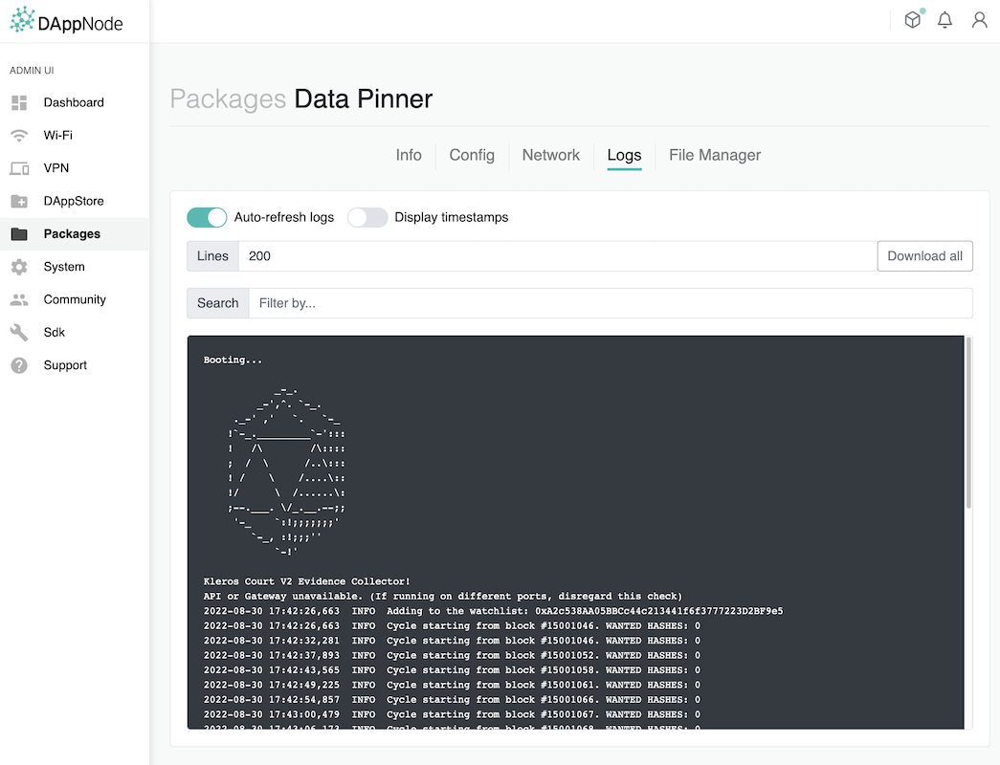

# Kleros Court V2 Evidence: Containers to replicate and decentralize data

## Quick start

If you don't have a local RPC node, add a RPC to the docker-compose file.

```bash
$ git clone git@github.com:kleros/kleros-v2.git
$ cd bot-pinner/
$ docker-compose build
$ docker-compose up -d
```

### In the box

1. Standard IPFS container which creates a local mount for data
2. Evidence container that awaits new events and then scrapes the latest hashes and submits it to IPFS.

## DappNode

:warning: For the following steps, you need access to [a DappNode](https://dappnode.io) system with the IPFS service running.

The IPFS service is expected by default at `http://ipfs-cluster.dappnode:9094`, it can be configured at build time in `docker-compose-dappnode.yml` or at runtime in the Config tab of the package in the dAppnode UI.

```bash
# first time only
$ yarn install
```

### Package installation without publishing

```bash
$ yarn build:dappnode
  ✔ Verify connection
  ✔ Create release dir
  ✔ Validate files
  ✔ Copy files
  ✔ Build docker image
  ✔ Save and compress image
  ✔ Upload release to IPFS node
  ✔ Save upload results

  DNP (DAppNode Package) built and uploaded
  Release hash : /ipfs/Qma773qBk3PqTDQk6biRagcjiNutmit2rpKStq5WbH16XJ
  http://my.dappnode/#/installer/%2Fipfs%2FQma773qBk3PqTDQk6biRagcjiNutmit2rpKStq5WbH16XJ
```

Then follow the url to install the package, or open the DappStore page and paste the ipfs hash.



### Publishing

```bash
# Increase the version number, specify either: major, minor, patch.
$ yarn bump:dappnode patch
0.1.1

# Upload to IPFS
$ yarn publish:dappnode patch
  ✔ Fetch current version from APM (next version: 0.1.1)
  ✔ Build and upload
  ✔ Generate transaction

  DNP (DAppNode Package) published (version 0.1.1)
  Release hash : /ipfs/xxxx
  http://my.dappnode/#/installer/%2Fipfs%2Fxxxx

  You must execute this transaction in mainnet to publish a new version of this DNP.

    To    : 0x988b3A538b618C7A603e1c11Ab82Cd16dbE28069
  Value : 0
  Data  : 0x32ab6afxxxxx
  Gas   : 1100000

  You can also execute this transaction with Metamask by following this pre-filled link

  https://dappnode.github.io/sdk-publish/?r=data-pinner.kleros.eth&v=0.1.1&h=%2Fipfs%2Fxxxxx

```

## Contributions

Please visit [contribution.kleros.io](contributing.kleros.io.).
For any questions, please join the Kleros Discord or Telegram.
