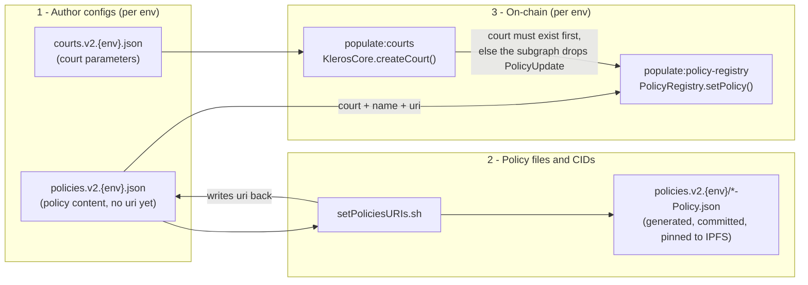

# @kleros/kleros-v2-contracts

Smart contracts for Kleros v2

See [Deployment artifacts guide](./docs/artifacts.md) for which format to use (JSON, viem, typechain, etc.).

## Pinning a past release

Run an old contract tree without checking out that commit. Web/subgraph stay on HEAD.

```bash
yarn pin <tag|commit|branch>   # npm version works too, e.g. 0.10.0
yarn build
yarn start-local               # deploy-local, populate:local use the pin as well
yarn unpin
```

From repo root: `yarn local-stack` (or `yarn local-stack --pin <ref>`). See [root README](../README.md#shortcut-using-tmux).

While pinned, `deploy` and `populate:*` only run on `hardhat` / `localhost`; use `yarn unpin` for other networks.

## Deployments

Refresh the list of deployed contracts by running `./scripts/generateDeploymentsMarkdown.sh` or `./scripts/populateReadme.sh`.

### V2 Mainnet
#### Arbitrum One

- [BlockHashRNG](https://arbiscan.io/address/0x39D123fc4cFD24EA5bB76195f9ecFE1f0DF35b0B)
- [ChainlinkRNG](https://arbiscan.io/address/0x897d83a7d5F23555eFA15e1BE297d5503522cbA3)
- [DisputeKitClassic: proxy](https://arbiscan.io/address/0x70B464be85A547144C72485eBa2577E5D3A45421), [implementation](https://arbiscan.io/address/0x371Aa4B1AE5b5f9422f3Ff1d105029AAd1D319BC)
- [DisputeKitGated: proxy](https://arbiscan.io/address/0xaE1eed20C125B739b64c948820C61F809ad9a925), [implementation](https://arbiscan.io/address/0xEA7863E6dE863e8E6d037D8693ad5dA45Db7790a)
- [DisputeKitGatedShutter: proxy](https://arbiscan.io/address/0x788330092B9704809C19858E39EB9Ac402c2E47b), [implementation](https://arbiscan.io/address/0xb12EB4c0716d3A9861a9AC471c6CdDB808d61b32)
- [DisputeKitShutter: proxy](https://arbiscan.io/address/0x9D3e3f1765744c2a1BC6F6088549770444BBC768), [implementation](https://arbiscan.io/address/0xF3103B46403A0bBd4551648BFb29BCC2b8783947)
- [DisputeResolver](https://arbiscan.io/address/0xb5526D022962A1fFf6eD32C93e8b714c901F4323)
- [DisputeResolverRuler](https://arbiscan.io/address/0xb3a5FdEAF461c42caCe148e978e6FBCa97bE6140)
- [DisputeTemplateRegistry: proxy](https://arbiscan.io/address/0x0cFBaCA5C72e7Ca5fFABE768E135654fB3F2a5A2), [implementation](https://arbiscan.io/address/0x57EfD43DAfCeb6C58Df57932b2B299f46fef5c87)
- [EvidenceModule: proxy](https://arbiscan.io/address/0x48e052B4A6dC4F30e90930F1CeaAFd83b3981EB3), [implementation](https://arbiscan.io/address/0xA502A3942abCF8e71FBD87ed442B39b798b192C8)
- [KlerosCore: proxy](https://arbiscan.io/address/0x991d2df165670b9cac3B022f4B68D65b664222ea), [implementation](https://arbiscan.io/address/0xC1210493804eEF123096F9581Ee82B915150E54c)
- [KlerosCoreRuler: proxy](https://arbiscan.io/address/0xc0169e0B19aE02ac4fADD689260CF038726DFE13), [implementation](https://arbiscan.io/address/0x85093b5EDa4F2e2E2fEDae34Da91239D6a08e324)
- [KlerosCoreSnapshotProxy](https://arbiscan.io/address/0xEF719a5B3352F607e6C4E17b7e0cDAd8322fEC95)
- [KlerosV2NeoEarlyUser](https://arbiscan.io/address/0xfE34a72c55e512601E7d491A9c5b36373cE34d63)
- [Pinakion](https://arbiscan.io/address/0x330bD769382cFc6d50175903434CCC8D206DCAE5)
- [PolicyRegistry: proxy](https://arbiscan.io/address/0x553dcbF6aB3aE06a1064b5200Df1B5A9fB403d3c), [implementation](https://arbiscan.io/address/0xf7EE0Cd4E33C832DC05fB359896Add6E14E96C28)
- [RandomizerRNG: proxy](https://arbiscan.io/address/0x044AfE0069C0fd641BC5f90d9A4218eF0b2Fa9d3), [implementation](https://arbiscan.io/address/0xF1a7Cd3115F5852966430f8E3877D2221F074A2e)
- [SBTACPExperience](https://arbiscan.io/address/0x4249564a17EE0143819a109FAB241F55B1A5e9B4)
- [SBTACPLawyer](https://arbiscan.io/address/0x2A2f1fBBf07C1372371cf4a65cB28C2DF681850b)
- [SortitionModule: proxy](https://arbiscan.io/address/0x21A9402aDb818744B296e1d1BE58C804118DC03D), [implementation](https://arbiscan.io/address/0x3f6D0daeD166b64FCfBb9bc7c9E26423c6C08eEE)
- [TransactionBatcher](https://arbiscan.io/address/0xBC5ef8d9ad307154447AE148c088f083d2dEa4eF)

### V2 Testnet
#### Arbitrum Sepolia

- [BlockHashRNG](https://sepolia.arbiscan.io/address/0x0298a3EFa6Faf90865725E2b48Cf0F66e5d52754)
- [ChainlinkRNG](https://sepolia.arbiscan.io/address/0xAd5cCc93429e3A977c273cEeD106Ef16A69EAf79)
- [DAI](https://sepolia.arbiscan.io/address/0xc34aeFEa232956542C5b2f2EE55fD5c378B35c03)
- [DAIFaucet](https://sepolia.arbiscan.io/address/0x1Fa58B52326488D62A406E71DBaD839560e810fF)
- [DisputeKitClassic: proxy](https://sepolia.arbiscan.io/address/0x0c38f115D001d3b5bBec5e8D44f78C7B61A27D94), [implementation](https://sepolia.arbiscan.io/address/0xA122856B3B4C5fBcA129088af3CEb204509805f0)
- [DisputeKitGated: proxy](https://sepolia.arbiscan.io/address/0xfc8E5cabC8D01fd555Ee77dcE16d718678f4F6Ed), [implementation](https://sepolia.arbiscan.io/address/0x2d1b63C9638ed62875256676C665a7ec14D7663C)
- [DisputeKitGatedShutter: proxy](https://sepolia.arbiscan.io/address/0x936231010462458ebaA45dDc422A5940C08a474C), [implementation](https://sepolia.arbiscan.io/address/0x3a06272f2FEEC12B0FB5F3FF82688c0F06808bE7)
- [DisputeKitShutter: proxy](https://sepolia.arbiscan.io/address/0x87445ca2C09978Dc8F8d7e79c59791b1B3B1CFaa), [implementation](https://sepolia.arbiscan.io/address/0xca04F97fc0Df83E25e585893F5A12fb0AebEC27d)
- [DisputeResolver](https://sepolia.arbiscan.io/address/0xed31bEE8b1F7cE89E93033C0d3B2ccF4cEb27652)
- [DisputeTemplateRegistry: proxy](https://sepolia.arbiscan.io/address/0xe763d31Cb096B4bc7294012B78FC7F148324ebcb), [implementation](https://sepolia.arbiscan.io/address/0xf97791DA66e0A8Ff8Ee4908872CfCAcc641829Ec)
- [EvidenceModule: proxy](https://sepolia.arbiscan.io/address/0xA88A9a25cE7f1d8b3941dA3b322Ba91D009E1397), [implementation](https://sepolia.arbiscan.io/address/0xC4e64e6E949936a18269937FC1e18cb11E3db14D)
- [KlerosCore: proxy](https://sepolia.arbiscan.io/address/0xE8442307d36e9bf6aB27F1A009F95CE8E11C3479), [implementation](https://sepolia.arbiscan.io/address/0x02F607722749CECd32db07AA0b0755281FE9D13c)
- [KlerosCoreSnapshotProxy](https://sepolia.arbiscan.io/address/0xd74e61A4dB9C6c3F2C97b62a319aE194f616858C)
- [PinakionV2](https://sepolia.arbiscan.io/address/0x34B944D42cAcfC8266955D07A80181D2054aa225)
- [PNKFaucet](https://sepolia.arbiscan.io/address/0x9f6ffc13B685A68ae359fCA128dfE776458Df464)
- [PolicyRegistry: proxy](https://sepolia.arbiscan.io/address/0x2668c46A14af8997417138B064ca1bEB70769585), [implementation](https://sepolia.arbiscan.io/address/0x7CC8E0787e381aE159C4d3e137f20f9203313D41)
- [RandomizerRNG: proxy](https://sepolia.arbiscan.io/address/0x51a97ad9F0aA818e75819da3cA20CAc319580627), [implementation](https://sepolia.arbiscan.io/address/0x1237F02bBeFDAEA20cE3A66aCAe458C4106Ae203)
- [SBTACPLawyer](https://sepolia.arbiscan.io/address/0xF83e3F4042D21a3Fa9bc1BCF7C4Cb4C46f893929)
- [SortitionModule: proxy](https://sepolia.arbiscan.io/address/0xbAA5068F0bD1417046250A3eDe2B1F27e31383BD), [implementation](https://sepolia.arbiscan.io/address/0x0C872eeF07030107b53eaD15bb7dD7E6FBCA2b83)
- [TransactionBatcher](https://sepolia.arbiscan.io/address/0x35f93986950804ac1F93519BF68C2a7Dd776db0E)
- [WETH](https://sepolia.arbiscan.io/address/0xAEE953CC26DbDeA52beBE3F97f281981f2B9d511)
- [WETHFaucet](https://sepolia.arbiscan.io/address/0x922B84134e41BC5c9EDE7D5EFCE22Ba3D0e71835)

#### Sepolia

- [PinakionV2](https://sepolia.etherscan.io/address/0x593e89704D285B0c3fbF157c7CF2537456CE64b5)

#### Chiado

- [ArbitrableExample](https://gnosis-chiado.blockscout.com/address/0x438ca5337AE771dF926B7f4fDE1A21D72a315bDC)
- [DisputeResolver](https://gnosis-chiado.blockscout.com/address/0x5f79737f65320bA12440aA88087281cC8e71A781)
- [DisputeTemplateRegistry](https://gnosis-chiado.blockscout.com/address/0xA55D4b90c1F8D1fD0408232bF6FA498dD6786385)
- [ForeignGatewayOnGnosis](https://gnosis-chiado.blockscout.com/address/0x2824bdcc752b1272D56A84be03A74Ee856C06e43)
- [SortitionSumTreeFactory](https://gnosis-chiado.blockscout.com/address/0xc7e3BF90299f6BD9FA7c3703837A9CAbB5743636)
- [TokenBridge](https://gnosis-chiado.blockscout.com/address/0xbb3c86f9918C3C1d83668fA84e79E876d147fFf2)
- [WETH](https://gnosis-chiado.blockscout.com/address/0x2DFC9c3141268e6eac04a7D6d98Fbf64BDe836a8)
- [WETHFaucet](https://gnosis-chiado.blockscout.com/address/0x22CB016c4b57413ca4DF5F1AC44a0E0d3c69811F)
- [WPNKFaucet](https://gnosis-chiado.blockscout.com/address/0x5898aeE045A25B276369914c3448B72a41758B2c)
- [WrappedPinakionV2](https://gnosis-chiado.blockscout.com/address/0xD75E27A56AaF9eE7F8d9A472a8C2EF2f65a764dd)
- [xKlerosLiquidV2](https://gnosis-chiado.blockscout.com/address/0x34E520dc1d2Db660113b64724e14CEdCD01Ee879)

### V2 Devnet (unstable)
#### Arbitrum Sepolia

- [ChainlinkRNG](https://sepolia.arbiscan.io/address/0x579ec660B26Fa388674D8900C92aCFE01C1383cB)
- [DAI](https://sepolia.arbiscan.io/address/0x593e89704D285B0c3fbF157c7CF2537456CE64b5)
- [DAIFaucet](https://sepolia.arbiscan.io/address/0xB5b39A1bcD2D7097A8824B3cC18Ebd2dFb0D9B5E)
- [DisputeKitClassic: proxy](https://sepolia.arbiscan.io/address/0x109C193ceD10bdC09b60A1D9A547726fc8271979), [implementation](https://sepolia.arbiscan.io/address/0x89e88748fD20655FF7b3E9940533724458ae8cB3)
- [DisputeKitClassicUniversity: proxy](https://sepolia.arbiscan.io/address/0x8cC64B1Bb07A768A316fE20E8A0b4c4FcF8Bcc73), [implementation](https://sepolia.arbiscan.io/address/0x63C5F038170c75285836dEFAb29BD1cb635b3652)
- [DisputeKitGated: proxy](https://sepolia.arbiscan.io/address/0x8bf3d23D9f52796C1909ECEEc1F4BCcCC7fbe4bf), [implementation](https://sepolia.arbiscan.io/address/0xaf8d2967Af133b326645D0aabCecE03290955c52)
- [DisputeKitGatedArgentinaConsumerProtection: proxy](https://sepolia.arbiscan.io/address/0xBe8ea5d936BFc5Dd3E533d0Dc9fCf2ce16b460B1), [implementation](https://sepolia.arbiscan.io/address/0x351eE4f500c7184BC3E64021Ce5bCaa9aCB16e8f)
- [DisputeKitGatedShutter: proxy](https://sepolia.arbiscan.io/address/0x8C7607dC538e38960916FE51fA91a77492CA4c61), [implementation](https://sepolia.arbiscan.io/address/0x5483d8Fa17D1008490AEF16bC89D4840ee33bb39)
- [DisputeKitShutter: proxy](https://sepolia.arbiscan.io/address/0x074b7467cb567beB574a41Be44be2e34A56c6da3), [implementation](https://sepolia.arbiscan.io/address/0x8235033164eF49687bB2a248d1141515bE884F21)
- [DisputeResolver](https://sepolia.arbiscan.io/address/0xe471Cf6b559b031fe785ce74e48BBa8e7728841D)
- [DisputeTemplateRegistry: proxy](https://sepolia.arbiscan.io/address/0xb34F68A2407E283c9e158a6c4D7888eCE6eDA24a), [implementation](https://sepolia.arbiscan.io/address/0x385a6ee0f40d59A5feC2a14107682c82cB3532ca)
- [EvidenceModule: proxy](https://sepolia.arbiscan.io/address/0x2242cE6Ca0F101979FD658B3a04Bf67966Ccc95f), [implementation](https://sepolia.arbiscan.io/address/0x0234186D6EfbfCc4B01b07Bc47E447d63AF23D9A)
- [KlerosCore: proxy](https://sepolia.arbiscan.io/address/0x244e65F833Be5Ab13c20a00EBc40940BD3514d4C), [implementation](https://sepolia.arbiscan.io/address/0x35FAC521Ad256D6b4346E4C057cAc73f87Be43eB)
- [KlerosCoreSnapshotProxy](https://sepolia.arbiscan.io/address/0x171Ea9B37F3c36E8d07e7c5b30F561ad4595AD28)
- [KlerosV2NeoEarlyUser](https://sepolia.arbiscan.io/address/0x0d60Ff8bbCF49Bc5352328E7E28e141834d7750F)
- [LeaderboardOffset](https://sepolia.arbiscan.io/address/0x9D2FafF0977143D2225EDA14A3b73a8B49558969)
- [PinakionV2](https://sepolia.arbiscan.io/address/0x34B944D42cAcfC8266955D07A80181D2054aa225)
- [PNKFaucet](https://sepolia.arbiscan.io/address/0x7EFE468003Ad6A858b5350CDE0A67bBED58739dD)
- [PolicyRegistry: proxy](https://sepolia.arbiscan.io/address/0xe9FB76E8E9ED979E9448113c9358cab3ecD5A4eE), [implementation](https://sepolia.arbiscan.io/address/0xE29228c99F893cb226C0432daa9d1F189F6C709f)
- [RatesConverter](https://sepolia.arbiscan.io/address/0x95D68c863075DB3B22560554761D3c318d8052F8)
- [RNGWithFallback](https://sepolia.arbiscan.io/address/0xaa20C44ACd0a5DA4c782375155800201fbC8eA19)
- [SBTACPExperience](https://sepolia.arbiscan.io/address/0xB4683e9a6e0Ea4F0f9e844b80A47cbF9A9541ab1)
- [SBTACPLawyer](https://sepolia.arbiscan.io/address/0xc375753247BEA64dd615196e444a2647fd50cd00)
- [SortitionModule: proxy](https://sepolia.arbiscan.io/address/0xEA3D4a542c7b627f0f8644aE52C179E8908739b7), [implementation](https://sepolia.arbiscan.io/address/0xF5E9D7cB1969E3c06402C2882E17E9f5d055227E)
- [TransactionBatcher](https://sepolia.arbiscan.io/address/0x35f93986950804ac1F93519BF68C2a7Dd776db0E)
- [WETH](https://sepolia.arbiscan.io/address/0x3829A2486d53ee984a0ca2D76552715726b77138)
- [WETHFaucet](https://sepolia.arbiscan.io/address/0x6F8C10E0030aDf5B8030a5E282F026ADdB6525fd)

#### Sepolia

- [PinakionV2](https://sepolia.etherscan.io/address/0x593e89704D285B0c3fbF157c7CF2537456CE64b5)

#### Chiado

- [ArbitrableExample](https://gnosis-chiado.blockscout.com/address/0xB56A23b396E0eae85414Ce5815da448ba529Cb4A)
- [DisputeResolver](https://gnosis-chiado.blockscout.com/address/0x16f20604a51Ac1e68c9aAd1C0E53e951B62CC1Cb)
- [DisputeTemplateRegistry](https://gnosis-chiado.blockscout.com/address/0x96E49552669ea81B8E9cE8694F7E4A55D8bFb957)
- [ForeignGatewayOnGnosis: proxy](https://gnosis-chiado.blockscout.com/address/0x078dAd05373d19d7fd6829735b765F12242a4300), [implementation](https://gnosis-chiado.blockscout.com/address/0xA4096fDA5291D5bbDD5Ed0D6CF2AF98229168Ace)
- [WETH](https://gnosis-chiado.blockscout.com/address/0x2DFC9c3141268e6eac04a7D6d98Fbf64BDe836a8)
- [WETHFaucet](https://gnosis-chiado.blockscout.com/address/0x22CB016c4b57413ca4DF5F1AC44a0E0d3c69811F)
- [WPNKFaucet](https://gnosis-chiado.blockscout.com/address/0x5898aeE045A25B276369914c3448B72a41758B2c)
- [WrappedPinakionV2](https://gnosis-chiado.blockscout.com/address/0xD75E27A56AaF9eE7F8d9A472a8C2EF2f65a764dd)

## Getting Started

### Install the Dependencies

```bash
yarn install
```

### Run Tests

```bash
yarn test
```

### Compile the Contracts

```bash
yarn build
```

### Run Linter on Files

```bash
yarn lint
```

### Fix Linter Issues on Files

```bash
yarn fix
```

### Deploy Instructions

**NOTICE:** the commands below work only if you are inside the `contracts/` directory.

#### 0. Set the Environment Variables

Copy `.env.example` file as `.env` and edit it accordingly.

```bash
cp .env.example .env
```

The following env vars are required:

- `PRIVATE_KEY`: the private key of the deployer account used for the testnets.
- `MAINNET_PRIVATE_KEY`: the private key of the deployer account used for Mainnet.
- `INFURA_API_KEY`: the API key for infura.

The ones below are optional:

- `ETHERSCAN_API_KEY`: to verify the source of the newly deployed contracts on **Etherscan**.
- `ARBISCAN_API_KEY`: to verify the source of the newly deployed contracts on **Arbitrum**.
- `GNOSISSCAN_API_KEY`: to verify the source of the newly deployed contracts on **Gnosis chain**.

#### 1. Update the Constructor Parameters (optional)

If some of the constructor parameters (such as the Meta Evidence) needs to change, you need to update the files in the `deploy/` directory.

#### 2. Deploy to a Local Network

The complete deployment is multi-chain, so a deployment to the local network can only simulate either the Home chain or the Foreign chain.

**Shell 1: the node**

```bash
yarn hardhat node --tags nothing
```

**Shell 2: the deploy script**

```bash
yarn deploy --network localhost --tags <Arbitration|VeaMock|ForeignGatewayOnEthereum|HomeGateway>
```

#### 3. Deploy to Public Testnets

```bash
# ArbitrumSepolia to Chiado
yarn deploy --network arbitrumSepolia --tags Arbitration
yarn deploy --network arbitrumSepolia --tags Resolver
yarn deploy --network chiado --tags ForeignGatewayOnGnosis
yarn deploy --network chiado --tags KlerosLiquidOnGnosis
yarn deploy --network chiado --tags ForeignArbitrable
yarn deploy --network arbitrumSepolia --tags HomeGatewayToGnosis

# Sepolia
yarn deploy --network sepolia --tags ForeignGatewayOnEthereum
yarn deploy --network sepolia --tags ForeignArbitrable
yarn deploy --network arbitrumSepolia --tags HomeGatewayToEthereum
```

The deployed addresses should be displayed to the screen after the deployment is complete. If you missed them, you can always go to the `deployments/<network>` directory and look for the respective file.

#### 4. Deploy a Devnet on Public Testnets

Same steps as above but append `Devnet` to the `--network` parameter.

#### 5. Verify the Source Code

This must be done for each network separately.

```bash
# explorer
yarn etherscan-verify --network <arbitrumSepolia|arbitrum|chiado|gnosischain|sepolia|mainnet>
yarn etherscan-verify-proxies

# sourcify
yarn sourcify --network <arbitrumSepolia|arbitrum|chiado|gnosischain|sepolia|mainnet>
```

#### Running Test Fixtures

**Shell 1: the node**

```bash
yarn hardhat node --tags Arbitration,VeaMock
```

**Shell 2: the test scripts**

```bash
yarn test --network localhost
```

## Ad-hoc procedures

### Creating a new court and its policy

Maintainer runbook for adding a court and its policy to Kleros v2. Run all commands from the `contracts/` directory.

#### Overview

Each environment (devnet, testnet, mainnet) has its own court and policy config files. The workflow is: 1) author the configs → 2) generate the policy files and their IPFS URIs → 3) create the court and register its policy on-chain.



Key points:

- **Config files are source of truth.** Individual policy files under `config/policies.v2.{env}/` are **generated** by [`setPoliciesURIs.sh`](./scripts/setPoliciesURIs.sh), not authored manually.
- **CIDs are per environment** because the `court` field (and thus the CID) differs across envs.
- **On-chain order is strict:** create the court before registering its policy. `PolicyRegistry.setPolicy` itself does not check that the court exists — the transaction succeeds either way — but the subgraph handler silently drops the `PolicyUpdate` event when the court entity is missing. Recovery: re-run `populate:policy-registry` for that court after `populate:courts`.

#### Config files

| Environment | Courts config | Policies manifest |
|---|---|---|
| Devnet | `config/courts.v2.devnet.json` | `config/policies.v2.devnet.json` |
| Testnet | `config/courts.v2.testnet.json` | `config/policies.v2.testnet.json` |
| Mainnet | `config/courts.v2.mainnet.json` | `config/policies.v2.mainnet.json` |

Format specifications:

- Court fields: [`specifications/courts.md`](./specifications/courts.md)
- Policy fields: [`specifications/policy-format.md`](./specifications/policy-format.md)

#### Court ID rules

- Court **ID 0** is the Forking court on-chain; it is **omitted** from config files. Config array index 0 corresponds to court ID 1.
- On-chain IDs are assigned sequentially by `KlerosCore.createCourt` (`courtID = courts.length`). Config `id` must equal the next available slot when creating courts in order.
- **Court IDs differ per environment** (e.g. Commerce Court is ID 8 on devnet, 7 on testnet, 33 on mainnet). Always edit the target env file; do not copy IDs across envs.
- Because each policy JSON embeds its environment-specific `court` ID, **policy files are not identical across devnet, testnet, and mainnet**, even when `name`, `purpose`, and `rules` match. IPFS CIDs (and therefore `uri` values) **differ per environment**. Do not reuse a `/ipfs/...` URI from one env in another; run `setPoliciesURIs.sh` separately for each env manifest.
- `name` in the courts config is purely informational for the human maintainer; no script reads it. The on-chain court name comes solely from `PolicyRegistry.setPolicy` (i.e. the `name` in the policies manifest). By convention keep both in sync.
- `parent` is immutable after creation; `minStake` must be >= parent court min stake.

#### Step-by-step workflow

**Step 1 — Add court parameters**

Append an entry to `config/courts.v2.{env}.json` with the next sequential `id`, correct `parent`, stakes, `alpha`, `jurorsForCourtJump`, and `timesPerPeriod`.

**Step 2 — Add policy content**

Append a matching entry to `config/policies.v2.{env}.json`:

```json
{
  "name": "Commerce Court",
  "purpose": "...",
  "rules": "",
  "requiredSkills": "",
  "court": 8
}
```

Omit `uri`; it is filled in Step 3. Required: `name`, `purpose`, `rules`, `court`. Optional: `requiredSkills`.

**Step 3 — Generate policy files and URIs (per environment)**

Prerequisites: `jq`, `ipfs` CLI, local IPFS node.

The local `ipfs add` only **predicts the CID**; it does not publish to the public network. The generated `*-Policy.json` files must separately be pinned to public IPFS infrastructure (usual Kleros pinning flow) for the `/ipfs/...` URIs to resolve.

Run once **per environment** after editing that env's manifest (court IDs differ, so CIDs differ):

```bash
./scripts/setPoliciesURIs.sh config/policies.v2.devnet.json
./scripts/setPoliciesURIs.sh config/policies.v2.testnet.json
./scripts/setPoliciesURIs.sh config/policies.v2.mainnet.json
# or all three at once:
yarn populate:policiesUris
```

The script:

- Creates/overwrites `config/policies.v2.{env}/{Name-With-Hyphens}-Policy.json`
- Strips `uri` before hashing (the CID reflects content only, including the env-specific `court` field)
- Writes `"/ipfs/Qm..."` back into that env's manifest

**Per-environment CIDs:** Even identical policy prose yields different IPFS hashes when `court` differs. Each env gets its own CID and `uri`. The generated files under `config/policies.v2.devnet/`, `config/policies.v2.testnet/`, and `config/policies.v2.mainnet/` are env-specific artifacts and must all be pinned and committed separately.

Filename rule: `{name with spaces replaced by hyphens}-Policy.json` (e.g. `"Agentic Commerce Court"` → `Agentic-Commerce-Court-Policy.json`).

Individual file schema: same as manifest entry **without** `uri`.

**Step 4 — Create court on-chain**

```bash
yarn populate:courts:devnet    # or :testnet / :mainnet
```

Uses [`populateCourts.ts`](./scripts/populateCourts.ts): creates court if missing, updates mutable params if present. Note: `sortitionExtraData` (tree K) is hardcoded to `5` in the script, not configurable.

**Step 5 — Register policy on-chain**

```bash
yarn populate:policies:devnet   # or :testnet / :mainnet
```

Uses [`populatePolicyRegistry.ts`](./scripts/populatePolicyRegistry.ts): calls `PolicyRegistry.setPolicy(courtID, name, uri)`.

**Warning — always pass `--from` when invoking the Hardhat tasks directly.** Without it, the source config auto-detects to `v2_devnet` on devnet networks and `v2_testnet` everywhere else — **never `v2_mainnet`**. A bare `yarn hardhat populate:courts --network arbitrum` would push the testnet config to mainnet. The `yarn populate:*:{env}` shortcuts are safe because they hardcode `--from`.

**Order (required):** Step 4 before Step 5. The new court **must** be created on-chain (`populate:courts`) **before** registering its policy (`populate:policy-registry`), otherwise the **subgraph indexer will not pick up the new policy** (see Key points above for why, and how to recover).

#### Targeting a single new court

Both Hardhat tasks accept `--start` and `--max-number-of-courts`. **Important:** these slice the config **array index**, not the court ID.

Example: if the new court is the last entry (index 8, court ID 9):

```bash
yarn hardhat populate:courts --from v2_devnet --start 8 --max-number-of-courts 1 --network arbitrumSepoliaDevnet
yarn hardhat populate:policy-registry --from v2_devnet --start 8 --max-number-of-courts 1 --network arbitrumSepoliaDevnet
```

#### Mainnet / multisig behavior

When contract `owner` is a Safe/multisig, populate scripts **do not broadcast**; they write batched txs to `tx-batch.json` for Safe Transaction Builder (see [`utils/execution.ts`](./scripts/utils/execution.ts)). Submit manually after review.

#### Rollout and commit checklist

- Roll out env-by-env: **devnet → testnet → mainnet**
- For each env, complete the full sequence before moving on: config → policy files + CIDs → `populate:courts` → `populate:policy-registry`
- Commit together (per env, all with env-specific URIs/CIDs):
  - Updated `courts.v2.{env}.json`
  - Updated `policies.v2.{env}.json` (with env-specific `uri` fields)
  - Generated `config/policies.v2.{env}/*-Policy.json` files
- Re-running `setPoliciesURIs.sh` regenerates **all** policy files in that manifest and updates all URIs; prefer running on a single env file when adding one court

#### Related yarn shortcuts

- `populate:policiesUris` — IPFS upload for all three env manifests
- `populate:courts:{devnet,testnet,mainnet}`
- `populate:policies:{devnet,testnet,mainnet}`
- `local:populate:local` — courts + policies on localhost

### Generate deployment artifacts for existing contracts

#### Usage

```bash
scripts/generateDeploymentArtifact.sh <network> <address>
```

#### Example: WETH on Gnosis chain

```bash
scripts/generateDeploymentArtifact.sh gnosischain 0xf8d1677c8a0c961938bf2f9adc3f3cfda759a9d9 > deployments/gnosischain/WETH.json
```

### Push the contracts to a Tenderly project

Ensure that your `$TENDERLY_PROJECT` and `$TENDERLY_USERNAME` is set correctly in `.env`.

```bash
yarn tenderly-verify --network sepolia
yarn tenderly-verify --network arbitrumSepolia
```
