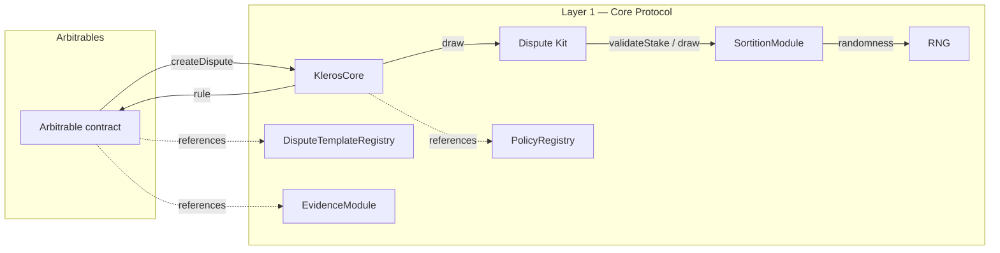

# Kleros v2 Protocol Overview

## Overview

Kleros v2 is a decentralized arbitration protocol. It settles disputes between parties by drawing jurors from a pool of staked token holders, collecting their votes, and producing a ruling that arbitrable contracts are expected to honor.

This document is the top-level entry point of the specification. It defines scope, actors, the trust model, and the high-level architecture. Detailed behavior is covered in per-component specifications organized into three layers.

## Layers

The specification is divided into three layers, each self-contained but building on the previous.

| Layer | Scope | Spec | Impl |
|-------|-------|------|------|
| **Layer 1 — Core Protocol** | Arbitrator, sortition, dispute kits, courts, on-chain metadata, and the integration surface exposed to arbitrable contracts. | draft | live |
| **Layer 2 — Cross-chain Disputes** | Gateways that allow arbitrable contracts on a foreign chain to obtain arbitration from the home chain. Target design uses Hashi with Vea as a fallback oracle. | placeholder | planned |
| **Layer 3 — Merge Phase** | Relays that migrate existing Kleros v1 dispute resolution on Ethereum and Gnosis to v2 transparently. Depends on Layer 2. | placeholder | planned |

## Goals

The v2 protocol is designed to satisfy the following goals. These are preserved from the original Courts v2.0 architecture document with obsolete items removed.

### 1. Cross-chain arbitration

The protocol MUST accept dispute requests from arbitrable contracts deployed on chains other than the home chain where the arbitrator is deployed. A dispute raised on a foreign chain is adjudicated on the home chain; the ruling is relayed back.

### 2. Modularity

The rules applied to resolve a dispute — juror drawing, vote aggregation, incentive distribution, and appeals — MUST be pluggable via **Dispute Kits**. New dispute kit implementations MUST be addable without modifying the arbitrator.

### 3. Fork-friendliness

The protocol MUST be deployable and operable as an independent instance by third parties, without coordination with the original deployment.

### 4. Lightweight staking token

The staking token (PNK) MUST be a standard ERC-20 token. Staking requires an explicit `approve` + `transferFrom` from the holder to the arbitrator. The arbitrator takes custody of staked tokens and releases them when they are no longer locked in a dispute or penalty.

### 5. Juror fraud protection

The protocol MUST support slashing of staked tokens in response to juror misbehavior. Slashing is invoked via governance-authorized calls on the arbitrator. Slashing primitives are specified in [layer-1-core/02-sortition.md](layer-1-core/02-sortition.md).

### 6. Evidence spam protection

The protocol MUST prevent unbounded on-chain evidence submissions from making dispute resolution prohibitively expensive. The canonical mechanism is to submit evidence off-chain (e.g. IPFS) and reference it on-chain by URI.

## Deferred goals

The following goals appear in the original Courts v2.0 architecture but are not currently implemented. They are recorded here for traceability. They carry no normative weight and are subject to revision when their specification is written.

- **Programmatic juror prosecution.** An on-chain mechanism that lets any party prove and submit juror misbehavior (e.g. pre-reveal disclosure, cartel coordination) and receive a bounty paid from slashed stake, without governance action. Out of scope for Layer 1 as currently specified; governance-authorized slashing (Goal 5) is the available mechanism today.

## Actors

The protocol recognizes the following actor roles. A single Ethereum address MAY occupy multiple roles simultaneously.

| Actor | Role |
|-------|------|
| **PNK holder** | Any address with a balance of the staking token. |
| **Juror** | A PNK holder who has staked in one or more courts and is therefore drawable for disputes. |
| **Party** | Anyone with a material stake in the outcome of a specific dispute (e.g. claimant, respondent). |
| **Appellant** | Anyone who funds an additional dispute round with more jurors; typically but not necessarily a party. |
| **Evidence submitter** | Anyone who submits evidence to an evidence group. |
| **Arbitrable integrator** | The developer of a contract that requests arbitration from the protocol. |
| **Governor** | A privileged address (typically a multisig or DAO-controlled contract) authorized to change protocol parameters and add or remove courts, dispute kits, and supported tokens. |

## Trust model

Trust flows as follows:

- **Arbitrable contracts trust `KlerosCore`** to produce and deliver a ruling.
- **`KlerosCore` trusts the sortition module** to maintain juror stakes and produce deterministic draws from the configured randomness source.
- **`KlerosCore` trusts dispute kits** to select jurors from the sortition module, aggregate votes correctly, and report per-juror coherence honestly.
- **`KlerosCore` trusts the governor** for all parameter changes; any such call from any other address MUST revert.
- **Jurors trust `KlerosCore`** to release their stake once it is no longer locked in an active dispute or pending penalty.
- **No actor is trusted to vote honestly.** Juror honesty is an emergent property of the incentive system (token-weighted drawing + coherence-based reward/penalty).

External dependencies (oracles, bridges, randomness sources) are not trusted to be always available. The protocol MUST operate correctly when any single external dependency degrades, either by using fallbacks or by surfacing the failure explicitly without losing state.

## Adversary model

The specifications below assume the following adversary classes. Each entry lists what the protocol defends against and what is assumed out of scope. Component-level specifications refine this model with component-specific assumptions.

| Adversary | Defended against | Out of scope |
|-----------|------------------|--------------|
| **Byzantine juror** — a single juror votes arbitrarily or abstains. | Token-weighted sortition plus coherence-based reward/penalty make a single byzantine juror unprofitable in expectation. | Jurors who know their selection in advance (sortition is pseudo-random over public state). |
| **Cartelized jurors** — a subset coordinates off-chain to vote together. | Appeals escalate to larger, token-weighted juror pools; cartel economics become unfavorable as rounds grow. | Cartels controlling a super-majority of staked PNK in the relevant court. |
| **Griefing arbitrable** — an arbitrable contract that requests disputes to exhaust juror time or drain appeal fees. | Arbitration fees are paid up-front per round; dispute creation is permissionless but not free. | Arbitrables with unbounded capital willing to burn it on griefing. |
| **Compromised governor** — the governor's key is stolen or misused. | Governor-privileged calls are confined to the parameter and registration surface; they cannot rewrite juror balances or overwrite dispute outcomes directly. | Protocol-wide economic security if the governor itself is malicious; operational security of the governor (key management, timelock) is not specified here. |
| **RNG withholder** — the primary randomness source stops responding. | The RNG subsystem uses at least one fallback path and surfaces failure without freezing state. | An attacker who controls every configured RNG source simultaneously. |
| **Stale bridge (Layer 2)** — cross-chain messages are delayed or dropped. | Layer 2 uses at least two bridging paths (Hashi with Vea as fallback) to preserve liveness. | A coordinated failure of every configured bridge. |

## Constraints

- **ERC-792 / ERC-1497 compatibility.** The integration surface for arbitrable contracts MUST be a superset of ERC-792 (Arbitrable) + ERC-1497 (Evidence), so existing arbitrables can migrate without redesign.
- **v1 compatibility.** Existing Kleros v1 arbitrables on Ethereum and Gnosis MUST be served transparently via the Layer 3 merge. Polygon is explicitly out of scope because v1 was never deployed there.
- **No hard dependency on a single infrastructure provider.** Bridges, randomness sources, and oracles MUST have at least one fallback path.
- **Dispute resolution timeliness.** New features MUST NOT delay ruling delivery to arbitrable contracts beyond bounds specified per-component.

## High-level architecture

**Notes on the diagram:**

- Layer 2 (foreign-chain arbitrables reaching `KlerosCore` via gateways) and Layer 3 (v1 arbitrables reaching v2 via the merge governor) are not shown here. See their respective overviews.
- `PolicyRegistry`, `DisputeTemplateRegistry`, and `EvidenceModule` are referenced by arbitrables and UIs; they do not sit on the critical ruling path.

## Component map

### Layer 1 — Core Protocol

| Component | Specification | Covers |
|-----------|---------------|--------|
| Arbitrator | [layer-1-core/01-arbitrator.md](layer-1-core/01-arbitrator.md) | `KlerosCore`, `IArbitratorV2` |
| Sortition | [layer-1-core/02-sortition.md](layer-1-core/02-sortition.md) | `SortitionModule`, `ISortitionModule`, `SortitionTrees` |
| Dispute Kits | [layer-1-core/03-dispute-kits.md](layer-1-core/03-dispute-kits.md) | `IDisputeKit`, `DisputeKitClassic` and variants |
| Courts | [layer-1-core/04-courts.md](layer-1-core/04-courts.md) | Court tree, parameters, eligibility |
| Integration surface | [layer-1-core/05-integration-surface.md](layer-1-core/05-integration-surface.md) | `IArbitratorV2`, `IArbitrableV2`, ERC-792 / ERC-1497 mapping |
| On-chain metadata | [layer-1-core/06-onchain-metadata.md](layer-1-core/06-onchain-metadata.md) | Policy JSON, Evidence JSON, Dispute Template JSON |

### Layer 2 — Cross-chain Disputes (placeholder)

See [layer-2-cross-chain/README.md](layer-2-cross-chain/README.md).

### Layer 3 — Merge Phase (placeholder)

See [layer-3-merge/README.md](layer-3-merge/README.md).

## Reading order

1. [_meta/conventions.md](_meta/conventions.md) — how to read and edit these docs.
2. This document.
3. [layer-1-core/00-overview.md](layer-1-core/00-overview.md) — Layer 1 entry point.
4. Individual Layer 1 specifications in the order suggested by their `depends_on` frontmatter.

## Security considerations

System-wide concerns are listed here. Component-specific concerns appear in each component's specification.

- **Randomness.** The protocol MUST NOT be freezable by a single randomness provider withholding results. See the RNG specification.
- **Governance capture.** The governor can change parameters that affect economic security. The governance configuration (multisig threshold, timelock, etc.) is out of scope for these specifications but MUST be documented in the deployment records.
- **Upgrades.** All upgradeable components use UUPS proxies. The upgrade authorization path is governor-only. Upgrade invariants (storage layout, initialization) are specified per-component.

## Related documents

- [_meta/conventions.md](_meta/conventions.md)
- [_meta/glossary.md](_meta/glossary.md)
- [_meta/open-questions.md](_meta/open-questions.md)
- [layer-1-core/00-overview.md](layer-1-core/00-overview.md)
- [layer-2-cross-chain/README.md](layer-2-cross-chain/README.md)
- [layer-3-merge/README.md](layer-3-merge/README.md)
