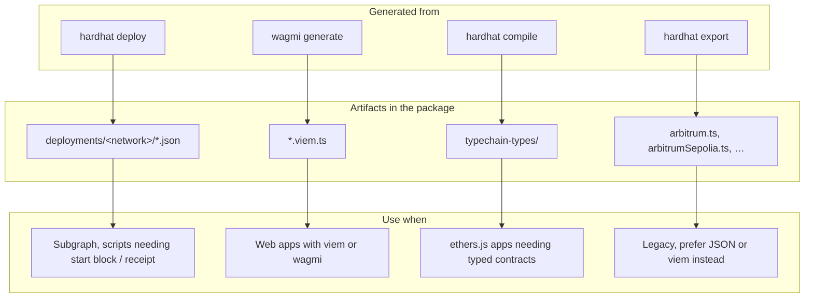

# Deployment artifacts guide

The package ships the same contract data in several formats. Pick the one that matches your tool, you usually only need **one**.

## Overview



## What each format is

| Format                 | Contains                                                  | Unique to this format                                      |
| ---------------------- | --------------------------------------------------------- | ---------------------------------------------------------- |
| **`*.json`**           | `address`, `abi`, deploy `receipt` (start block, tx hash) | Deployment metadata for indexers                           |
| **`*.viem.ts`**        | `fooAbi`, `fooAddress`, `fooConfig` per contract          | Multi-chain address maps, viem `as const` types            |
| **`typechain-types/`** | ethers factories + TS interfaces per compiled contract    | Typed ethers `connect()`, from **source**, not deployments |
| **`arbitrum.ts` etc.** | One object: all contracts on a network `{ address, abi }` | Nothing essential, same data as JSON, bundled              |

**Overlap:** ABI and address are duplicated across JSON, viem, and hardhat-export files. Typechain also embeds ABIs, but for every compiled contract (deployed or not).

## What to use when

| You are building…       | Use                         | Import path                                                         |
| ----------------------- | --------------------------- | ------------------------------------------------------------------- |
| Subgraph                | JSON                        | `@kleros/kleros-v2-contracts/deployments/<network>/KlerosCore.json` |
| React + viem / wagmi    | viem configs                | `@kleros/kleros-v2-contracts/viem`                                  |
| React + ethers          | typechain factory + address | `@kleros/kleros-v2-contracts/ethers` (or import factory directly, do note that factory does not include address, those have to be provided separately to the factory)    |
| Single ABI in a bundler | JSON                        | `@kleros/kleros-v2-contracts/deployments/.../Foo.json`              |
| Solidity project        | `.sol` sources              | `@kleros/kleros-v2-contracts/contracts/.../Foo.sol`                 |

**Avoid** importing from `@kleros/kleros-v2-contracts/deployments` (the root barrel) unless you need everything at once, it pulls in all networks and typechain.

---

## Examples

### JSON - subgraph / scripts

```ts
import klerosCore from "@kleros/kleros-v2-contracts/deployments/arbitrumSepoliaDevnet/KlerosCore.json";

const address = klerosCore.address;
const abi = klerosCore.abi;
const startBlock = klerosCore.receipt.blockNumber;
```

### viem - web app

```ts
import { devnetViem } from "@kleros/kleros-v2-contracts/viem";
import { getContract } from "viem";

const core = getContract({
  address: devnetViem.klerosCoreConfig.address[421614],
  abi: devnetViem.klerosCoreConfig.abi,
  client: publicClient,
});
```

Or use the helper:

```ts
import { getContracts } from "@kleros/kleros-v2-contracts/viem";

const contracts = getContracts(publicClient, walletClient, "devnet");
await contracts.klerosCore.read.disputeCount();
```

### ethers - typechain

```ts
import { KlerosCore__factory } from "@kleros/kleros-v2-contracts/ethers";
import { devnetViem } from "@kleros/kleros-v2-contracts/viem";

// Since factory does not ship with addresses, the consumer has to provide the address themselves. Here we use the viem artifact as an example.
const address = devnetViem.klerosCoreConfig.address[421614];
const core = KlerosCore__factory.connect(address, signer);

await core.disputeCount(); // typed
```

### Solidity

```solidity
import "@kleros/kleros-v2-contracts/contracts/arbitration/interfaces/IArbitratorV2.sol";
```

Solidity reads files from `node_modules/.../contracts/` — not from package `exports`.
