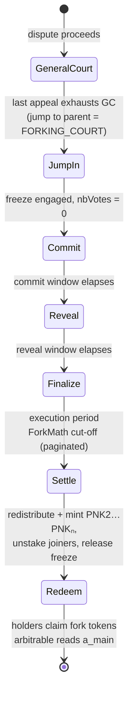
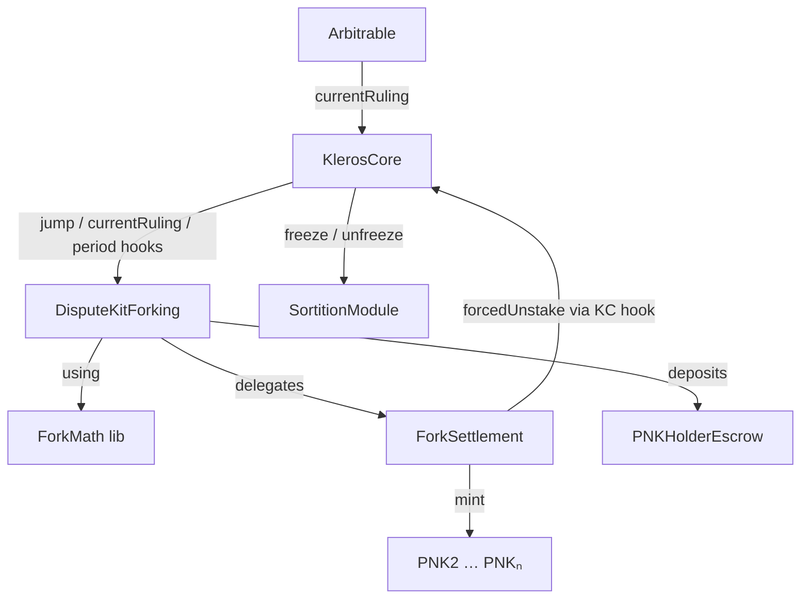

# Forking

## Overview

This document specifies the **forking mechanism**: the protocol's last-resort defense against a malicious majority of PNK. When a dispute exhausts all appeals in the General Court, it jumps to the **forking court** and a single, terminal **forking round** is held among *all* reachable PNK holders. That round determines the final ruling and, simultaneously, splits the token: the winning option continues as the **main fork** (the existing PNK and arbitrator), while each sufficiently-supported losing option spawns a **minority fork** - a new fork token (`PNK2 … PNKₙ`) in which the majority's holdings and the other minorities' holdings have been erased. The mechanism gives an honest minority an escape hatch into a universe where their preferred outcome won and their tokens retain value, without requiring them to first win the on-chain vote they are, by hypothesis, outnumbered in.

The design follows the Kleros yellow paper's forking proposal (§4.10), with one deliberate simplification adopted for this version: votes are **single-choice with a single threshold** rather than fully ranked. The consequences of that choice - and the path back to the richer ranked model - are recorded as non-guarantees and open questions.

> **Scope boundary.** This specification covers the mechanism through *settlement*: a settled main fork (ruling delivered, main-chain PNK redistributed) and correct **genesis balances** for each minority fork token, with joiners unstaked from the main fork. Standing up a *parallel arbitrator* on a fork token - deploying a forked court system, migrating open disputes, arbitrables switching arbitrator ([Q-013](../_meta/open-questions.md)) - is out of scope and tracked as future work ([Q-011](../_meta/open-questions.md), [Q-012](../_meta/open-questions.md), [Q-015](../_meta/open-questions.md)).

## Covers

- `contracts/src/arbitration/dispute-kits/DisputeKitForking.sol` - the dispute kit at the `KlerosCore` boundary (planned; an early draft exists).
- `ForkMath` - pure library for the single-largest-fork computation (planned).
- `ForkSettlement` - redistribution, fork-token genesis, and minting (planned; see [Q-007](../_meta/open-questions.md) on in-lining vs. splitting).
- `PNKHolderEscrow` - the tier-2 participation path (planned).
- Fork tokens `PNK2 … PNKₙ` - one ERC-20 per minority fork (planned).
- `contracts/src/arbitration/SortitionModule.sol` - the stake-freeze gate (modification).
- `contracts/src/arbitration/KlerosCore.sol` - forking-court guards and the unstake hook (modification).

## Guarantees

- **G-1 - Terminal round.** A dispute that exhausts General Court appeals MUST transition to a single forking round in `FORKING_COURT`, after which no further appeal is possible.
- **G-2 - Stake freeze.** From the moment a dispute enters the forking court until its settlement completes, no account's staked PNK balance MUST change.
- **G-3 - Ruling.** The stake-weighted plurality option of the forking round MUST become the dispute's final ruling (`a_main`) and MUST settle the arbitrable on the main fork.
- **G-4 - Largest fork.** For each losing option, the set of holders moved to its minority fork MUST be the maximal self-consistent set under the [removal fixed point](#fork-computation): every joiner's [forking threshold](../_meta/glossary.md) is satisfied by the resulting fork size, and no excluded co-voter could be added consistently.
- **G-5 - Supply equalization.** After settlement, each fork's total fork-token supply MUST equal the original total PNK supply.
- **G-6 - Single assignment.** Each participating holder MUST end on exactly one fork (the main fork or exactly one minority fork).
- **G-7 - Exit.** A fork joiner MUST be unstaked from the main fork, MUST receive a genesis balance of that fork's token, and their main-chain PNK MUST be redistributed to the main fork's participants.
- **G-8 - Participation incentive.** Staked or escrowed PNK whose holder does not reveal a vote MUST be slashed. Unstaked PNK whose holder does not vote MUST default to the main fork and MUST NOT receive the redistribution bonus.
- **G-9 - Hidden votes.** Forking-round votes MUST be cast under commit/reveal; a holder's `(choice, threshold)` MUST NOT be observable before the reveal period.

## Non-guarantees

- **Off-chain PNK is unreachable.** PNK held outside the arbitrator's home chain (Arbitrum) - e.g. on Ethereum or Gnosis - cannot be made to participate on-chain. The protocol does not enforce its inclusion; encouraging such holders to bridge and participate is a social-layer action only. (See tier 3 in [Actors](#actors-and-permissions).)
- **No clone independence.** Under single-choice plurality, splitting support across near-identical options can change the winner. The yellow paper's clone-independence (Prop. 5) and its strict ≥ T attack-resistance bound (Prop. 6) hold only for the ranked variant ([Q-009](../_meta/open-questions.md)).
- **Mitigation, not prevention.** Forking does not prevent a malicious majority from winning `a_main` on the main fork. It bounds the *consequence*: the honest minority escapes to a fork where their outcome won and the majority's tokens are void.
- **No parallel arbitrator.** This mechanism mints fork-token genesis balances; it does not deploy or bootstrap a working court system on a fork token (see [Scope boundary](#overview), [Q-011](../_meta/open-questions.md)).

## Actors and permissions

| Actor                                  | Role in forking                                                                                                                                                                                                   |
| -------------------------------------- | ----------------------------------------------------------------------------------------------------------------------------------------------------------------------------------------------------------------- |
| **Tier-1 holder** (PNK staker)         | Any account with staked PNK, drawn or not. Frozen `stakedPnk` is their vote weight. Participates by revealing a vote.                                                                                         |
| **Tier-2 holder** (Arbitrum, unstaked) | A PNK holder on the home chain without an active stake. Participates by depositing into `PNKHolderEscrow`; the deposit is their vote weight.                                                                    |
| **Tier-3 holder** (other chains)       | A PNK holder on a foreign chain. Unreachable on-chain - see Non-guarantees.                                                                                                                                       |
| **`KlerosCore`**                       | Routes the jump into the forking court, exposes `currentRuling`, drives the freeze, and exposes the guarded unstake hook used at settlement. Never learns fork internals.                                         |
| **`DisputeKitForking`**                | The dispute kit hosting the round: votes, period hooks, ruling, and (via composed units) computation, settlement, and minting.                                                                                  |
| **Governor**                           | Configures the forking court parameters (periods, hidden votes). Cannot alter a round in progress. Notably **not** a trusted gate on triggering a fork - see [Security considerations](#security-considerations). |

## Behavior

The forking round is **one terminal round** layered onto the existing `KlerosCore` period machine ([01-arbitrator](01-arbitrator.md)). The governing principle is *reuse the period progression verbatim; change only what the absence of juror drawing forces.*

Component boundary - `KlerosCore` talks only to the dispute kit; everything forking-specific is composed beneath it:

### Jump into the forking court

The forking court is `FORKING_COURT` (court `0`), the parent of the General Court. Reaching it is the existing *jump to parent* mechanic: when an appeal would exceed the General Court's `jurorsForCourtJump`, the next jump targets the parent, which is the forking court. On entry, `KlerosCore`:

1. Engages the [stake freeze](#stake-freeze) atomically (G-2).
2. Creates the forking round with `nbVotes = 0` (no drawing).
3. Forbids any subsequent appeal of this dispute (G-1).

The transition does **not** use the per-juror appeal-fee-to-votes formula of ordinary appeals; the forking round is funded and bounded differently because it has no drawn jurors. How the round is funded, and the exact entry trigger, are settled by the implementation guards in [Implementation impact](#implementation-impact-core--sortitionmodule-compatibility). The deterministic appeal-exhaustion trigger specified here MAY later be strengthened with a probabilistic element so that jurors cannot know which appeal is the last before a fork - recorded as [OPEN QUESTION Q-010].

### Stake freeze

While the round is live, the protocol **freezes staked-PNK balances**: `setStake` (juror-initiated, up or down), reward and penalty execution (`setStakeReward` / `setStakePenalty`), and delayed-stake processing are all blocked. Stake *locking* and *unlocking* (`lockStake` / `unlockStake`), juror *drawing*, and *ruling execution* (`executeRuling`) are **not** blocked, so concurrent disputes continue to draw and vote; only their reward/penalty settlement (`execute`) defers until the freeze lifts.

> **Rationale - freeze in place, do not copy.** Copying every staker's balance into round storage is O(N) gas and infeasible at protocol scale. Freezing mutation instead makes the *live* `stakedPnk` the vote snapshot, read per voter at reveal for no extra cost. The price is a bounded liveness cost on concurrent settlement, discussed under [Security considerations](#security-considerations). Whether to additionally bound the round's duration is [OPEN QUESTION Q-008].

### Vote: commit and reveal

Votes are **single-choice with a single threshold** and use commit/reveal (G-9), because the information edge for a late voter - who can see the forming tally - is high.

- **Commit.** A participant submits `hash(choice, threshold, salt)`. Tier-1 holders commit directly; tier-2 holders first deposit into `PNKHolderEscrow` (the deposit is their weight) and then commit. A holder may be both tier-1 and tier-2; weights are additive.
- **Reveal.** The participant reveals `(choice, threshold, salt)`. `choice` is one dispute option; `threshold` is the minimum fork size (in PNK weight) at which the holder is willing to join a minority fork where `choice` wins. Weight is the holder's frozen stake plus any escrow.

Whether the reserved option `0` (Invalid / Refuse-to-Arbitrate), which is always available in ordinary disputes, is a permissible `choice` in the forking round - as a winner, as a forkable minority option, and in interaction with tie semantics - is [OPEN QUESTION Q-003].

### Fork computation

Run at finalization (the `execution` period), paginated so it cannot exceed the gas limit.

#### **Winner (main fork)** 
The option with the greatest revealed weight is `a_main`, the final ruling (G-3). Every holder who voted `a_main` stays on the main fork. A winner tie is broken deterministically - lowest option ID is the leaning, recorded as [OPEN QUESTION Q-004].

#### **Minority forks - the removal fixed point**
For each **losing** option independently, take the holders who voted for it, with total weight `S`. Then, walking from the **highest** threshold downward, evict any member whose threshold exceeds the current `S` (subtracting their weight from `S`); stop at the first member whose threshold is satisfied. The survivors form the fork; if every member is evicted, the fork is empty and its voters stay on the main fork (G-4).

Because each holder votes for exactly one option, the per-option voter lists are **disjoint**. Every losing option with a non-empty survivor set therefore materializes its own minority fork **simultaneously** - there is no competition for members and no cross-fork iteration.

> **Yellow-paper mapping.** This is the paper's single-largest-fork rule (Prop. 4) specialized to single-choice votes. The paper's outer "find the largest fork, remove its members, repeat" loop exists to resolve members who, under *ranked* votes, are willing to join several forks at once. Single-choice votes remove that possibility, so all viable forks coexist - a genuine simplification the vote model buys. The ranked variant, which restores clone-independence and the strict attack-resistance bound, is [OPEN QUESTION Q-009].

**On-chain shape.** `ForkMath` maintains one threshold-sorted linked list per losing option. Insertion uses an IICO-style search hint (`search` / `searchAndBid`) to amortize ordering across reveals; finalization is the paginated descending cut-off walk. Complexity is `O(N)` amortized per option and `O(#A·N)` overall - far below the ranked model's `O(#A² N log N)`, which is why the optimistic off-chain fork-proposal verifier is not needed at this stage (also folded into [Q-009](../_meta/open-questions.md)).

#### Example 1 - binary, A wins

Eight holders; options A (winner) and B. B-voters and their `(threshold, weight)`: v3 (12, 12), v4 (30, 11), v5 (40, 9), v7 (20, 7). Total B weight = 39.

Removal walk, initial support 39:

| Step | Member (threshold) | Test vs. support | Action | Support |
|------|--------------------|------------------|--------|---------|
| 1 | v5 (40) | 40 > 39 | evict | 39 → 30 |
| 2 | v4 (30) | 30 ≤ 30 | keep, **stop** | 30 |

Survivors `{v3 (12), v7 (20), v4 (30)}` - all thresholds ≤ the final support 30 - form **B fork = 30**. v5 voted B but is cut off (40 > 39) and **stays on the main fork**. Main fork = 70.

Genesis (each fork scaled to the original total of 100, i.e. `weight / fork_size × 100`):

| Holder | Vote | Fork | Genesis on its fork |
|--------|------|------|---------------------|
| v1 (26) | A | main | 37.1 |
| v2 (20) | A | main | 28.6 |
| v6 (9) | A | main | 12.9 |
| v5 (9) | B | main (cut off) | 12.9 |
| v8 (6) | A | main | 8.6 |
| v3 (12) | B | B | 40.0 |
| v4 (11) | B | B | 36.7 |
| v7 (7) | B | B | 23.3 |

Main fork = 70 over five holders (v1, v2, v6, v8 voted A; v5 voted B but was cut off). A B-voter who stays on the main fork (v5) shares the main-fork bonus exactly as an A-voter does - placement, not vote, determines the bonus.

#### Example 2 - four options, A wins

Nine holders; options A (winner), B, C, D. Weight per option: A = 48, B = 20, **C = 23**, D = 9 → winner A. Per losing option:

| Option | Members `(threshold, weight)`, ascending | Removal result |
|--------|------------------------------------------|----------------|
| **C** | v3 (12, 12), v8 (15, 4), v7 (20, 7) | none evicted (12 ≤ 12, 15 ≤ 16, 20 ≤ 23) → **fork = 23** |
| B | v5 (15, 9), v4 (25, 11) | 25 > 20 evict v4 → 15 > 9 evict v5 → **empty** |
| D | v6 (10, 9) | 10 > 9 evict v6 → **empty** |

Only C forks. **Main fork A = 77** - every holder except the three C-joiners, including the B- and D-voters whose forks collapsed. Genesis: main `{v1 33.8, v2 26.0, v4 14.3, v5 11.7, v6 11.7, v9 2.6}`, C `{v3 52.2, v7 30.4, v8 17.4}`.

### Settlement

At settlement, `ForkSettlement`:

1. **Equalizes supply (G-5).** Each fork's token supply equals the original total. On every fork, the erased holders' mass is redistributed to that fork's **participants**, pro-rata by weight - except silent main-fork holders, who retain face value and receive no bonus (G-8). With full participation, this reduces to the `weight / fork_size × total` form used in the examples. The exact genesis basis - pure stake-snapshot pro-rata (the baseline assumed here) versus the paper's per-fork coherence replay of earlier rounds - is [OPEN QUESTION Q-002].
2. **Mints fork tokens.** For each non-empty minority fork, deploys/mints a fork token (`PNK2 … PNKₙ`) crediting each joiner their genesis balance.
3. **Exits joiners (G-7).** Unstakes each joiner from the main fork via the guarded `KlerosCore` hook; their main-chain PNK is the redistribution mass for the main fork.
4. **Slashes the silent (G-8).** Staked or escrowed PNK that did not reveal is removed; its destination - absorbed into the main-fork redistribution versus sent to the governor - is [OPEN QUESTION Q-006].
5. **Releases the freeze.**

Earlier appeal rounds require **no new redistribution code**: because `currentRuling` returns `a_main`, `KlerosCore`'s existing `execute` loop redistributes each prior round's PNK against the forking-determined winner automatically. The forking round itself performs no coherence redistribution. A holder who voted a losing option but stayed on the main fork suffers no *forking-round* penalty, though their *earlier-round* incoherence is still penalized normally; whether that is the intended end state is [OPEN QUESTION Q-005].

Unstaked PNK belonging to liquidity providers, market makers, or treasuries that did not participate stays at face value on the main fork. Whether a minority fork may additionally choose to mint to such entities 1:1 is a per-fork policy question, [OPEN QUESTION Q-014].

### Redemption

Holders of a minority fork claim their fork-token balance. The arbitrable and any dependent contracts read `currentRuling`, which returns `a_main`, and settle ETH on the main fork as usual. A minority fork that wishes to recreate and re-resolve the triggering dispute (with its own winning option already set) does so when its parallel arbitrator is bootstrapped - out of scope here, [OPEN QUESTION Q-015].

## Invariants

- **INV-1 - Frozen stability.** While the stake freeze is engaged, every account's `stakedPnk` is constant.
- **INV-2 - Cut-off correctness.** For each minority fork, every joiner's threshold ≤ the fork size, and the joiner set is maximal: no evicted co-voter of the same option could be re-added without violating some member's threshold.
- **INV-3 - Partition.** The forks partition the participating holders; the fork sizes sum to the total participating weight.
- **INV-4 - Supply conservation.** Each fork token's total supply equals the original total PNK supply, and each holder's weight is counted toward exactly one fork's genesis.
- **INV-5 - Exit completeness.** After settlement, a fork joiner's main-chain stake is zero.
- **INV-6 - Ruling stability.** `currentRuling` is stable once the `execution` period is reached (consistent with [01-arbitrator](01-arbitrator.md)).

## Error conditions

| Error | Condition | Actor impact |
|-------|-----------|--------------|
| `NotForkingCourt` | A forking operation is attempted on a dispute that is not in the forking court. | Caller's transaction reverts. |
| `WrongPeriod` | Commit, reveal, finalize, or settle is called outside its period. | Caller must wait for the correct period. |
| `StakingFrozen` | A staked-balance mutation (`setStake`, reward, penalty, delayed) is attempted while frozen. | Juror / concurrent `execute` reverts; retried after release. |
| `AlreadyRevealed` / `CommitMismatch` | A reveal does not match the prior commit, or is duplicated. | Vote rejected. |
| `NothingToReveal` | A reveal references a holder with no committed vote or no weight. | Reverts. |
| `AlreadyFinalized` / `AlreadySettled` | Finalization or settlement is repeated after completion. | Reverts. |
| `AppealNotAllowed` | An appeal is attempted on a dispute already in the forking court. | Reverts (G-1). |

## Events

| Event | Emitted when | Purpose |
|-------|--------------|---------|
| `ForkingRoundStarted` | Dispute enters the forking court and the round opens. | Signals freeze engaged and votes open. |
| `VoteCommitted` | A holder commits. | Off-chain tally of turnout. |
| `VoteRevealed` | A holder reveals `(choice, threshold, weight)`. | Drives the on-chain computation and UI. |
| `ForkFinalized` | The cut-off computation completes. | Publishes `a_main` and each minority fork's size/members. |
| `ForkTokenCreated` | A minority fork token is minted at genesis. | Announces a new `PNKₙ` and its address. |
| `ForkSettled` | Settlement completes and the freeze releases. | Marks redistribution, minting, and exits done. |

## Traceability

Implementation is planned; rows reference target contracts and are completed (with `contract:function:line`) as code lands.

| ID          | Statement                              | Implementation (planned)                                                              |
| ----------- | -------------------------------------- | ------------------------------------------------------------------------------------- |
| G-1         | Terminal round, no further appeal      | `KlerosCore.sol:appeal` / `appealCost` (forking-court guard)                          |
| G-2 / INV-1 | Stake freeze                           | `SortitionModule.sol:_setStake` (freeze guard), `:freeze` / `:unfreeze`               |
| G-3         | Plurality winner is the ruling         | `DisputeKitForking.sol:currentRuling`, `ForkMath`                                     |
| G-4 / INV-2 | Largest-fork cut-off                   | `ForkMath` (removal fixed point)                                                      |
| G-5 / INV-4 | Supply equalization                    | `ForkSettlement` (genesis)                                                            |
| G-6 / INV-3 | Single assignment / partition          | `ForkMath`, `ForkSettlement`                                                          |
| G-7 / INV-5 | Joiner exit + mint                     | `ForkSettlement`, `KlerosCore.sol` unstake hook → `SortitionModule.sol:forcedUnstake` |
| G-8         | Slash silent, default unstaked to main | `ForkSettlement`                                                                      |
| G-9         | Commit/reveal votes                    | `DisputeKitForking.sol` (commit/reveal)                                               |

## Verification

| ID | Test (planned) |
|----|----------------|
| INV-2 | `ForkMath.t.sol::testRemovalFixedPointExample1` (B fork = 30, v5 cut off) |
| INV-2 | `ForkMath.t.sol::testRemovalFixedPointExample2` (C fork = 23, B/D empty) |
| INV-2 | `ForkMath.t.sol::testEdgeCases` (empty fork, lone voter below own threshold, all-join, threshold ties) |
| INV-1 | `SortitionModule_Freeze.t.sol::testStakeMutationsRevertWhileFrozen` (and lock/draw still succeed; concurrent `execute` reverts then succeeds post-release) |
| G-5 / INV-4 | `ForkSettlement.t.sol::testEachForkSupplyEqualsOriginal` (examples 1 and 2) |
| G-7 / INV-5 | `ForkSettlement.t.sol::testJoinersUnstakedAndMinted` |
| G-1..G-3 | `Forking_Integration.t.sol::testFullLifecycle` (GC appeal exhaustion → jump → commit/reveal → finalize → settle → `currentRuling == a_main`) |

The two worked examples are the canonical `ForkMath` fixtures.

## Security considerations

- **51% resistance, and its limits.** Forking exists precisely for the case where a malicious majority can win the vote. It does not stop them winning `a_main`; it erases their tokens on the honest minority's fork. The yellow paper's quantitative resistance bound (Prop. 6) assumes ranked votes; under the single-choice model adopted here, that bound is weaker and clone-sensitive (see Non-guarantees, [Q-009](../_meta/open-questions.md)).
- **Last-round gaming.** Because the deterministic trigger makes the final appeal predictable, a juror who expects a fork may behave differently in the last ordinary round. A probabilistic trigger ([Q-010](../_meta/open-questions.md)) would remove that certainty.
- **Late-reveal information edge.** Commit/reveal (G-9) prevents a holder from observing the forming tally and the support behind each option before choosing their own `(choice, threshold)`.
- **Concurrent-settlement liveness (the freeze cost).** While a forking round is live, every *other* dispute's `execute` reverts (it would move frozen balances) and must be retried after the freeze releases. This is bounded by the forking court's period lengths and is the deliberate cost of an O(1) freeze-in-place over an O(N) snapshot copy. Bounding the round's duration is [Q-008](../_meta/open-questions.md).
- **No trusted gate.** Triggering a fork is permissionless given appeal exhaustion; it is intentionally **not** gated on governance, because the adversary the mechanism defends against may control governance in exactly the scenario where a fork is needed.

## Implementation impact (Core / SortitionModule compatibility)

The central question for an upgradeable deployment: *can forking be added without breaking the storage layout?* **Yes - the change is overwhelmingly additive.** No existing field is repurposed or reordered.

### Storage

**1. New contracts - bulk of state, zero upgrade risk.** All forking-specific storage (per-option threshold-sorted lists, revealed votes and weights, fork sizes, genesis allocations, escrow balances, fork-token addresses) lives in `DisputeKitForking` and its composed units - greenfield layout.

**2. `SortitionModule` - one appended flag.** A `bool stakingFrozen` (optionally a triggering `coreDisputeID` for events) appended after `totalStaked`. There is no contract-level `__gap`, but `SortitionModule` is the most-derived storage contract (its parents are OpenZeppelin `Initializable` / `UUPSProxiable`, namespaced and stable), so appending is upgrade-safe. Its `Juror` / `DelayedStake` structs are gap-less but **mapping-stored**, so appending to a struct's end would also be safe if per-juror forking state were ever required (not expected).

**3. `KlerosCore` - expected zero new top-level storage.** "Is this dispute forking?" is already derivable as `dispute.courtID == FORKING_COURT`. Critically, `Round` lives in a dynamic array (`Dispute.rounds`), where adding struct fields would normally corrupt the layout - but `Court`, `Dispute`, and `Round` each already carry a `uint256[10] __gap`. Any per-court/dispute/round forking marker we might later want consumes those reserved slots safely (~10 each). We do not expect to need them.

### Behavior - ordinary round vs. forking round

The forking round breaks two assumptions baked into the period machine (no juror is drawn), so a small number of `FORKING_COURT`-guarded changes are required. The forking court is already special-cased elsewhere (it cannot be staked into directly and cannot be a parent of another court), so these guards extend an existing pattern rather than introduce a new concept.

| # | Site | Ordinary assumption | Forking divergence | Change |
|---|------|---------------------|--------------------|--------|
| 1 | `appeal` / `appealCost` | jump funded per juror (`nbVotes = msg.value / feeForJuror`); forking jump returns `NON_PAYABLE_AMOUNT` | terminal jump; no per-juror fee model; `nbVotes = 0`; no further appeal | on jump to `FORKING_COURT`: set `nbVotes = 0`, engage freeze, bypass the fee→votes formula; forbid subsequent appeals |
| 2 | `passPeriod` (evidence exit) | requires `drawnJurors.length == nbVotes` | `0 == 0` holds | none - works; configure forking-court period timings |
| 3 | `draw` | draws jurors | safe no-op at `nbVotes = 0` | none - DK `draw` reverts or returns zero harmlessly |
| 4 | `execute` | `totalFeesForJurors / drawnJurors.length` | `len = 0` → division by zero | guard: short-circuit `execute` for the forking round (no Core-level coherence step) |
| 5 | `currentRuling` | DK returns the winner | forking DK returns `a_main` | none - DK routing works as-is |
| 6 | stake mutators | always allowed | must be frozen mid-round | new `freeze` / `unfreeze` (Core-only); guard blocks `setStake` / reward / penalty / delayed; concurrent `execute` reverts and is retried after release |
| 7 | settlement → unstake joiners | `forcedUnstake` is Core-only on the `SortitionModule` side | the forking DK must unstake joiners | **one genuine new Core entry point**: a `FORKING_COURT`-guarded path letting the forking DK drive `forcedUnstake` for joiners |
| 8 | `FORKING_COURT` configuration | court `0` is unconfigured | needs hidden votes, commit/reveal period lengths, zero appeal window | configure the forking court on deployment |

Only **#7** is a new Core function; #1/#4/#6 are guards on existing functions; #2/#3/#5 already work; #8 is configuration.

## Related documents

- [01-arbitrator](01-arbitrator.md) - periods, appeals, `currentRuling`, `execute`.
- [02-sortition](02-sortition.md) - staking, `stakedPnk`, the freeze surface.
- [03-dispute-kits](03-dispute-kits.md) - the `IDisputeKit` boundary forking implements.
- [04-courts](04-courts.md) - the court tree and the forking court's place at its root.
- [_meta/open-questions](../_meta/open-questions.md) - Q-002 … Q-015.
- [_meta/glossary](../_meta/glossary.md) - forking terms.
