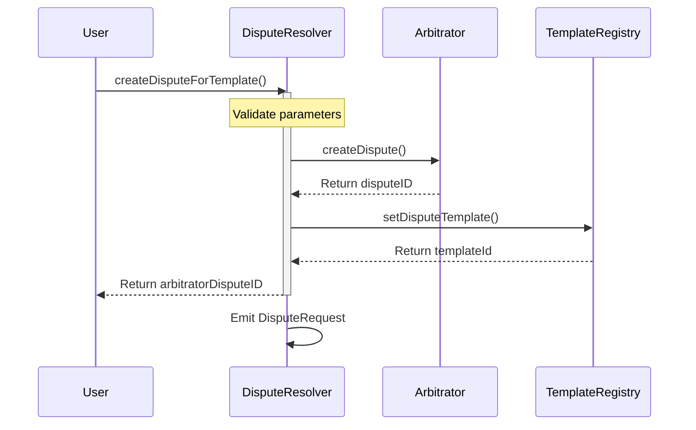
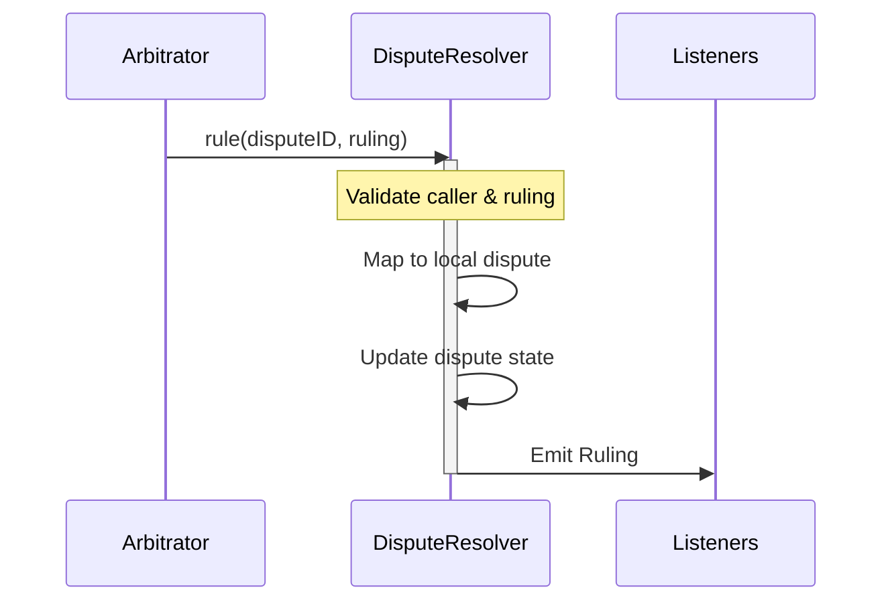

# 🤝 Arbitrable V2

## 📋 Overview

The Arbitrable interface (`IArbitrableV2`) and its reference implementation (`DisputeResolver`) are key components of the Kleros V2 protocol that enable contracts to create and handle disputes. The Arbitrable pattern allows any contract to request arbitration from a Kleros court while maintaining flexibility in how they handle rulings.

## 📑 Table of Contents

1. [🔍 Interface Specification](#-interface-specification)
   - [Events](#events)
   - [Core Methods](#core-methods)
2. [📝 DisputeResolver Implementation](#-disputeresolver-implementation)
   - [Dispute Creation](#dispute-creation)
   - [Ruling Handling](#ruling-handling)
   - [Dispute Templates](#dispute-templates)
3. [🔄 Interactions](#-interactions)
   - [Dispute Creation Flow](#dispute-creation-flow)
   - [Ruling Flow](#ruling-flow)

## 🔍 Interface Specification

The `IArbitrableV2` interface defines the minimum requirements for a contract to interact with Kleros courts. It specifies how disputes are created and how rulings are received.

### Events

The interface defines two key events that enable tracking of dispute lifecycle and rulings:

#### DisputeRequest

```solidity
event DisputeRequest(
  IArbitratorV2 indexed _arbitrator,
  uint256 indexed _arbitratorDisputeID,
  uint256 _externalDisputeID,
  uint256 _templateId,
  string _templateUri
);
```

Emitted when a new dispute is created. This event serves two critical purposes:

1. Links the dispute to its evidence template
2. Provides traceability between different dispute identifiers

Parameters:

- `_arbitrator`: The Kleros court contract that will arbitrate the dispute
- `_arbitratorDisputeID`: The unique identifier of the dispute in the arbitrator's contract
- `_externalDisputeID`: A local identifier for the dispute in the arbitrable contract, allowing correlation between arbitrator and arbitrable dispute IDs
- `_templateId`: The identifier of the dispute template in the template registry (mutually exclusive with `_templateUri`)
- `_templateUri`: Direct URI to the dispute template, e.g., IPFS path '/ipfs/...' (mutually exclusive with `_templateId`)

Note: Either `_templateId` or `_templateUri` should be used, but not both. This flexibility allows for both on-chain template registry and direct template URI references.

#### Ruling

```solidity
event Ruling(IArbitratorV2 indexed _arbitrator, uint256 indexed _disputeID, uint256 _ruling);
```

Emitted when the arbitrator gives a ruling on a dispute. This event must be emitted by the arbitrable contract when it receives and processes a ruling.

Parameters:

- `_arbitrator`: The Kleros court contract that made the ruling (indexed for efficient filtering)
- `_disputeID`: The identifier of the dispute in the arbitrator's contract (indexed for efficient filtering)
- `_ruling`: The ruling value given by the arbitrators where:
  - `0`: Indicates "Refused to rule" or "Unable to rule"
  - `1` to `numberOfChoices`: The actual ruling value corresponding to the dispute's choices

Note: The ruling value's meaning is dispute-specific and should be interpreted according to the dispute's context and template.

### Dispute Templates

The DisputeResolver uses a structured template system to provide clear information about disputes to jurors. Templates are either stored in the template registry or referenced directly via URI.

#### Template Structure

A dispute template is a JSON document with the following structure:

```json
{
  "title": "string", // Clear, concise title of the dispute
  "description": "string", // Detailed description of the case
  "question": "string", // The specific question jurors must answer
  "category": "string", // The type/category of dispute
  "answers": [
    // Possible rulings jurors can choose from
    {
      "title": "string", // Short answer (e.g., "Yes", "No")
      "id": "string", // Unique identifier (e.g., "0x1")
      "description": "string" // Detailed explanation of this choice
    }
  ],
  "version": "string", // Template format version
  "policyURI": "string", // Link to applicable policy document
  "arbitratorAddress": "string", // Address of the Kleros court
  "arbitratorChainID": "string" // Chain ID where the court exists
}
```

#### Example Template

Here's an example of a dispute template for a residential lease dispute:

```json
{
  "title": "Ms. Jamie Zachreson v. Mr. Craig Veale: Appeal of Prior Decision",
  "description": "Appeal of a residential lease dispute regarding lease violation and rent refund...",
  "question": "Did Mr. Craig Veale violate the terms of the lease agreement in a way that justified Ms. Jamie Zachreson terminating the tenancy and withholding the rent and deposit?",
  "category": "Residential lease",
  "answers": [
    {
      "title": "Yes",
      "id": "0x1",
      "description": "In favor of Ms. Jamie Zachreson: The lease included a valid and enforceable clause..."
    },
    {
      "title": "No",
      "id": "0x2",
      "description": "In favor of Mr. Craig Veale: The lease did not include the disputed clause..."
    },
    {
      "title": "Partially",
      "id": "0x3",
      "description": "Split Responsibility: Return partial payment..."
    },
    {
      "title": "Not enough evidence",
      "id": "0x4",
      "description": "Insufficient evidence to determine..."
    },
    {
      "title": "Refuse to arbitrate",
      "id": "0x5",
      "description": "Case ineligible for arbitration..."
    }
  ],
  "version": "1.0",
  "policyURI": "/ipfs/QmcDrvCaXtae4o6KgXYhi4yLKm5JYQSRQdZ9itbnASbsb9",
  "arbitratorAddress": "0x991d2df165670b9cac3B022f4B68D65b664222ea",
  "arbitratorChainID": "42161"
}
```

Key aspects of templates:

- The `answers` array corresponds to valid ruling values (1 to N)
- Each answer must have a clear title and detailed description
- The `question` should be specific and answerable based on the options
- Templates can be stored:
  1. On-chain in the template registry (referenced by `templateId`)
  2. Off-chain (referenced by `templateUri`, typically IPFS)
- The number of answers must match `numberOfRulingOptions` in the dispute creation

### Core Methods

```solidity
function rule(uint256 _disputeID, uint256 _ruling) external;
```

- Called by the arbitrator to give a ruling
- Must verify caller is the arbitrator
- `_ruling` of 0 is reserved for "Unable/unwilling to make a decision"

## 📝 DisputeResolver Implementation

The `DisputeResolver` contract provides a reference implementation of `IArbitrableV2` that can be used directly or as a base for more complex arbitrable contracts.

### Dispute Creation

Two methods for creating disputes:

1. **Template-based Creation**:

```solidity
function createDisputeForTemplate(
    bytes calldata _arbitratorExtraData,
    string calldata _disputeTemplate,
    string memory _disputeTemplateDataMappings,
    uint256 _numberOfRulingOptions
) external payable returns (uint256 disputeID)
```

2. **URI-based Creation**:

```solidity
function createDisputeForTemplateUri(
    bytes calldata _arbitratorExtraData,
    string calldata _disputeTemplateUri,
    uint256 _numberOfRulingOptions
) external payable returns (uint256 disputeID)
```

Key aspects:

- Both methods require arbitration fees to be sent with the call
- At least 2 ruling options must be specified
- Creates both local and arbitrator-side dispute records
- Emits `DisputeRequest` with template information

### Ruling Handling

The `rule` function implementation:

- Verifies the caller is the arbitrator
- Maps arbitrator dispute ID to local ID
- Validates the ruling is within allowed options
- Prevents duplicate rulings
- Updates dispute state and emits `Ruling` event

## 🔄 Interactions

### Dispute Creation Flow



### Ruling Flow



The DisputeResolver provides a foundation for creating arbitrable contracts in the Kleros ecosystem. It handles the core functionality of dispute creation and ruling management while allowing derived contracts to add custom business logic.

### Dispute Templates

**:warning: TODO: add the generic specification for Dispute Templates and Mappings**

#### Template Structure

**:warning: THIS TEMPLATE DOES NOT LOOK COMPLIANT WITH THE SDK SCHEMA**

```json
{
  "title": "string", // Clear, concise title of the dispute
  "description": "string", // Detailed description of the case
  "question": "string", // The specific question jurors must answer
  "category": "string", // The type/category of dispute
  "answers": [
    // Possible rulings jurors can choose from
    {
      "title": "string", // Short answer (e.g., "Yes", "No")
      "id": "string", // Unique identifier (e.g., "0x1")
      "description": "string" // Detailed explanation of this choice
    }
  ],
  "version": "string", // Template format version
  "policyURI": "string", // Link to applicable policy document
  "arbitratorAddress": "string", // Address of the Kleros court
  "arbitratorChainID": "string" // Chain ID where the court exists
}
```

#### Example Template

```json
{
  "title": "Ms. Jamie Zachreson v. Mr. Craig Veale: Appeal of Prior Decision",
  "description": "Appeal of a residential lease dispute regarding lease violation and rent refund...",
  "question": "Did Mr. Craig Veale violate the terms of the lease agreement in a way that justified Ms. Jamie Zachreson terminating the tenancy and withholding the rent and deposit?",
  "category": "Residential lease",
  "answers": [
    {
      "title": "Yes",
      "id": "0x1",
      "description": "In favor of Ms. Jamie Zachreson: The lease included a valid and enforceable clause..."
    },
    {
      "title": "No",
      "id": "0x2",
      "description": "In favor of Mr. Craig Veale: The lease did not include the disputed clause..."
    },
    {
      "title": "Partially",
      "id": "0x3",
      "description": "Split Responsibility: Return partial payment..."
    },
    {
      "title": "Not enough evidence",
      "id": "0x4",
      "description": "Insufficient evidence to determine..."
    },
    {
      "title": "Refuse to arbitrate",
      "id": "0x5",
      "description": "Case ineligible for arbitration..."
    }
  ],
  "version": "1.0",
  "policyURI": "/ipfs/QmcDrvCaXtae4o6KgXYhi4yLKm5JYQSRQdZ9itbnASbsb9",
  "arbitratorAddress": "0x991d2df165670b9cac3B022f4B68D65b664222ea",
  "arbitratorChainID": "42161"
}
```

Key aspects of templates:

- The `answers` array corresponds to valid ruling values (1 to N)
- Each answer must have a clear title and detailed description
- The `question` should be specific and answerable based on the options
- Templates can be stored:
  1. On-chain in the template registry (referenced by `templateId`)
  2. Off-chain (referenced by `templateUri`, typically IPFS)
- The number of answers must match `numberOfRulingOptions` in the dispute creation
