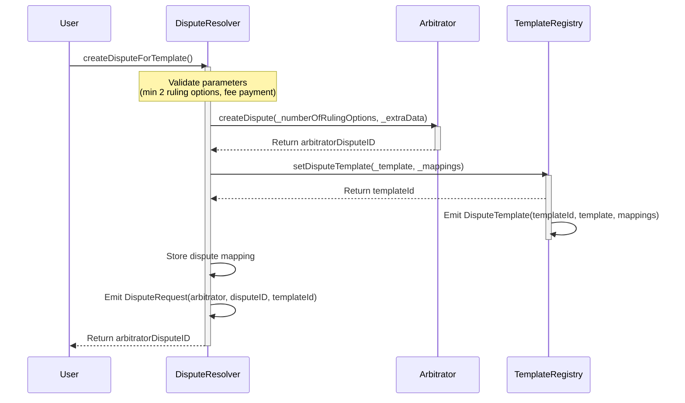
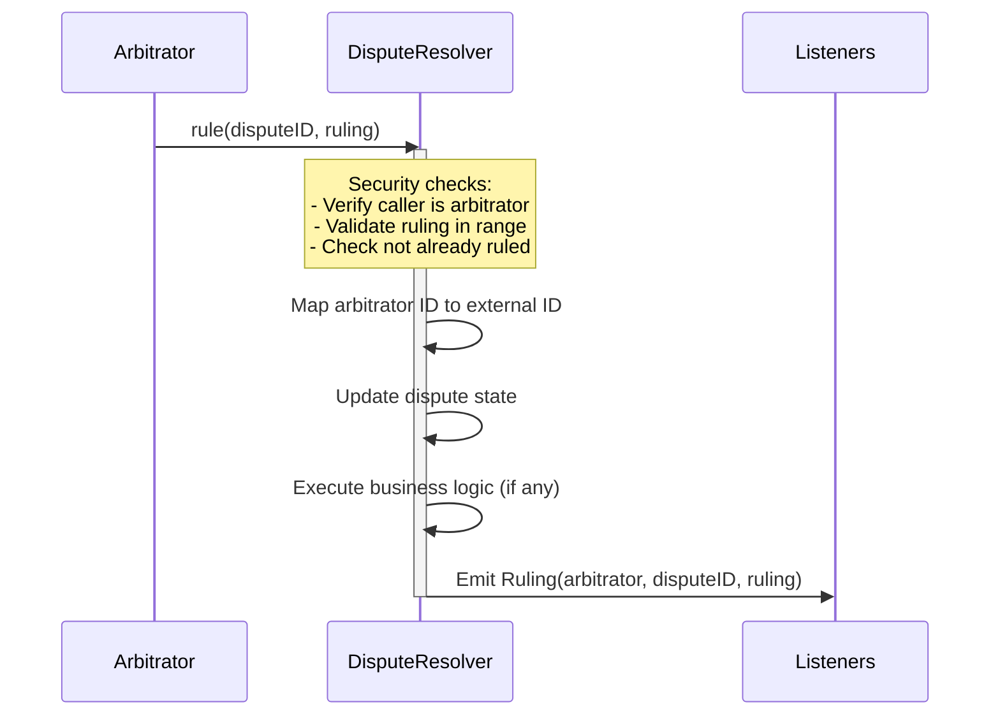

# 🤝 Arbitrable V2

> Last updated: 2026-03-14 | Based on: kleros-v2 contracts @ dev branch

## 📋 Overview

The Arbitrable interface (`IArbitrableV2`) and its reference implementation (`DisputeResolver`) are key components of the Kleros V2 protocol that enable contracts to create and handle disputes. The Arbitrable pattern allows any contract to request arbitration from a Kleros court while maintaining flexibility in how they handle rulings.

## 📑 Table of Contents

1. [🔍 Interface Specification](#-interface-specification)
   - [Events](#events)
   - [Core Methods](#core-methods)
2. [📝 DisputeResolver Implementation](#-disputeresolver-implementation)
   - [Dispute Creation](#dispute-creation)
   - [Ruling Handling](#ruling-handling)
   - [Dispute Templates](#dispute-templates)
3. [🔄 Interactions](#-interactions)
   - [Dispute Creation Flow](#dispute-creation-flow)
   - [Ruling Flow](#ruling-flow)
4. [🎯 Template System Integration](#-template-system-integration)
   - [Template Registry](#template-registry)
   - [Direct URI References](#direct-uri-references)

## 🔍 Interface Specification

The `IArbitrableV2` interface defines the minimum requirements for a contract to interact with Kleros courts. It specifies how disputes are created and how rulings are received.

### Events

The interface defines two key events that enable tracking of dispute lifecycle and rulings:

#### DisputeRequest

```solidity
event DisputeRequest(
    IArbitratorV2 indexed _arbitrator,
    uint256 indexed _arbitratorDisputeID,
    uint256 _templateId
);
```

Emitted when a new dispute is created. This event serves two critical purposes:

1. Links the dispute to its evidence template
2. Provides traceability between arbitrator and arbitrable dispute identifiers

**Parameters**:

- `_arbitrator`: The Kleros court contract that will arbitrate the dispute
- `_arbitratorDisputeID`: The unique identifier of the dispute in the arbitrator's contract (indexed for efficient filtering)
- `_templateId`: The identifier of the dispute template in the `DisputeTemplateRegistry`

**Key Changes in V2**:
- Simplified to only reference template ID from the registry
- Removed external dispute ID mapping (handled internally by implementations)
- Streamlined for better gas efficiency and simpler integration

#### Ruling

```solidity
event Ruling(IArbitratorV2 indexed _arbitrator, uint256 indexed _disputeID, uint256 _ruling);
```

Emitted when the arbitrator gives a ruling on a dispute. This event must be emitted by the arbitrable contract when it receives and processes a ruling.

**Parameters**:

- `_arbitrator`: The Kleros court contract that made the ruling (indexed for efficient filtering)
- `_disputeID`: The identifier of the dispute in the arbitrator's contract (indexed for efficient filtering)
- `_ruling`: The ruling value given by the arbitrators where:
  - `0`: Indicates "Refused to rule" or "Unable to rule"
  - `1` to `numberOfChoices`: The actual ruling value corresponding to the dispute's choices

### Core Methods

The interface defines one essential method that arbitrable contracts must implement:

```solidity
function rule(uint256 _disputeID, uint256 _ruling) external;
```

**Purpose**: Called by the arbitrator to deliver the final ruling on a dispute.

**Parameters**:
- `_disputeID`: The identifier of the dispute in the arbitrator's contract
- `_ruling`: The ruling value (0 = refused to rule, 1+ = actual ruling)

**Implementation Requirements**:
- Must verify that `msg.sender` is the expected arbitrator
- Should handle ruling value 0 as "unable to make a decision"
- Must emit the `Ruling` event
- Should implement appropriate business logic for the ruling

## 📝 DisputeResolver Implementation

The `DisputeResolver` contract provides a reference implementation of `IArbitrableV2` that can be used directly or as a base for more complex arbitrable contracts.

### Dispute Creation

The DisputeResolver supports template-based dispute creation:

```solidity
function createDisputeForTemplate(
    bytes calldata _arbitratorExtraData,
    string calldata _disputeTemplate,
    string memory _disputeTemplateDataMappings,
    uint256 _numberOfRulingOptions
) external payable returns (uint256 disputeID)
```

**Parameters**:
- `_arbitratorExtraData`: Encoded court ID, min jurors, and dispute kit ID
- `_disputeTemplate`: JSON template describing the dispute structure
- `_disputeTemplateDataMappings`: JSON mapping for template variables
- `_numberOfRulingOptions`: Number of possible ruling outcomes (must be ≥ 2)

**Process**:
1. Validates input parameters
2. Creates dispute in the arbitrator contract
3. Registers template in the `DisputeTemplateRegistry`
4. Emits `DisputeRequest` event with template ID
5. Returns the arbitrator's dispute ID

**Gas Considerations**:
- Template registration happens in the same transaction
- Consider template reuse to save gas on repeated dispute types
- Large templates may impact gas costs

### Ruling Handling

```solidity
function rule(uint256 _disputeID, uint256 _ruling) external override
```

**Implementation Features**:
- Validates caller is the arbitrator contract
- Maps arbitrator dispute ID to internal tracking
- Validates ruling is within expected range
- Prevents duplicate rulings on the same dispute
- Updates internal dispute state
- Emits `Ruling` event

**Security Checks**:
```solidity
if (msg.sender != address(arbitrator)) revert OnlyArbitrator();
if (_ruling > numberOfRulingOptions) revert InvalidRuling();
if (disputes[externalDisputeID].isRuled) revert DisputeAlreadyRuled();
```

### Dispute Templates

The DisputeResolver integrates with the template system to provide structured dispute information:

#### Template Structure

```typescript
{
  title: string;        // Clear, concise dispute title
  description: string;  // Detailed case description
  question: string;     // Specific question for jurors
  category: string;     // Dispute type/category
  answers: Array<{      // Possible ruling options
    title: string;      // Short answer (e.g., "Yes", "No")
    id: string;         // Unique identifier
    description: string; // Detailed explanation
  }>;
  version: string;      // Template format version
  policyURI: string;    // Link to applicable policy
  arbitratorAddress: string; // Kleros court address
  arbitratorChainID: string; // Blockchain network ID
}
```

#### Template Data Mappings

Templates support variable substitution through data mappings:

```json
{
  "disputeID": "123",
  "plaintiff": "Alice",
  "defendant": "Bob",
  "amount": "1000 USDC",
  "contractAddress": "0x..."
}
```

These mappings allow reusable templates with case-specific information.

## 🔄 Interactions

### Dispute Creation Flow


```mermaid
sequenceDiagram
    participant User
    participant DisputeResolver
    participant KlerosCore as Arbitrator
    participant TemplateRegistry

    User->>DisputeResolver: createDisputeForTemplate()
    activate DisputeResolver
    
    Note over DisputeResolver: Validate parameters<br/>(min 2 ruling options, fee payment)
    
    DisputeResolver->>KlerosCore: createDispute(_numberOfRulingOptions, _extraData)
    activate KlerosCore
    KlerosCore-->>DisputeResolver: Return arbitratorDisputeID
    deactivate KlerosCore
    
    DisputeResolver->>TemplateRegistry: setDisputeTemplate(_template, _mappings)
    activate TemplateRegistry
    TemplateRegistry-->>DisputeResolver: Return templateId
    TemplateRegistry->>TemplateRegistry: Emit DisputeTemplate(templateId, template, mappings)
    deactivate TemplateRegistry
    
    DisputeResolver->>DisputeResolver: Store dispute mapping
    DisputeResolver->>DisputeResolver: Emit DisputeRequest(arbitrator, disputeID, templateId)
    
    DisputeResolver-->>User: Return arbitratorDisputeID
    deactivate DisputeResolver
```

### Ruling Flow


```mermaid
sequenceDiagram
    participant KlerosCore as Arbitrator
    participant DisputeResolver
    participant Listeners

    KlerosCore->>DisputeResolver: rule(disputeID, ruling)
    activate DisputeResolver
    
    Note over DisputeResolver: Security checks:<br/>- Verify caller is arbitrator<br/>- Validate ruling in range<br/>- Check not already ruled
    
    DisputeResolver->>DisputeResolver: Map arbitrator ID to external ID
    DisputeResolver->>DisputeResolver: Update dispute state
    DisputeResolver->>DisputeResolver: Execute business logic (if any)
    
    DisputeResolver->>Listeners: Emit Ruling(arbitrator, disputeID, ruling)
    
    deactivate DisputeResolver
```

## 🎯 Template System Integration

### Template Registry

The `DisputeTemplateRegistry` provides centralized template management:

#### Registration Process

```solidity
function setDisputeTemplate(
    string memory _templateTag,
    string memory _templateData,
    string memory _templateDataMappings
) external returns (uint256 templateId)
```

**Features**:
- Templates are immutable once registered
- Each template gets a unique incrementing ID
- Templates are publicly accessible by ID
- Events enable indexing and discovery

#### Template Event

```solidity
event DisputeTemplate(
    uint256 indexed templateId,
    string templateTag,
    string templateData,
    string templateDataMappings
);
```

This event enables:
- Off-chain indexing of templates
- Template discovery and browsing
- Historical template tracking
- Integration with dispute browsers

### Direct URI References

For flexibility, arbitrable contracts can also reference templates directly:

```solidity
function createDisputeForTemplateUri(
    bytes calldata _arbitratorExtraData,
    string calldata _disputeTemplateUri,
    uint256 _numberOfRulingOptions
) external payable returns (uint256 disputeID)
```

**Use Cases**:
- Large templates that exceed transaction size limits
- Templates hosted on IPFS or other decentralized storage
- Private or proprietary dispute formats
- Integration with external template systems

**Example URI formats**:
- IPFS: `/ipfs/QmHash...`
- HTTP: `https://templates.example.com/dispute/123`
- Custom protocols: `template://registry/identifier`

## 🔧 Implementation Best Practices

### For Arbitrable Contract Developers

1. **Ruling Validation**:
   ```solidity
   modifier onlyArbitrator() {
       require(msg.sender == address(arbitrator), "Only arbitrator");
       _;
   }
   
   function rule(uint256 _disputeID, uint256 _ruling) external onlyArbitrator {
       require(_ruling <= numberOfChoices[_disputeID], "Invalid ruling");
       require(!isRuled[_disputeID], "Already ruled");
       // Implementation logic
   }
   ```

2. **Template Reuse**:
   - Create standardized templates for common dispute types
   - Use template data mappings for case-specific information
   - Consider gas costs when deciding between template registration vs. URI references

3. **Event Emission**:
   ```solidity
   emit DisputeRequest(arbitrator, disputeID, templateId);
   emit Ruling(arbitrator, disputeID, ruling);
   ```

4. **Error Handling**:
   - Handle ruling value 0 (refused to arbitrate) appropriately
   - Implement fallback mechanisms for disputed states
   - Consider partial resolutions for complex disputes

### Security Considerations

1. **Arbitrator Verification**: Always verify the caller is the expected arbitrator
2. **Ruling Range Validation**: Ensure rulings are within the expected range
3. **Reentrancy Protection**: Use appropriate guards for state-changing operations
4. **Template Integrity**: Validate template structure before dispute creation

## 🔗 Related Components

- **Core Arbitration**:
  - `IArbitratorV2`: The arbitrator interface this connects to
  - `KlerosCore`: Main arbitrator implementation

- **Template System**:
  - `DisputeTemplateRegistry`: Centralized template storage
  - `EvidenceModule`: Evidence submission and formatting

- **Supporting Infrastructure**:
  - IPFS: For large template storage
  - Indexing services: For template discovery and dispute browsing