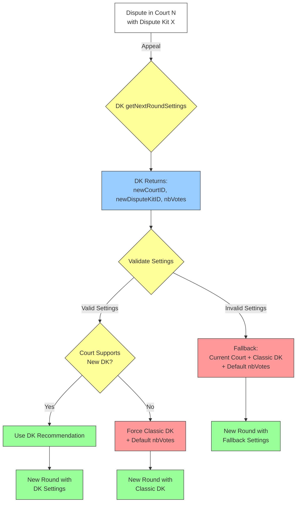

# 👨‍⚖️ Arbitrator V2

> Last updated: 2026-03-14 | Based on: kleros-v2 contracts @ dev branch

## 📋 Overview

The `IArbitratorV2` interface defines the standard interface for arbitration in the Kleros V2 protocol. Unlike its predecessor ERC-792, this standard is not concerned with appeals, allowing each arbitrator to implement an appeal system that best suits its needs.

## 📑 Table of Contents

1. [💫 Typical Flow](#-typical-flow)
   - [Dispute Lifecycle Sequence](#dispute-lifecycle-sequence)
2. [🔄 Court and Dispute Kit Jumps](#-court-and-dispute-kit-jumps)
   - [Jump Flow Diagram](#jump-flow-diagram)
   - [Court Jump Mechanism](#court-jump-mechanism)
   - [Dispute Kit Jump Mechanism](#dispute-kit-jump-mechanism)
3. [📦 Extra Data Format](#-extra-data-format)
   - [Encoding Structure](#1-encoding-structure)
   - [Parameter Details](#2-parameter-details)
   - [Usage Notes](#4-usage-notes)
4. [💰 Fee Token Support](#-fee-token-support)
   - [Payment Methods](#1-payment-methods)
   - [Exchange Rates](#2-exchange-rates)
   - [Implementation Considerations](#3-implementation-considerations)
5. [🪙 Autostaking PNK Rewards](#-autostaking-pnk-rewards)
   - [Mechanism](#mechanism)
   - [Fallback Behavior](#fallback-behavior)
   - [Benefits](#benefits)
6. [⏸️ Arbitration Pause System](#️-arbitration-pause-system)
   - [Grace Period Mechanism](#grace-period-mechanism)
   - [Appeal Period Adjustments](#appeal-period-adjustments)
7. [🛡️ Access Control Features](#️-access-control-features)
   - [Arbitrable Whitelist](#arbitrable-whitelist)
   - [Juror NFT Eligibility](#juror-nft-eligibility)
8. [🔄 Events](#-events)
   - [DisputeCreation](#disputecreation)
   - [Ruling](#ruling)
   - [AcceptedFeeToken](#acceptedfeetoken)
   - [ArbitrationUnpaused](#arbitrationunpaused)
9. [🔧 Core Methods](#-core-methods)
   - [Dispute Creation and Cost Methods](#dispute-creation-and-cost-methods)
   - [Staking and Drawing](#staking-and-drawing)
   - [Dispute Lifecycle Management](#dispute-lifecycle-management)
   - [Current Ruling](#current-ruling)
10. [🛡️ Emergency Controls](#️-emergency-controls)
    - [Roles and Permissions](#roles-and-permissions)
    - [Pause Mechanism](#pause-mechanism)
    - [Impact of Pausing](#impact-of-pausing)
11. [🔗 Related Components](#-related-components)
12. [🔒 Security Considerations](#-security-considerations)

## 💫 Typical Flow

1. **Dispute Creation**

   - Arbitrable contract calls `createDispute`
   - Pays arbitration fees (ETH or ERC20)
   - Dispute is created with specified court and parameters
   - Jurors are drawn based on court configuration

2. **Dispute Resolution**

   - Follows court-specific periods:
     1. Evidence submission
     2. Commit (if hidden votes)
     3. Vote
     4. Appeal
     5. Execution

3. **Court and Dispute Kit Jumps**

   - During appeals, disputes can:
     1. Move to parent courts (Court Jump)
     2. Switch dispute resolution mechanisms (Dispute Kit Jump)
   - Triggered when:
     - Number of jurors reaches `jurorsForCourtJump`
     - Parent court doesn't support current dispute kit

4. **Ruling Execution**
   - Final ruling determined through `currentRuling`
   - Ruling executed on arbitrable contract
   - Rewards distributed to coherent jurors
   - **New**: PNK rewards auto-staked when possible

### Dispute Lifecycle Sequence

```mermaid
sequenceDiagram
    participant Arbitrable
    participant Juror
    participant KlerosCore
    participant DisputeKit
    participant SortitionModule

    Note over Arbitrable,SortitionModule: 1. Dispute Creation
    Arbitrable->>KlerosCore: createDispute(choices, extraData)
    KlerosCore->>SortitionModule: createDisputeHook()
    KlerosCore->>DisputeKit: createDispute()
    KlerosCore-->>KlerosCore: emit DisputeCreation

    Note over Arbitrable,SortitionModule: 2. Evidence Period
    loop Drawing until nbVotes reached
        KlerosCore->>DisputeKit: draw()
        DisputeKit-->>KlerosCore: drawnAddress
        KlerosCore->>SortitionModule: lockStake()
        KlerosCore-->>KlerosCore: emit Draw
    end

    Note over KlerosCore: Check: All jurors drawn & (round > 0 || evidence period passed)
    KlerosCore->>KlerosCore: passPeriod()
    KlerosCore-->>KlerosCore: emit NewPeriod(commit/vote)

    Note over Arbitrable,SortitionModule: 3. Commit Period (if hidden votes)
    loop Until deadline
        Juror->>DisputeKit: castCommit()
        DisputeKit-->>DisputeKit: emit CommitCast
    end

    Note over KlerosCore: Check: Deadline passed || all commits cast
    KlerosCore->>KlerosCore: passPeriod()
    KlerosCore-->>KlerosCore: emit NewPeriod(vote)

    Note over Arbitrable,SortitionModule: 4. Vote Period
    loop Until deadline
        Juror->>DisputeKit: castVote()
        DisputeKit-->>DisputeKit: emit VoteCast
    end

    Note over KlerosCore: Check: Deadline passed || all votes cast
    KlerosCore->>KlerosCore: passPeriod()
    KlerosCore-->>KlerosCore: emit NewPeriod(appeal)
    KlerosCore-->>KlerosCore: emit AppealPossible

    Note over Arbitrable,SortitionModule: 5. Appeal Period
    KlerosCore->>KlerosCore: passPeriod()
    alt Appeal Filed & Fully Funded
        DisputeKit->>KlerosCore: appeal()
        KlerosCore-->>KlerosCore: emit AppealDecision
        opt Court Jump (nbVotes >= jurorsForCourtJump)
            KlerosCore-->>KlerosCore: Switch to parent court
            KlerosCore-->>KlerosCore: emit CourtJump
        end
        opt Dispute Kit Jump (parent court incompatible)
            KlerosCore->>DisputeKit: createDispute() in new DK
            KlerosCore-->>KlerosCore: emit DisputeKitJump
        end
        KlerosCore-->>KlerosCore: emit NewPeriod(evidence)
        Note over Arbitrable,SortitionModule: Return to Evidence Period
    else No Appeal or Appeal Failed
        Note over KlerosCore: Check: Appeal period deadline passed || grace period
        KlerosCore->>KlerosCore: passPeriod()
        KlerosCore-->>KlerosCore: emit NewPeriod(execution)
    end

    Note over Arbitrable,SortitionModule: 6. Execution Period
    loop Execute Rewards (called via execute())
        KlerosCore->>DisputeKit: getCoherentCount()
        KlerosCore->>DisputeKit: getDegreeOfCoherence()
        KlerosCore->>SortitionModule: unlockStake()
        alt Auto-stake PNK reward
            KlerosCore->>SortitionModule: setStakeReward(account, courtID, reward)
            SortitionModule-->>KlerosCore: success/failure
        else Direct transfer
            KlerosCore->>KlerosCore: Transfer PNK to juror
        end
        KlerosCore-->>KlerosCore: emit JurorRewardPenalty
    end

    Note over KlerosCore: executeRuling() is a SEPARATE external function
    Note over KlerosCore: Must be called manually AFTER execute() completes
    
    alt Manual executeRuling() call
        Participant->>KlerosCore: executeRuling(disputeID)
        KlerosCore-->>KlerosCore: emit Ruling
        KlerosCore->>Arbitrable: rule()
    end
```

## 🔄 Court and Dispute Kit Jumps

When a dispute is appealed, it may move to a parent court and/or switch dispute kits. The system now uses improved logic with the `_getCompatibleNextRoundSettings()` function that delegates to each dispute kit's `getNextRoundSettings()` method for more flexible jump decisions.

### Jump Flow Diagram


```mermaid
graph TD
    A[Dispute in Court N<br/>with Dispute Kit X] -->|Appeal| B{DK getNextRoundSettings}
    B --> C[DK Returns:<br/>newCourtID, newDisputeKitID, nbVotes]
    C --> D{Validate Settings}
    
    D -->|Valid Settings| E{Court Supports<br/>New DK?}
    D -->|Invalid Settings| F[Fallback:<br/>Current Court + Classic DK<br/>+ Default nbVotes]
    
    E -->|Yes| G[Use DK Recommendation]
    E -->|No| H[Force Classic DK<br/>+ Default nbVotes]
    
    F --> I[New Round with<br/>Fallback Settings]
    G --> J[New Round with<br/>DK Settings]
    H --> K[New Round with<br/>Classic DK]

    style A fill:#fff,stroke:#333
    style B fill:#ff9,stroke:#333
    style C fill:#9cf,stroke:#333
    style D fill:#ff9,stroke:#333
    style E fill:#ff9,stroke:#333
    style F fill:#f99,stroke:#333
    style G fill:#9f9,stroke:#333
    style H fill:#f99,stroke:#333
    style I fill:#9f9,stroke:#333
    style J fill:#9f9,stroke:#333
    style K fill:#9f9,stroke:#333
```

### Court Jump Mechanism

The new court jump mechanism delegates decision-making to dispute kits:

1. **DK-Driven Decisions**

   ```solidity
   // Public interface - dispute kits implement this:
   (newCourtID, newDisputeKitID, newRoundNbVotes) = disputeKits[disputeKitID].getNextRoundSettings(
       _disputeID,
       _dispute.courtID,
       _court.parent,
       _round.jurorsForCourtJump,
       disputeKitID,
       _round.nbVotes
   );

   // Internal function signature (implementation detail):
   function _getCompatibleNextRoundSettings(
       Dispute storage _dispute,
       Round storage _round,
       Court storage _court,
       uint256 _disputeID
   ) internal view returns (uint96 newCourtID, uint256 newDisputeKitID, uint256 newRoundNbVotes)
   ```

2. **Compatibility Enforcement**

   - If DK returns invalid settings → fallback to current court + Classic DK
   - If parent court doesn't support new DK → force Classic DK
   - Ensures disputes always have valid resolution path

3. **Validation Rules**
   ```solidity
   // Invalid conditions trigger fallback:
   if (newCourtID == FORKING_COURT ||
       newCourtID >= courts.length ||
       newDisputeKitID == NULL_DISPUTE_KIT ||
       newDisputeKitID >= disputeKits.length ||
       newRoundNbVotes == 0) {
       // Use fallback settings
   }
   ```

### Dispute Kit Jump Mechanism

Dispute kit jumps now occur through the same `getNextRoundSettings()` mechanism:

1. **Unified Jump Logic**

   - DK can recommend both court and kit changes
   - Classic Dispute Kit always serves as fallback
   - Ensures compatibility across all courts

2. **State Migration**
   ```solidity
   if (extraRound.disputeKitID != round.disputeKitID) {
       emit DisputeKitJump(_disputeID, dispute.rounds.length - 1, round.disputeKitID, extraRound.disputeKitID);
       disputeKits[extraRound.disputeKitID].createDispute(
           _disputeID,
           extraRoundID,
           _numberOfChoices,
           _extraData,
           extraRound.nbVotes
       );
   }
   ```

## 📦 Extra Data Format

The `extraData` parameter is a crucial component used in dispute creation and cost calculation. It encodes three key parameters that determine how a dispute will be handled.

### 1. Encoding Structure

```solidity
bytes extraData = abi.encode(
    uint96 courtID,      // Court handling the dispute
    uint256 minJurors,   // Minimum number of jurors
    uint256 disputeKitID // Specific dispute resolution mechanism
);
```

### 2. Parameter Details

**Court ID** (first 32 bytes)

- Type: `uint96`
- Purpose: Identifies which court will handle the dispute
- Validation:
  - If `courtID == FORKING_COURT` → defaults to `GENERAL_COURT`
  - If `courtID >= courts.length` → defaults to `GENERAL_COURT`
  - Must be a valid court that supports the specified dispute kit

**Minimum Jurors** (next 32 bytes)

- Type: `uint256`
- Purpose: Specifies minimum number of jurors required
- Validation:
  - If `minJurors == 0` → defaults to `DEFAULT_NB_OF_JURORS`
- Impact: Directly affects arbitration costs (`feeForJuror * minJurors`)

**Dispute Kit ID** (last 32 bytes)

- Type: `uint256`
- Purpose: Specifies which dispute resolution mechanism to use
- Validation:
  - If `disputeKitID == NULL_DISPUTE_KIT (0)` → defaults to `DISPUTE_KIT_CLASSIC (1)`
  - If `disputeKitID >= disputeKits.length` → defaults to `DISPUTE_KIT_CLASSIC (1)`
  - Must be supported by the selected court

### 4. Usage Notes

- **Encoding**: Always use `abi.encode()` to ensure proper padding and alignment
- **Length Validation**: Implementation handles both complete and incomplete data
- **Default Behavior**:
  - If `extraData` is shorter than expected → all parameters get default values
  - If any parameter is invalid → that parameter gets a default value
  - Other valid parameters are still used
- **Gas Efficiency**: Uses assembly for efficient decoding
- **Safety**: All invalid inputs are handled gracefully with defaults

## 💰 Fee Token Support

The arbitrator supports both native currency (ETH) and ERC20 token payments for arbitration fees through the `RatesConverter` integration.

### 1. Payment Methods

- **Native currency (ETH)**:

  - Always supported as the default payment method
  - Direct value transfer through payable functions
  - **Required for appeal fees**: Appeals must be paid in ETH due to complexity of handling token conversions during court jumps

- **ERC20 tokens**:
  - Must be explicitly enabled by the governor via `changeAcceptedFeeTokens()`
  - Acceptance tracked through `AcceptedFeeToken` events
  - Requires approval before dispute creation
  - Not supported for appeal fees

### 2. Exchange Rates

- **RatesConverter Integration**:

  ```solidity
  function convertEthToTokenAmount(IERC20 _toToken, uint256 _amountInEth) public view returns (uint256) {
      return ratesConverter.convert(_toToken, _amountInEth);
  }
  ```

- **Rate Management**:
  - Handled by the external `RatesConverter` contract
  - Governor can update the converter contract via `changeRatesConverter()`
  - Enables flexible rate management strategies

### 3. Implementation Considerations

- **Token Validation**:

  ```solidity
  if (!acceptedFeeTokens[_feeToken]) revert TokenNotAccepted();
  if (_feeAmount < arbitrationCost(_extraData, _feeToken)) revert ArbitrationFeesNotEnough();
  ```

- **Safe Transfer Operations**:
  ```solidity
  if (!_feeToken.safeTransferFrom(msg.sender, address(this), _feeAmount)) revert TransferFailed();
  ```

## 🪙 Autostaking PNK Rewards

A new feature that automatically stakes PNK rewards in the court where the juror was drawn, improving capital efficiency and user experience.

### Mechanism

During reward execution, the system attempts to auto-stake PNK rewards:

```solidity
// In _executeRewards()
uint96 rewardedInCourtID = round.drawnJurorFromCourtIDs[repartition];

// Try to stake the PNK reward automatically
if (!sortitionModule.setStakeReward(account, rewardedInCourtID, pnkReward)) {
    // If auto-staking fails, transfer directly to juror
    pinakion.safeTransfer(account, pnkReward);
}
```

### Fallback Behavior

Auto-staking can fail in several scenarios, triggering direct transfer:

1. **Zero Reward**: No reward to stake
2. **Unstaked Juror**: Juror has been fully unstaked from the court
3. **Max Stake Exceeded**: Would exceed `maxStakePerJuror` limits
4. **Total Stake Limits**: Would exceed global staking limits

### Benefits

1. **Capital Efficiency**: Rewards immediately compound
2. **User Experience**: No manual restaking required
3. **Gas Savings**: Avoids separate staking transactions
4. **Seamless Integration**: Transparent fallback behavior

## ⏸️ Arbitration Pause System

Enhanced pause system with grace periods for smoother transitions during emergency situations.

### Grace Period Mechanism

When arbitration is unpaused after being paused:

```solidity
function unpauseArbitration(uint256 _gracePeriod) external onlyByOwner {
    if (!arbitrationPaused) revert WhenArbitrationPausedOnly();
    arbitrationPaused = false;
    arbitrationPauseGracePeriodStart = block.timestamp;
    arbitrationPauseGracePeriodEnd = block.timestamp + _gracePeriod;
    emit ArbitrationUnpaused(arbitrationPauseGracePeriodEnd);
}
```

### Appeal Period Adjustments

During grace periods, appeal periods are automatically adjusted:

```solidity
function appealPeriod(uint256 _disputeID) external view returns (uint256 start, uint256 end) {
    // ... normal calculation ...
    if (end < arbitrationPauseGracePeriodEnd) {
        // Currently in unpause grace period, adjust the start and end times
        start = arbitrationPauseGracePeriodStart;
        end = arbitrationPauseGracePeriodEnd;
    }
}
```

**Benefits**:
- Prevents unfair expiration of appeal periods during pauses
- Provides time buffer for system stabilization
- Maintains fairness for ongoing disputes

## 🛡️ Access Control Features

### Arbitrable Whitelist

Optional whitelist system for restricting which contracts can create disputes:

```solidity
mapping(address => bool) public arbitrableWhitelist;
bool public arbitrableWhitelistEnabled;

// In dispute creation:
if (arbitrableWhitelistEnabled && !arbitrableWhitelist[msg.sender]) {
    revert ArbitrableNotWhitelisted();
}
```

**Use Cases**:
- Gradual rollout of new arbitrable contracts
- Quality control for dispute sources
- Emergency restriction capabilities

### Juror NFT Eligibility

Optional NFT requirement for juror participation:

```solidity
IERC721 public jurorNft;

// In staking:
if (address(jurorNft) != address(0) && jurorNft.balanceOf(msg.sender) == 0) {
    revert NotEligibleForStaking();
}
```

**Features**:
- Can be disabled by setting to zero address
- Checked during staking operations
- Enables reputation-based jury systems

## 🔄 Events

### DisputeCreation

```solidity
event DisputeCreation(uint256 indexed _disputeID, IArbitrableV2 indexed _arbitrable)
```

### Ruling

```solidity
event Ruling(IArbitrableV2 indexed _arbitrable, uint256 indexed _disputeID, uint256 _ruling)
```

### AcceptedFeeToken

```solidity
event AcceptedFeeToken(IERC20 indexed _token, bool indexed _accepted)
```

### ArbitrationUnpaused

```solidity
event ArbitrationUnpaused(uint256 _gracePeriodEnd)
```

**New in V2**: Includes grace period end timestamp for tracking appeal period adjustments.

**Note**: The event is defined in IArbitratorV2.sol but fee token support is KlerosCore-specific, not a universal arbitrator requirement.

## 🔧 Core Methods

## Public Interface

The following methods are part of the stable external API and can be safely called by arbitrable contracts and external integrators:

### Dispute Creation and Cost Methods

#### createDispute

```solidity
function createDispute(
    uint256 _numberOfChoices,
    bytes calldata _extraData
) external payable returns (uint256 disputeID)
```

#### createDispute (ERC20)

```solidity
function createDispute(
    uint256 _numberOfChoices,
    bytes calldata _extraData,
    IERC20 _feeToken,
    uint256 _feeAmount
) external returns (uint256 disputeID)
```

#### arbitrationCost

```solidity
function arbitrationCost(bytes calldata _extraData) external view returns (uint256 cost)
function arbitrationCost(bytes calldata _extraData, IERC20 _feeToken) external view returns (uint256 cost)
```

### Staking and Drawing

#### setStake

```solidity
function setStake(uint96 _courtID, uint256 _newStake) external whenNotPaused
```

**New features**:
- NFT eligibility check if `jurorNft` is configured
- Enhanced validation through `SortitionModule`

#### draw

```solidity
function draw(uint256 _disputeID, uint256 _iterations) external returns (uint256 nbDrawnJurors)
```

### Dispute Lifecycle Management

#### passPeriod

```solidity
function passPeriod(uint256 _disputeID) external
```

**Enhanced with**:
- Grace period checks for arbitration pause
- Improved validation logic

#### appeal

```solidity
function appeal(uint256 _disputeID, uint256 _numberOfChoices, bytes memory _extraData) external payable
```

**New features**:
- Improved court/DK jump logic via `_getCompatibleNextRoundSettings()`
- Better compatibility validation

## Internal Mechanics (implementation detail)

The following are internal functions and implementation details that are subject to change. Do not depend on these externally:

#### _getCompatibleNextRoundSettings

```solidity
function _getCompatibleNextRoundSettings(
    Dispute storage _dispute,
    Round storage _round,
    Court storage _court,
    uint256 _disputeID
) internal view returns (uint96 newCourtID, uint256 newDisputeKitID, uint256 newRoundNbVotes)
```

**Internal function** that determines optimal settings for the next round during appeals by delegating to dispute kit implementations.

#### execute

```solidity
function execute(uint256 _disputeID, uint256 _round, uint256 _iterations) external whenNotPaused
```

**Enhanced with**:
- Auto-staking PNK rewards via `setStakeReward()`
- Improved reward distribution logic

**Important**: `execute()` distributes rewards but does NOT emit rulings. After all rewards are distributed, you must call `executeRuling()` separately.

#### executeRuling

```solidity
function executeRuling(uint256 _disputeID) external
```

**Separate function** for emitting rulings and calling the arbitrable contract:
- Emits the `Ruling` event
- Calls `rule()` on the arbitrable contract with the final decision
- Must be called manually AFTER `execute()` completes all reward distribution
- This separation allows for proper reward processing before final ruling execution

### Current Ruling

#### currentRuling

```solidity
function currentRuling(
    uint256 _disputeID
) external view returns (uint256 ruling, bool tied, bool overridden)
```

## 🛡️ Emergency Controls

### Roles and Permissions

1. **Guardian**
   - Can pause arbitration period transitions
   - Cannot unpause (requires governor)
   - Quick emergency response capability

2. **Governor**
   - Full pause/unpause capabilities
   - Can set grace periods during unpause
   - Manages all system parameters
   - Plans to transition to DAO control

### Pause Mechanism

```solidity
function pauseArbitration() external onlyByGuardianOrOwner
function unpauseArbitration(uint256 _gracePeriod) external onlyByOwner
```

### Impact of Pausing

**When arbitration is paused**:
- Period transitions blocked (`passPeriod`)
- Drawing operations blocked (`draw`)
- Appeals blocked through period transition prevention
- Dispute creation and voting continue normally

**Grace period behavior**:
- Appeal periods extended during grace window
- Provides fair transition time
- Prevents unfair deadline expiration

## 🔗 Related Components

- **Core Contracts**:
  - `KlerosCore`: Main arbitrator implementation
  - `SortitionModule`: Enhanced with `setStakeReward()` for autostaking
  - `RatesConverter`: New component for ERC20 fee conversion

- **Dispute Kits**:
  - `DisputeKitClassic`: Universal fallback with improved jump logic
  - `DisputeKitSybilResistant`: Proof of Humanity integration
  - `DisputeKitGated`: Token-gated jury selection

- **Supporting Modules**:
  - `EvidenceModule`: Evidence submission and tracking
  - `DisputeTemplateRegistry`: Template management
  - `PolicyRegistry`: Court policy management

## Error Conditions

| Operation | Failure condition | Result |
|-----------|------------------|--------|
| createDispute() | Insufficient fee | Reverts |
| createDispute() | Invalid court ID | Defaults to General Court |
| createDispute() | Invalid dispute kit | Defaults to Classic Dispute Kit |
| setStake() | Arbitration paused | Reverts |
| appeal() | Appeal period expired | Reverts |
| appeal() | Insufficient funding | Reverts |
| draw() | Arbitration paused | Reverts |
| execute() | Arbitration paused | Reverts |
| executeRuling() | Dispute not in execution | Reverts |

## 🔒 Security Considerations

1. **Fee Management**
   - ERC20 rates must be maintained carefully through `RatesConverter`
   - Appeal fees restricted to ETH for security
   - Proper validation of token transfers

2. **Access Controls**
   - NFT eligibility prevents unauthorized jury participation
   - Arbitrable whitelist provides quality control
   - Grace periods prevent unfair deadline exploitation

3. **Autostaking Security**
   - Respects staking limits to prevent manipulation
   - Graceful fallback ensures rewards are never lost
   - No additional attack vectors introduced

4. **Court/DK Jumps**
   - Validation ensures disputes always have valid resolution path
   - Classic DK serves as universal fallback
   - No manipulation possible through invalid settings