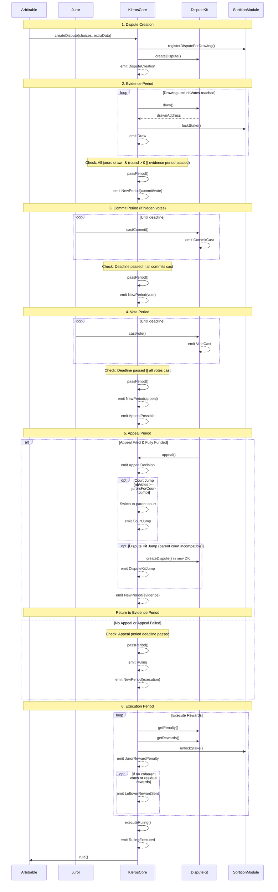

# 👨‍⚖️ Arbitrator V2

## 📋 Overview

The `IArbitratorV2` interface defines the standard interface for arbitration in the Kleros V2 protocol. Unlike its predecessor ERC-792, this standard is not concerned with appeals, allowing each arbitrator to implement an appeal system that best suits its needs.

## 📑 Table of Contents

1. [💫 Typical Flow](#-typical-flow)
   - [Dispute Lifecycle Sequence](#dispute-lifecycle-sequence)
2. [🔄 Court and Dispute Kit Jumps](#-court-and-dispute-kit-jumps)
   - [Court Jump Mechanism](#court-jump-mechanism)
   - [Dispute Kit Jump Mechanism](#dispute-kit-jump-mechanism)
3. [📦 Extra Data Format](#-extra-data-format)
   - [Encoding Structure](#1-encoding-structure)
   - [Parameter Details](#2-parameter-details)
   - [Usage Notes](#4-usage-notes)
4. [🔄 Events](#-events)
   - [DisputeCreation](#disputecreation)
   - [Ruling](#ruling)
   - [RulingExecuted](#rulingexecuted)
5. [🔧 Core Methods](#-core-methods)
   - [Dispute Creation and Cost Methods](#dispute-creation-and-cost-methods)
     - [createDispute](#createdispute)
     - [arbitrationCost](#arbitrationcost)
   - [Staking and Drawing](#staking-and-drawing)
     - [setStake](#setstake)
     - [draw](#draw)
   - [Dispute Lifecycle Management](#dispute-lifecycle-management)
     - [passPeriod](#passperiod)
     - [appeal](#appeal)
     - [execute](#execute)
     - [executeRuling](#executeruling)
   - [Current Ruling](#current-ruling)
     - [currentRuling](#currentruling)
6. [🔗 Related Components](#-related-components)
7. [🔒 Security Considerations](#-security-considerations)
   - [Fee Management](#1-fee-management)
   - [Dispute Creation](#2-dispute-creation)
   - [Ruling Integrity](#3-ruling-integrity)

## 💫 Typical Flow

1. **Dispute Creation**

   - Arbitrable contract calls `createDispute`
   - Pays arbitration fees
   - Dispute is created with specified court and parameters
   - Jurors are drawn based on court configuration

2. **Dispute Resolution**

   - Follows court-specific periods:
     1. Evidence submission
     2. Commit (if hidden votes)
     3. Vote
     4. Appeal
     5. Execution

3. **Court and Dispute Kit Jumps**

   - During appeals, disputes can:
     1. Move to parent courts (Court Jump)
     2. Switch dispute resolution mechanisms (Dispute Kit Jump)
   - Triggered when:
     - Number of jurors reaches `jurorsForCourtJump`
     - Parent court doesn't support current dispute kit

4. **Ruling Execution**
   - Final ruling determined through `currentRuling`
   - Ruling executed on arbitrable contract

### Dispute Lifecycle Sequence


```mermaid
sequenceDiagram
    participant Arbitrable
    participant Juror
    participant KlerosCore
    participant DisputeKit
    participant SortitionModule

    Note over Arbitrable,SortitionModule: 1. Dispute Creation
    Arbitrable->>KlerosCore: createDispute(choices, extraData)
    KlerosCore->>SortitionModule: registerDisputeForDrawing()
    KlerosCore->>DisputeKit: createDispute()
    KlerosCore-->>KlerosCore: emit DisputeCreation

    Note over Arbitrable,SortitionModule: 2. Evidence Period
    loop Drawing until nbVotes reached
        KlerosCore->>DisputeKit: draw()
        DisputeKit-->>KlerosCore: drawnAddress
        KlerosCore->>SortitionModule: lockStake()
        KlerosCore-->>KlerosCore: emit Draw
    end

    Note over KlerosCore: Check: All jurors drawn & (round > 0 || evidence period passed)
    KlerosCore->>KlerosCore: passPeriod()
    KlerosCore-->>KlerosCore: emit NewPeriod(commit/vote)

    Note over Arbitrable,SortitionModule: 3. Commit Period (if hidden votes)
    loop Until deadline
        Juror->>DisputeKit: castCommit()
        DisputeKit-->>DisputeKit: emit CommitCast
    end

    Note over KlerosCore: Check: Deadline passed || all commits cast
    KlerosCore->>KlerosCore: passPeriod()
    KlerosCore-->>KlerosCore: emit NewPeriod(vote)

    Note over Arbitrable,SortitionModule: 4. Vote Period
    loop Until deadline
        Juror->>DisputeKit: castVote()
        DisputeKit-->>DisputeKit: emit VoteCast
    end

    Note over KlerosCore: Check: Deadline passed || all votes cast
    KlerosCore->>KlerosCore: passPeriod()
    KlerosCore-->>KlerosCore: emit NewPeriod(appeal)
    KlerosCore-->>KlerosCore: emit AppealPossible

    Note over Arbitrable,SortitionModule: 5. Appeal Period
    alt Appeal Filed & Fully Funded
        DisputeKit->>KlerosCore: appeal()
        KlerosCore-->>KlerosCore: emit AppealDecision
        opt Court Jump (nbVotes >= jurorsForCourtJump)
            KlerosCore-->>KlerosCore: Switch to parent court
            KlerosCore-->>KlerosCore: emit CourtJump
        end
        opt Dispute Kit Jump (parent court incompatible)
            KlerosCore->>DisputeKit: createDispute() in new DK
            KlerosCore-->>KlerosCore: emit DisputeKitJump
        end
        KlerosCore-->>KlerosCore: emit NewPeriod(evidence)
        Note over Arbitrable,SortitionModule: Return to Evidence Period
    else No Appeal or Appeal Failed
        Note over KlerosCore: Check: Appeal period deadline passed
        KlerosCore->>KlerosCore: passPeriod()
        KlerosCore-->>KlerosCore: emit Ruling
        KlerosCore-->>KlerosCore: emit NewPeriod(execution)
    end

    Note over Arbitrable,SortitionModule: 6. Execution Period
    loop Execute Rewards
        KlerosCore->>DisputeKit: getPenalty()
        KlerosCore->>DisputeKit: getRewards()
        KlerosCore->>SortitionModule: unlockStake()
        KlerosCore-->>KlerosCore: emit JurorRewardPenalty
        opt If no coherent votes or residual rewards
            KlerosCore-->>KlerosCore: emit LeftoverRewardSent
        end
    end

    KlerosCore->>KlerosCore: executeRuling()
    KlerosCore-->>KlerosCore: emit RulingExecuted
    KlerosCore->>Arbitrable: rule()
```

The diagram shows:

1. **Dispute Creation**: Arbitrable contract initiates the dispute
2. **Evidence Period**: Jurors are drawn through the dispute kit
   - Requires all jurors to be drawn
   - For first round: evidence period must also have passed
3. **Commit Period**: Hidden votes phase (if enabled)
   - Transitions when deadline passed or all commits cast
4. **Vote Period**: Jurors cast their votes
   - Transitions when deadline passed or all votes cast
5. **Appeal Period**: Possible court/dispute kit jumps if appealed
   - Transitions to execution if deadline passed without successful appeal
   - Returns to evidence if appeal successful
6. **Execution Period**: Rewards distribution and final ruling

Key interactions:

- KlerosCore orchestrates the overall process and emits state change events
- DisputeKit handles voting mechanics and vote-related events
- SortitionModule manages stake operations
- Jurors interact directly with DisputeKit for voting
- Arbitrable contract initiates and receives the final ruling

## 🔄 Court and Dispute Kit Jumps

Appeals can change the court, the dispute kit, or both. Ordinary courts must support Classic (ID 1) as a compatibility fallback. Final Court is the exception and uses Final Kit (ID 0).

### Court Jump Mechanism

When a dispute is appealed and the number of jurors reaches or exceeds the court's `jurorsForCourtJump` threshold:

1. **Trigger Conditions**

   ```solidity
   newCourtID = currentRoundNbVotes >= currentCourtJurorsForJump ? parentCourtID : currentCourtID;
   ```

2. **Jump Process**

   - Dispute moves to parent court
   - New round created with parent court parameters
   - Fees and stakes recalculated based on parent court
   - Emits `CourtJump` event with:
     ```solidity
     event CourtJump(
       uint256 indexed _disputeID,
       uint256 indexed _roundID,
       uint96 indexed _fromCourtID,
       uint96 _toCourtID
     );
     ```

3. **Special Cases**
   - General Court appeals: Reserved for the final round in Final Court
   - Final Court: Cannot be directly used for disputes

### Dispute Kit Jump Mechanism

When the destination court does not support the current kit, the kit selects its configured jumpDisputeKitID. Core validates that selection and can fall back to Classic:

1. **Trigger Condition**

   ```solidity
   bool disputeKitUnsupported = newDisputeKitID >= disputeKits.length ||
      !courts[newCourtID].supportedDisputeKits[newDisputeKitID];
   if (disputeKitUnsupported) {
      newDisputeKitID = DISPUTE_KIT_CLASSIC;
   }
   ```

   - Falls back to Classic if the selected kit is invalid or unsupported
   - Classic Dispute Kit must be supported by all courts

2. **Jump Process**
   - Local dispute/round created in the selected dispute kit
   - State transferred to new dispute kit
   - Emits `DisputeKitJump` event:
     ```solidity
     event DisputeKitJump(
       uint256 indexed _disputeID,
       uint256 indexed _roundID,
       uint256 indexed _fromDisputeKitID,
       uint256 _toDisputeKitID
     );
     ```

### 📝 Implementation Notes

1. **Jump Sequence**

   - Court jump evaluated first
   - Dispute kit jump follows if needed
   - Both can occur in same appeal
   - Classic Dispute Kit ensures resolution continuity

2. **State Management**

   - Dispute parameters updated for new court/kit
   - Round information preserved
   - Appeal periods reset
   - Drawing process restarts

3. **Fee Handling**

   ```solidity
   extraRound.nbVotes = msg.value / court.feeForJuror;
   extraRound.pnkAtStakePerJuror = (court.minStake * court.alpha) / ONE_BASIS_POINT;
   extraRound.totalFeesForJurors = msg.value;
   ```

4. **Security Considerations**
   - Validates court existence
   - Ensures dispute kit compatibility
   - Maintains coherent state during transitions
   - Preserves appeal funding

## 📦 Extra Data Format

The `extraData` parameter is a crucial component used in dispute creation and cost calculation. It encodes three key parameters that determine how a dispute will be handled.

### 1. Encoding Structure

```solidity
bytes extraData = abi.encode(
    uint96 courtID,      // Court handling the dispute
    uint256 minJurors,   // Minimum number of jurors
    uint256 disputeKitID // Specific dispute resolution mechanism
);
```

### 2. Parameter Details

**Court ID** (first 32 bytes)

- Type: `uint96`
- Purpose: Identifies which court will handle the dispute
- Validation:
  - If `courtID == FINAL_COURT` → defaults to `GENERAL_COURT`
  - If `courtID >= courts.length` → defaults to `GENERAL_COURT`
  - Must be a valid court that supports the specified dispute kit

**Minimum Jurors** (next 32 bytes)

- Type: `uint256`
- Purpose: Specifies minimum number of jurors required
- Validation:
  - If `minJurors == 0` → defaults to `DEFAULT_NB_OF_JURORS`
- Impact: Directly affects arbitration costs (`feeForJuror * minJurors`)

**Dispute Kit ID** (last 32 bytes)

- Type: `uint256`
- Purpose: Specifies which dispute resolution mechanism to use
- Validation:
  - If `disputeKitID == FINAL_DISPUTE_KIT` → defaults to `DISPUTE_KIT_CLASSIC (1)`
  - If `disputeKitID >= disputeKits.length` → defaults to `DISPUTE_KIT_CLASSIC (1)`
  - Must be supported by the selected court

### 4. Usage Notes

- **Encoding**: Always use `abi.encode()` to ensure proper padding and alignment
- **Length Validation**: Implementation handles both complete and incomplete data
- **Default Behavior**:
  - If `extraData` is shorter than expected → all parameters get default values
  - If any parameter is invalid → that parameter gets a default value
  - Other valid parameters are still used
- **Gas Efficiency**: Uses assembly for efficient decoding
- **Safety**: All invalid inputs are handled gracefully with defaults


## 🔄 Events

### DisputeCreation

```solidity
event DisputeCreation(uint256 indexed _disputeID, IArbitrableV2 indexed _arbitrable)
```

- Emitted when a new dispute is created
- Parameters:
  - `_disputeID`: Unique identifier for the dispute
  - `_arbitrable`: Contract which created the dispute

### Ruling

```solidity
event Ruling(IArbitrableV2 indexed _arbitrable, uint256 indexed _disputeID, uint256 _ruling)
```

- Emitted when the dispute enters the execution period and its ruling becomes final. Delivery to the arbitrable happens separately through executeRuling
- Parameters:
  - `_arbitrable`: Contract receiving the ruling
  - `_disputeID`: Identifier of the dispute
  - `_ruling`: The ruling value

### RulingExecuted

```solidity
event RulingExecuted(IArbitrableV2 indexed _arbitrable, uint256 indexed _disputeID, uint256 _ruling);
```

- To be raised when a ruling is relayed to arbitrable.
- Parameters:
  - `_arbitrable`: Contract receiving the ruling
  - `_disputeID`: Identifier of the dispute
  - `_ruling`: The ruling value

## 🔧 Core Methods

### Dispute Creation and Cost Methods

#### createDispute

```solidity
function createDispute(
    uint256 _numberOfChoices,
    bytes calldata _extraData
) external payable returns (uint256 disputeID)
```

- Creates a dispute with native currency payment (typically ETH)
- Parameters:
  - `_numberOfChoices`: Number of ruling options
  - `_extraData`: Additional dispute data containing:
    - Court ID (first 32 bytes)
    - Minimum jurors required (next 32 bytes)
    - Dispute kit ID (last 32 bytes)
- Returns: Unique identifier for the created dispute
- Requirements:
  - Must be called by the arbitrable contract
  - Payment must be >= `arbitrationCost(_extraData)`


#### arbitrationCost

```solidity
function arbitrationCost(bytes calldata _extraData) external view returns (uint256 cost)
```

- Computes arbitration cost in native currency
- In KlerosCore: Cost = `feeForJuror * minJurors`
- Note: Changes should be infrequent due to gas costs for arbitrable contracts


#### appealCost

```solidity
function appealCost(uint256 _disputeID) public view returns (uint256 cost)
```

- Gets the cost of appealing a specified dispute
- Cost calculation:
  - If staying in current court: `feeForJuror * ((nbVotes * 2) + 1)`
  - If jumping to parent court: uses parent court's `feeForJuror`
  - If appealing in Final Court: returns non-payable amount
- Cost increases exponentially with each appeal to discourage frivolous appeals
- **Important**: Appeal fees must always be paid in ETH (native currency) due to complexity of handling token conversions during court jumps

### Staking and Drawing

#### setStake

Stake changes use previously deposited PNK and are delayed; deposits and withdrawals are separate operations.

```solidity
function setStake(uint96 _courtID, uint256 _newStake) external
```

- Allows jurors to stake/unstake PNK in courts
- Delegated to `SortitionModule` which:
  - Manages the sortition trees for each court
  - Handles stake transitions and delayed stakes
  - Tracks total staked amounts
  - Ensures proper stake accounting
- Requirements:
  - Stake amount must meet court's minimum requirement
  - Court must be valid (not Final Court)

#### draw

```solidity
function draw(uint256 _disputeID, uint256 _iterations) external
```

- Draws jurors for a dispute during evidence period
- Delegated to the dispute kit associated with the dispute
- Can be called in parts through `_iterations` parameter
- For each successful draw:
  - Locks juror's PNK stake as collateral
  - Emits `Draw` event
  - Updates round information

### Dispute Lifecycle Management

#### passPeriod

```solidity
function passPeriod(uint256 _disputeID) external
```

- Advances dispute to next period when conditions are met
- Period sequence: evidence → commit → vote → appeal → execution
- Each transition has specific requirements:
  - Evidence: All jurors must be drawn
  - Commit: Commit period has passed or the dispute kit reports all commits cast
  - Vote: Vote period has passed or the dispute kit reports voting complete
  - Appeal: Appeal period has passed or the dispute kit permits early completion
  - Execution: Final state

#### appeal

```solidity
function appeal(uint256 _disputeID, uint256 _numberOfChoices) external payable
```

- Handles appeals of dispute rulings
- Delegated to the dispute kit for appeal validation
- Manages:
  - Court jumps when juror count threshold is reached
  - Dispute kit jumps when parent court compatibility requires
  - Creation of new rounds
  - Fee payments and stake calculations

#### execute

```solidity
function execute(uint256 _disputeID, uint256 _round, uint256 _iterations) external
```

- Distributes PNK stakes and dispute fees to jurors
- Can be called in parts through `_iterations`
- Handles:
  - PNK penalties for incoherent votes
  - Fee distribution to coherent jurors
  - Reward calculations based on vote coherence
  - Leftover reward distribution

#### executeRuling

```solidity
function executeRuling(uint256 _disputeID) external
```

- Relays the final ruling to the arbitrable contract
- Can only be called in execution period
- Ensures:
  - Dispute is in execution period
  - Ruling hasn't been executed before
- Emits RulingExecuted and calls the arbitrable’s rule function

### Current Ruling

#### currentRuling

```solidity
function currentRuling(
    uint256 _disputeID
) external view returns (uint256 ruling, bool tied, bool overridden)
```

- Gets current ruling for a dispute
- Returns:
  - `ruling`: Current ruling value
  - `tied`: Whether there's a tie
  - `overridden`: Whether ruling was overridden by appeal funding

These methods work together to enable:

1. Juror selection through secure stake-weighted randomization
2. Multi-round dispute resolution with appeals
3. Economic incentives through coherence-based rewards
4. Seamless transitions between courts and dispute kits


## 🔗 Related Components

- `IArbitrableV2`: Interface for contracts that can be arbitrated
- `KlerosCore`: Reference implementation of the arbitrator interface
- Dispute Kits:
  - `DisputeKitClassic`: Default implementation with proportional drawing to staked PNK and plurality voting. Mandatorily supported by all courts as a fallback mechanism.
  - `DisputeKitSybilResistant`: Variant requiring Proof of Humanity registration for drawing
  - `DisputeKitGated`: Variant requiring token holdings (ERC20/721/1155) for drawing
  - More dispute kits can be implemented to support different voting mechanisms, but courts must always support the Classic Dispute Kit
- `EvidenceModule`: Handles submission and tracking of evidence for disputes
- `SortitionModule`: Manages juror selection and stake tracking using sortition trees

## 🔒 Security Considerations

1. **Fee Management**

   - Arbitration costs should change infrequently:
     - Frequent changes force arbitrable contracts to update their stored fees
     - Each update costs significant gas for arbitrable contracts
     - Changes can make pending transactions invalid if fees increase
   - Cost calculation must be deterministic and consistent

2. **Dispute Creation**

   - Only arbitrable contracts can create disputes
   - Fees must be paid upfront
   - Extra data validation is critical

3. **Ruling Integrity**
   - Rulings become final when the dispute enters execution; executeRuling delivers them to the arbitrable
   - Appeal system must be robust
   - Tied votes must be handled consistently

## ⚙️ Core Functions

The KlerosCore contract delegates key functionality to specialized modules while maintaining the orchestration of the dispute lifecycle.
