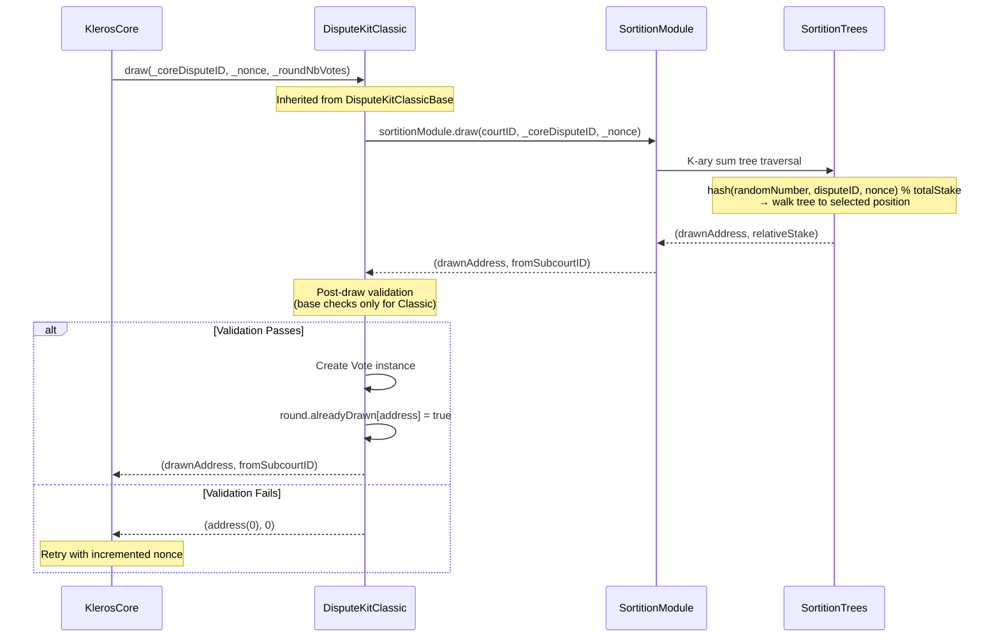
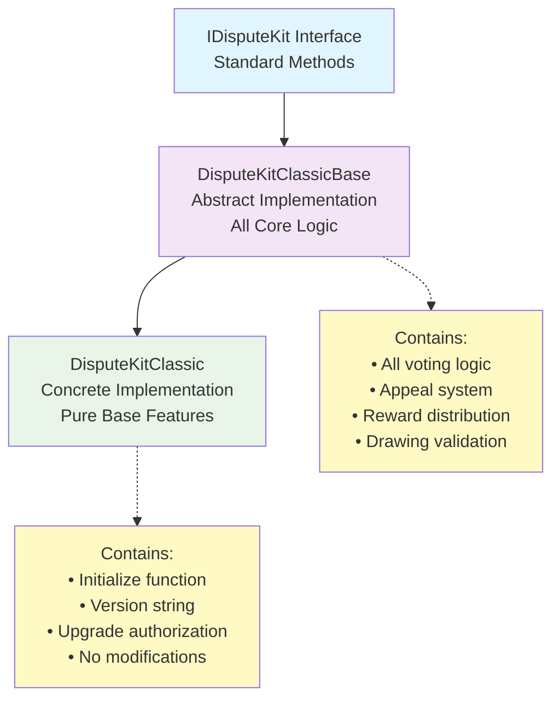

# 🛠️ Classic Dispute Kit Specification

> Last updated: 2026-03-14 | Based on: kleros-v2 contracts @ dev branch

## 📋 Overview

The Classic Dispute Kit (`DisputeKitClassic`) is the default dispute resolution mechanism in Kleros V2. It implements the four core features that define Kleros v1-style dispute resolution: proportional drawing by staked PNK, plurality vote aggregation, equal reward distribution among coherent voters, and binary appeal funding.

In the current architecture, `DisputeKitClassic` inherits from `DisputeKitClassicBase` without modifications — it is literally an empty concrete instantiation of the abstract base class with only initialization and upgrade authorization. This separation allows other dispute kits to extend the proven base logic while adding specialized features.

## 📑 Table of Contents

1. [🎯 Core Features](#-core-features)
   - [Drawing System: Proportional to Staked PNK](#1-drawing-system-proportional-to-staked-pnk)
     - [Drawing Pipeline](#drawing-pipeline)
     - [SortitionTrees Algorithm](#sortitiontrees-algorithm)
     - [Post-Draw Validation](#post-draw-validation)
   - [Vote Aggregation: Plurality Voting](#2-vote-aggregation-plurality-voting)
     - [Vote Counting](#vote-counting)
     - [Tie Resolution](#tie-resolution)
   - [Incentive System: Equal Split Among Coherent Votes](#3-incentive-system-equal-split-among-coherent-votes)
     - [Reward Sources](#reward-sources)
     - [Distribution Rules](#distribution-rules)
     - [Coherence Calculation](#coherence-calculation)
   - [Appeal System: Binary Funding with Free Choice](#4-appeal-system-binary-funding-with-free-choice)
     - [Appeal Mechanism](#appeal-mechanism)
     - [Funding Requirements](#funding-requirements)
     - [Appeal Outcomes](#appeal-outcomes)
2. [🏗️ Architecture](#-architecture)
   - [Inheritance Structure](#inheritance-structure)
   - [Base Class Features](#base-class-features)
   - [Classic Implementation](#classic-implementation)
3. [📢 Events](#-events)
   - [Standard Events (IDisputeKit)](#standard-events-idisputekit)
     - [VoteCast](#votecast)
   - [Classic Dispute Kit Events](#classic-dispute-kit-events)
     - [Dispute Lifecycle Events](#1-dispute-lifecycle-events)
     - [Appeal Funding Events](#2-appeal-funding-events)
   - [Event Usage Patterns](#event-usage-patterns)
4. [🔧 Important Methods](#-important-methods)
   - [Juror Methods](#juror-methods)
     - [castCommit](#castcommit)
     - [castVote](#castvote)
   - [Appeal Methods](#appeal-methods)
     - [fundAppeal](#fundappeal)
   - [Maintenance Methods](#maintenance-methods)
     - [withdrawFeesAndRewards](#withdrawfeesandrewards)
   - [Arbitrator-Permissioned Methods](#arbitrator-permissioned-methods)
     - [createDispute](#createdispute)
     - [draw](#draw)
5. [📝 Implementation Notes](#-implementation-notes)
   - [Gas Optimization](#1-gas-optimization)
   - [Upgradeability](#2-upgradeability)
   - [Integration](#3-integration)
6. [🔒 Security Considerations](#-security-considerations)
   - [Drawing Fairness](#1-drawing-fairness)
   - [Vote Integrity](#2-vote-integrity)
   - [Reward Distribution](#3-reward-distribution)
   - [Appeal Safety](#4-appeal-safety)

## 🎯 Core Features

### 1. Drawing System: Proportional to Staked PNK

The drawing system determines how jurors are selected for a dispute using weighted random selection proportional to staked PNK.

#### Drawing Pipeline

The juror selection follows a multi-layered pipeline:



**Key Properties**:
- **Deterministic**: Same dispute + nonce always draws same juror
- **Proportional**: Probability = (Juror's Staked PNK) / (Total Court Staked PNK)
- **Cross-court drawing**: `fromSubcourtID` may differ from dispute's court
- **Retry mechanism**: Failed draws increment nonce and retry

#### SortitionTrees Algorithm

The underlying random selection uses **K-ary sum trees** from the SortitionTrees library:

**Tree Structure**:
- Each court maintains its own sortition tree
- Leaf nodes: `stakePathID = toStakePathID(address, courtID)` (20 + 12 bytes)
- Internal nodes: Sum of all descendant stakes
- Automatic rebalancing on stake changes

**Selection Algorithm**:
```solidity
// 1. Generate deterministic random position
uint256 randomNumber = hash(disputeID, nonce, block.timestamp);
uint256 targetPosition = randomNumber % totalStaked;

// 2. Tree traversal to find juror
// Start at root, traverse branches:
//   - If targetPosition < leftChildSum: go left  
//   - Else: go right, subtract leftChildSum from target
// Continue until reaching leaf node

// 3. Return results
return (leafAddress, courtIDWhereStaked);
```

#### Post-Draw Validation

After the sortition tree returns a juror, the dispute kit validates the selection:

```mermaid
graph TD
    Draw[Tree Returns Address] --> Check1{drawnAddress != 0?}
    Check1 -->|No| Reject[Return address(0)]
    Check1 -->|Yes| Check2{Base Validation}
    
    Check2 --> Check3{singleDrawPerJuror<br/>enabled?}
    Check3 -->|Yes| Check4{Already drawn<br/>this round?}
    Check4 -->|Yes| Reject
    Check4 -->|No| Accept[Create Vote Instance]
    Check3 -->|No| Accept
    
    Accept --> Update[round.alreadyDrawn[address] = true]
    Update --> Return[Return (address, fromSubcourtID)]
    
    Reject --> ReturnZero[Return (address(0), 0)]
```

**Classic-Specific Validation**: 
- Only the base validation from `DisputeKitClassicBase._postDrawCheck()`
- No additional eligibility requirements (unlike gated or sybil-resistant variants)
- `singleDrawPerJuror` check if enabled (default: false)

### 2. Vote Aggregation: Plurality Voting

The vote aggregation system determines how individual votes combine into a final ruling.

#### Vote Counting

- **Equal Weight**: All votes have equal weight regardless of stake
- **Simple Counting**: Each vote increments `round.counts[choice]`
- **Real-time Tracking**: Winning choice updated after each vote
- **Multiple Votes**: Jurors drawn multiple times cast multiple equal votes

#### Tie Resolution

```mermaid
graph TD
    VotesCast[All Votes Cast] --> CountVotes[Count Votes per Choice]
    CountVotes --> CheckTie{Multiple choices<br/>with max votes?}
    
    CheckTie -->|No Tie| SingleWinner[Single Winner]
    CheckTie -->|Tie| CheckRound{First Round?}
    
    CheckRound -->|Yes| RefuseToArbitrate[Winner = 0<br/>("Refuse to Arbitrate")]
    CheckRound -->|No| MaintainPrevious[Maintain Previous<br/>Round's Winner]
    
    SingleWinner --> FinalRuling[Final Ruling Determined]
    RefuseToArbitrate --> FinalRuling
    MaintainPrevious --> FinalRuling
```

### 3. Incentive System: Equal Split Among Coherent Votes

The incentive system determines reward distribution based on vote coherence with the final outcome.

#### Reward Sources

1. **Arbitration Fees**: Paid by the arbitrable contract in ETH or ERC20
   - Split among coherent jurors in the final round
   - Proportional to degree of coherence

2. **PNK Penalties**: Collected from incoherent voters
   - Redistributed to coherent jurors
   - Penalty = `(1 - coherence) * pnkAtStakePerJuror`

#### Distribution Rules

**Coherent Jurors Only**: 
- Only jurors who voted for the final winning choice receive rewards
- Incoherent jurors are penalized

**Equal Split Principle**:
```solidity
// Fee reward calculation
uint256 feeReward = (totalArbitrationFees / coherentCount) * degreeOfCoherence;

// PNK reward calculation  
uint256 pnkReward = (totalPnkPenalties / coherentCount) * degreeOfCoherence;
```

#### Coherence Calculation

In the Classic dispute kit, coherence is binary:

```solidity
function _getDegreeOfCoherence(uint256 _coreDisputeID, uint256 _coreRoundID, uint256 _voteID) 
    internal view returns (uint256 coherence) {
    
    Vote storage vote = disputes[localDisputeID].rounds[localRoundID].votes[_voteID];
    uint256[] memory winningChoices = core.getWinningChoices(_coreDisputeID);
    
    // Check if vote matches any winning choice
    for (uint256 i = 0; i < winningChoices.length; i++) {
        if (vote.choice == winningChoices[i] && vote.voted) {
            return ONE_BASIS_POINT; // 100% coherent (10000 basis points)
        }
    }
    return 0; // 0% coherent
}
```

**Coherence Values**:
- `10000` (100%): Voted for winning choice
- `0` (0%): Voted for losing choice or didn't vote

### 4. Appeal System: Binary Funding with Free Choice

The appeal system allows disputes to be escalated to higher courts with more jurors.

#### Appeal Mechanism

- **Binary Funding**: Only two choices can be funded for appeal
- **Free Voting**: Any choice can be voted for in the appeal round
- **Escalation**: Appeals typically double the number of jurors

#### Funding Requirements

```mermaid
graph TD
    AppealPeriod[Appeal Period Starts] --> CheckFunding{Check Funding Status}
    
    CheckFunding --> Winner[Winning Choice:<br/>1x Appeal Cost]
    CheckFunding --> Loser[Losing Choice:<br/>2x Appeal Cost]
    
    Winner --> WinnerTime[Full Appeal Period]
    Loser --> LoserTime[Half Appeal Period<br/>(LOSER_APPEAL_PERIOD_MULTIPLIER)]
    
    WinnerTime --> CheckComplete{Both Sides<br/>Fully Funded?}
    LoserTime --> CheckComplete
    
    CheckComplete -->|Yes| Appeal[Appeal Proceeds<br/>Create New Round]
    CheckComplete -->|No| NoAppeal[No Appeal<br/>Current Round Final]
    
    Appeal --> DoubleJurors[Juror Count: 2n + 1]
```

**Funding Multipliers**:
- `WINNER_STAKE_MULTIPLIER = 10000` (1x appeal cost)
- `LOSER_STAKE_MULTIPLIER = 20000` (2x appeal cost)
- `LOSER_APPEAL_PERIOD_MULTIPLIER = 5000` (0.5x time period)

#### Appeal Outcomes

1. **Both Sides Funded**: 
   - Appeal proceeds to new round
   - Juror count increases (typically 2n + 1)
   - May jump to parent court if threshold exceeded

2. **Insufficient Funding**:
   - Current round's outcome becomes final
   - Partial contributions are refunded
   - No new round created

## 🏗️ Architecture

### Inheritance Structure



### Base Class Features

`DisputeKitClassicBase` contains all the core implementation:

- **Voting Logic**: Commit/reveal and direct voting mechanisms
- **Appeal System**: Funding tracking, validation, and round creation
- **Reward Distribution**: Coherence calculation and penalty/reward allocation  
- **Drawing Validation**: Post-draw checks and vote instance creation
- **Storage Management**: Dispute, round, and vote data structures

### Classic Implementation

`DisputeKitClassic` provides a minimal concrete implementation:

```solidity
contract DisputeKitClassic is DisputeKitClassicBase {
    string public constant override version = "2.0.0";

    constructor() {
        _disableInitializers();
    }

    function initialize(address _owner, KlerosCore _core, address _wNative) external initializer {
        __DisputeKitClassicBase_initialize(_owner, _core, _wNative);
    }

    function _authorizeUpgrade(address) internal view override onlyByOwner {
        // NOP - owner-only upgrade authorization
    }
}
```

**Key Points**:
- **No Feature Additions**: Pure implementation of base functionality
- **Standard Initialization**: Owner, core, and wrapped native token setup
- **Upgrade Pattern**: UUPS proxy with owner-only upgrades
- **Version Tracking**: Explicit version string for deployment tracking

## 📢 Events

### Standard Events (IDisputeKit)

All dispute kits must implement these standard events defined in `IDisputeKit`:

#### `VoteCast`

Emitted when a juror casts their vote, providing transparency about voting choices and their justification.

```solidity
event VoteCast(
    uint256 indexed _coreDisputeID,
    address indexed _juror,
    uint256[] _voteIDs,
    uint256 indexed _choice,
    string _justification
);
```

Parameters:
- `_coreDisputeID`: Dispute identifier in the Arbitrator contract
- `_juror`: Address of the voting juror  
- `_voteIDs`: Array of vote IDs being cast (multiple if juror drawn multiple times)
- `_choice`: Selected choice (0 = refuse to arbitrate, 1+ = ruling options)
- `_justification`: Text explaining the juror's decision

### Classic Dispute Kit Events

Events specific to the Classic implementation, supporting its unique features:

#### 1. Dispute Lifecycle Events

##### `DisputeCreation`

Emitted when a new dispute is created in the dispute kit.

```solidity
event DisputeCreation(uint256 indexed _coreDisputeID, uint256 _numberOfChoices, bytes _extraData);
```

##### `CommitCast`

Emitted during the commit phase when a juror submits their vote commitment.

```solidity
event CommitCast(uint256 indexed _coreDisputeID, address indexed _juror, uint256[] _voteIDs, bytes32 _commit);
```

#### 2. Appeal Funding Events

##### `Contribution`

Emitted when someone contributes funds to appeal a specific choice.

```solidity
event Contribution(
    uint256 indexed _coreDisputeID,
    uint256 indexed _coreRoundID,
    uint256 _choice,
    address indexed _contributor,
    uint256 _amount
);
```

##### `ChoiceFunded`

Emitted when a choice receives full funding required for appeal.

```solidity
event ChoiceFunded(uint256 indexed _coreDisputeID, uint256 indexed _coreRoundID, uint256 indexed _choice);
```

##### `Withdrawal`

Emitted when a contributor withdraws their appeal funding contribution.

```solidity
event Withdrawal(
    uint256 indexed _coreDisputeID,
    uint256 _choice,
    address indexed _contributor,
    uint256 _amount
);
```

### Event Usage Patterns

1. **Dispute Tracking**: Use `_coreDisputeID` index to filter events by dispute
2. **User Activity**: Use `_juror`/`_contributor` indices for user-specific queries  
3. **Round Analysis**: `_coreRoundID` for tracking appeal progression
4. **Choice Monitoring**: `_choice` index for funding progress per option

## 🔧 Important Methods

## Public Interface

The following methods are part of the stable external API and can be safely called by jurors and external integrators:

### Juror Methods

#### castCommit

```solidity
function castCommit(
    uint256 _coreDisputeID,
    uint256[] calldata _voteIDs,
    bytes32 _commit
) external
```

**Purpose**: Submit vote commitment during hidden vote phase

**Requirements**:
- Must be in commit period (`Period.commit`)
- Caller must own all specified vote IDs
- Commit hash must not be empty
- Arbitration must not be paused

**Behavior**:
- Stores commitment hash for each vote ID
- Tracks total committed votes for period progression
- Can be called multiple times to update commitments
- Emits `CommitCast` event

#### castVote

```solidity
function castVote(
    uint256 _coreDisputeID,
    uint256[] calldata _voteIDs,
    uint256 _choice,
    uint256 _salt,
    string memory _justification
) external
```

**Purpose**: Cast actual votes during vote period

**Requirements**:
- Must be in vote period (`Period.vote`)
- Caller must own all specified vote IDs
- Choice must be within valid range (0 to numberOfChoices)
- For hidden votes: revealed choice+salt must match commitment
- Vote must not have been cast already

**Behavior**:
- Records choice for each vote ID
- Updates vote counts and determines winning choice
- Validates hidden vote commitments if applicable
- Emits `VoteCast` event

### Appeal Methods

#### fundAppeal

```solidity
function fundAppeal(uint256 _coreDisputeID, uint256 _choice) external payable
```

**Purpose**: Contribute ETH to fund an appeal for a specific choice

**Requirements**:
- Must be in appeal period (`Period.appeal`)
- Choice must be within valid range
- Must be within appropriate funding timeframe (winners get full period, losers get half)

**Funding Logic**:
```solidity
uint256 multiplier = (ruling == _choice) ? WINNER_STAKE_MULTIPLIER : LOSER_STAKE_MULTIPLIER;
uint256 totalCost = appealCost + (appealCost * multiplier) / ONE_BASIS_POINT;
```

**Behavior**:
- Accepts partial contributions until choice is fully funded
- Refunds excess contributions immediately
- Tracks contributions per user for later withdrawal
- Triggers appeal when two choices are fully funded
- Emits `Contribution` and `ChoiceFunded` events

### Maintenance Methods

#### withdrawFeesAndRewards

```solidity
function withdrawFeesAndRewards(
    uint256 _coreDisputeID,
    address payable _beneficiary,
    uint256 _choice
) external returns (uint256 amount)
```

**Purpose**: Withdraw appeal contributions and rewards after dispute resolution

**Requirements**:
- Dispute must be in execution period
- Core must not be paused
- Dispute must be known to this dispute kit

**Withdrawal Logic**:
- **Unsuccessful funding**: Full refund of contributions
- **Winning choice**: Proportional share of collected appeal fees
- **Unsuccessful winner funding**: Proportional refund when winner wasn't funded

**Return Value**: Total amount withdrawn in wei

## Internal Mechanics (implementation detail)

The following are arbitrator-permissioned internal functions and implementation details that are subject to change. Do not depend on these externally:

### Arbitrator-Permissioned Methods

#### createDispute

```solidity
function createDispute(
    uint256 _coreDisputeID,
    uint256 _coreRoundID,
    uint256 _numberOfChoices,
    bytes calldata _extraData,
    uint256 _nbVotes
) public virtual override onlyByCore
```

**Purpose**: Initialize new dispute instance (called by KlerosCore only)

**Behavior**:
- Creates local dispute mapping to core dispute ID
- Initializes first round with provided parameters
- Sets up vote array and choice tracking
- Handles dispute kit jumps (reusing existing local dispute if needed)

#### draw

```solidity
function draw(
    uint256 _coreDisputeID,
    uint256 _nonce,
    uint256 _roundNbVotes
) public virtual override onlyByCore isActive(_coreDisputeID) 
    returns (address drawnAddress, uint96 fromSubcourtID)
```

**Purpose**: Draw a juror for the dispute (called by KlerosCore only)

**Flow**:
1. Call `sortitionModule.draw()` with court ID and dispute parameters
2. Validate returned address through `_postDrawCheck()`
3. Create vote instance if validation passes
4. Return drawn address and subcourt ID

**Validation**: Base implementation only checks `singleDrawPerJuror` setting

## 📝 Implementation Notes

### 1. Gas Optimization

- **Batch Operations**: Supports multiple vote IDs in single transaction
- **Efficient Storage**: Packed structs with upgrade-safe gaps
- **Minimal Validation**: Only essential checks in core paths
- **Event Optimization**: Strategic parameter indexing for query efficiency

### 2. Upgradeability

- **UUPS Pattern**: Upgrade logic in implementation contract
- **Storage Gaps**: Reserved slots for future upgrade compatibility
- **Owner Authorization**: Upgrade restricted to contract owner
- **Version Tracking**: Explicit version string for deployment verification

### 3. Integration

- **Standard Interface**: Full `IDisputeKit` compliance
- **Multi-token Support**: Works with ETH and any ERC20 for fees
- **Court Compatibility**: Supports all court configurations
- **Period Management**: Integrates with KlerosCore period transitions

## Error Conditions

| Operation | Failure condition | Result |
|-----------|------------------|--------|
| castCommit() | Not in commit period | Reverts |
| castCommit() | Empty commitment | Reverts |
| castVote() | Not in vote period | Reverts |
| castVote() | Invalid choice | Reverts |
| castVote() | Commitment mismatch | Reverts |
| fundAppeal() | Not in appeal period | Reverts |
| fundAppeal() | Invalid choice | Reverts |
| draw() | Already drawn (if singleDrawPerJuror) | Returns address(0) |

## 🔒 Security Considerations

### 1. Drawing Fairness

**Concerns**:
- Manipulation of random number generation
- Stake changes during drawing process
- Tree corruption affecting proportionality

**Mitigations**:
- Deterministic RNG using dispute ID and nonce
- Stake locking prevents mid-draw changes
- SortitionTrees library handles tree integrity

### 2. Vote Integrity  

**Concerns**:
- Double voting by same juror
- Invalid vote commitments
- Vote manipulation

**Mitigations**:
- Vote ID ownership validation
- Cryptographic commitment verification
- Immutable vote recording

### 3. Reward Distribution

**Concerns**:
- Incorrect coherence calculation
- Reward double-claiming
- Rounding errors in distribution

**Mitigations**:
- Binary coherence eliminates edge cases
- Single-execution reward distribution
- Excess reward transfer to owner

### 4. Appeal Safety

**Concerns**:
- Funding manipulation
- Deadlock conditions
- Incorrect refund calculations

**Mitigations**:
- Atomic funding operations
- Clear timeout mechanisms  
- Proportional refund calculations
- Immediate excess refunds