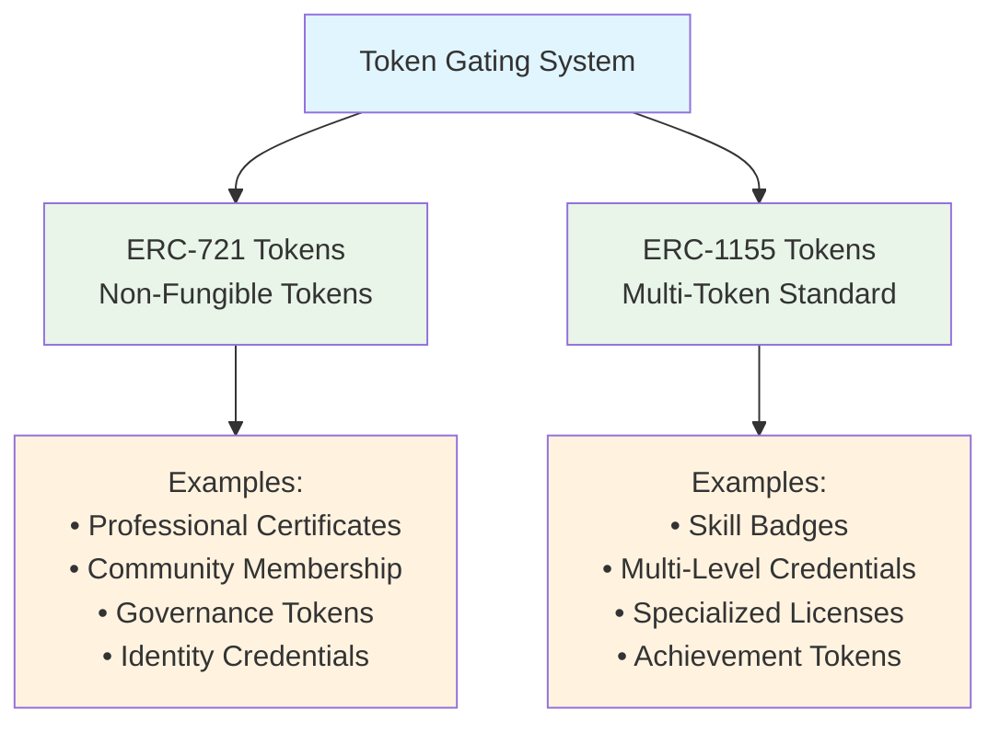
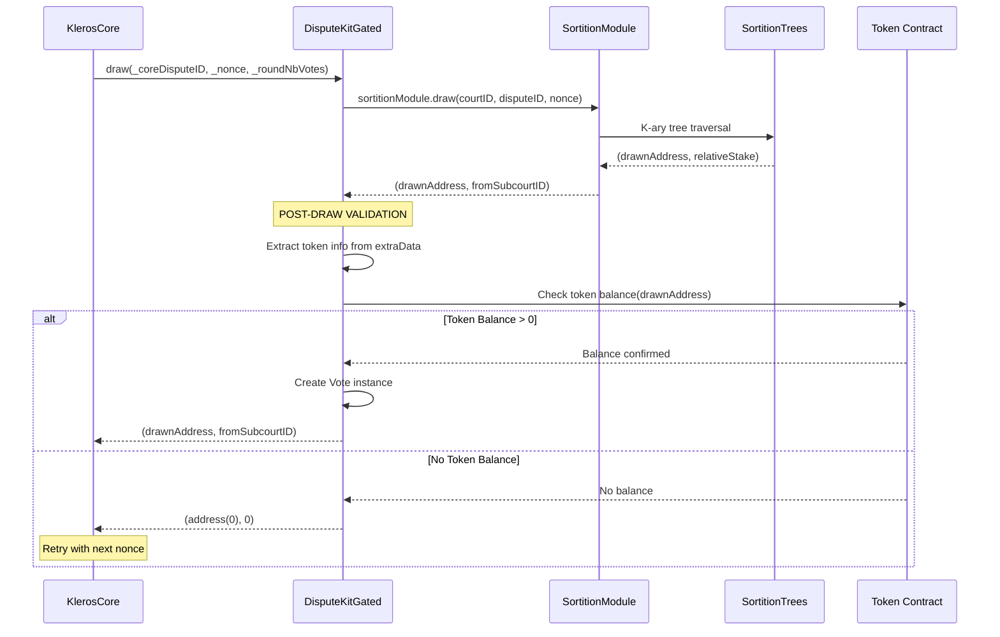
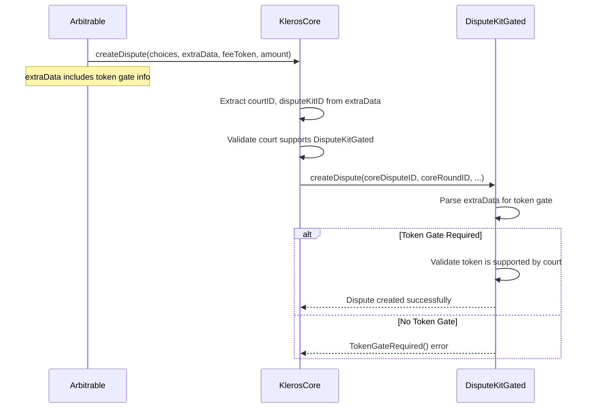
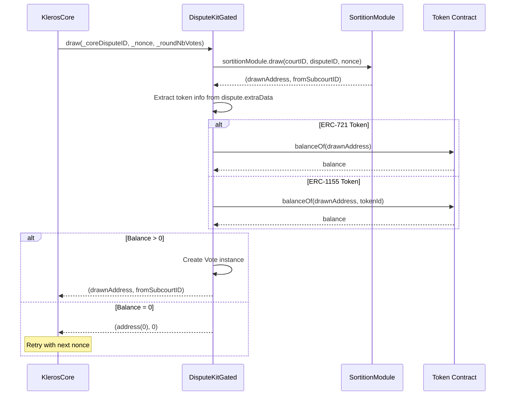

# 🚪 Gated Dispute Kit Specification

> Last updated: 2026-03-14 | Based on: kleros-v2 contracts @ dev branch

## 📋 Overview

The Gated Dispute Kit (`DisputeKitGated`) extends the Classic Dispute Kit with **token-gated juror eligibility**. Only jurors holding specific ERC-721 or ERC-1155 tokens can be drawn for disputes in courts using this dispute kit.

This enables specialized courts for specific communities (token holders), professional credentials (NFT certificates), or exclusive access scenarios while maintaining the proven Kleros dispute resolution mechanism.

## 📑 Table of Contents

1. [🎯 Core Features](#-core-features)
   - [All Classic Features](#all-classic-features)
   - [Token-Gated Eligibility](#token-gated-eligibility)
     - [Supported Token Types](#supported-token-types)
     - [Court-Specific Configuration](#court-specific-configuration)
     - [Post-Draw Validation](#post-draw-validation)
2. [🔑 Eligibility System](#-eligibility-system)
   - [ICourtEligibility Interface](#icourteligibility-interface)
   - [Token Validation Process](#token-validation-process)
   - [Drawing Pipeline Integration](#drawing-pipeline-integration)
3. [⚙️ Configuration Management](#-configuration-management)
   - [ERC-721 Token Management](#erc-721-token-management)
   - [ERC-1155 Token Management](#erc-1155-token-management)
   - [ExtraData Format](#extradata-format)
4. [📢 Events](#-events)
   - [Standard Events (Inherited)](#standard-events-inherited)
   - [Gated-Specific Events](#gated-specific-events)
     - [SupportedErc721TokenChanged](#supportederc721tokenchanged)
     - [SupportedErc1155TokenIdChanged](#supportederc1155tokenidchanged)
   - [Event Usage Patterns](#event-usage-patterns)
5. [🔧 Key Methods](#-key-methods)
   - [Configuration Methods](#configuration-methods)
     - [changeSupportedErc721Tokens](#changesupportederc721tokens)
     - [changeSupportedErc1155TokenIds](#changesupportederc1155tokenids)
   - [Eligibility Methods](#eligibility-methods)
     - [isEligible](#iseligible)
   - [Query Methods](#query-methods)
   - [Inherited Methods](#inherited-methods)
6. [🔄 Token Validation Flow](#-token-validation-flow)
   - [Dispute Creation](#dispute-creation)
   - [Juror Drawing](#juror-drawing)
   - [Eligibility Checking](#eligibility-checking)
7. [📝 Implementation Details](#-implementation-details)
   - [Storage Architecture](#storage-architecture)
   - [ExtraData Parsing](#extradata-parsing)
   - [Token Balance Verification](#token-balance-verification)
8. [🔒 Security Considerations](#-security-considerations)
   - [Token Contract Security](#1-token-contract-security)
   - [Eligibility Validation](#2-eligibility-validation)
   - [Configuration Security](#3-configuration-security)
   - [Drawing Fairness](#4-drawing-fairness)

## 🎯 Core Features

### All Classic Features

DisputeKitGated inherits all functionality from DisputeKitClassicBase:

- **Drawing System**: Proportional selection by staked PNK via SortitionTrees
- **Vote Aggregation**: Plurality voting with real-time winner tracking  
- **Incentive System**: Equal reward split among coherent voters
- **Appeal System**: Binary funding with 1x/2x multipliers

For details on these inherited features, see the [Classic Dispute Kit Specification](./dispute-kit-classic.md).

### Token-Gated Eligibility

#### Supported Token Types

The system supports two main token standards for gating access:



**ERC-721 Support**:
- Any balance > 0 qualifies juror for eligibility
- Court maintains allowlist of supported token contracts
- Binary qualification: hold token or not

**ERC-1155 Support**:
- Specific token IDs must be configured per court
- Multiple token IDs can be supported for same contract
- Fine-grained control over which tokens qualify

#### Court-Specific Configuration

Each court maintains its own token configuration:

```mermaid
graph TD
    Court[Court ID: X] --> ERC721Config[ERC-721 Configuration]
    Court --> ERC1155Config[ERC-1155 Configuration]
    
    ERC721Config --> Contract1[Contract A: 0x123...]
    ERC721Config --> Contract2[Contract B: 0x456...]
    ERC721Config --> ContractN[Contract N: 0x789...]
    
    ERC1155Config --> Token1[Contract X: TokenID [1,5,10]]
    ERC1155Config --> Token2[Contract Y: TokenID [2,7]]
    ERC1155Config --> TokenN[Contract Z: TokenID [3]]
    
    classDef court fill:#e3f2fd
    classDef config fill:#e8f5e8
    classDef contract fill:#fff3e0
    
    class Court court
    class ERC721Config,ERC1155Config config
    class Contract1,Contract2,ContractN,Token1,Token2,TokenN contract
```

**Configuration Benefits**:
- Courts can specify exact requirements for juror eligibility
- Different courts can have different token requirements
- Supports both broad categories (any NFT from collection) and specific items
- Allows for complex multi-token requirements

#### Post-Draw Validation

**Critical Implementation Detail**: Token eligibility is checked **AFTER** the SortitionTrees draw, not before:



**Why Post-Draw Validation?**:
- SortitionTrees only considers PNK stake, not token holdings
- Token balances can change between stake and draw time
- Allows reuse of existing sortition infrastructure
- Enables multiple gating criteria without complex tree modifications

## 🔑 Eligibility System

### ICourtEligibility Interface

DisputeKitGated implements the `ICourtEligibility` interface:

```solidity
interface ICourtEligibility {
    /// @notice Checks if the juror is eligible to stake or to vote in the court.
    /// @param _juror The address of the juror.
    /// @param _courtID The ID of the court.
    /// @return True if the juror is eligible, false otherwise.
    function isEligible(address _juror, uint96 _courtID) external view returns (bool);
}
```

This interface enables integration with KlerosCore for eligibility checking during staking and other operations.

### Token Validation Process

The eligibility validation follows this algorithm:

```mermaid
graph TD
    Check[isEligible(_juror, _courtID)] --> ERC721Check{Check ERC-721<br/>Tokens}
    
    ERC721Check --> Loop721[For each ERC-721<br/>contract in court]
    Loop721 --> Balance721{balanceOf(juror) > 0?}
    Balance721 -->|Yes| Eligible[Return True]
    Balance721 -->|No| Next721{More ERC-721<br/>contracts?}
    Next721 -->|Yes| Loop721
    Next721 -->|No| ERC1155Check{Check ERC-1155<br/>Tokens}
    
    ERC1155Check --> Loop1155[For each ERC-1155<br/>contract in court]
    Loop1155 --> LoopTokenID[For each supported<br/>tokenID in contract]
    LoopTokenID --> Balance1155{balanceOf(juror, tokenID) > 0?}
    Balance1155 -->|Yes| Eligible
    Balance1155 -->|No| NextToken{More tokenIDs?}
    NextToken -->|Yes| LoopTokenID
    NextToken -->|No| NextContract{More ERC-1155<br/>contracts?}
    NextContract -->|Yes| Loop1155
    NextContract -->|No| NotEligible[Return False]
    
    classDef check fill:#e3f2fd
    classDef loop fill:#e8f5e8
    classDef decision fill:#fff3e0
    classDef result fill:#fce4ec
    
    class Check,ERC721Check,ERC1155Check check
    class Loop721,Loop1155,LoopTokenID loop
    class Balance721,Next721,Balance1155,NextToken,NextContract decision
    class Eligible,NotEligible result
```

**Validation Complexity**: O(n + m) where n = number of ERC-721 contracts, m = total ERC-1155 tokenIDs across all contracts

### Drawing Pipeline Integration

The gated eligibility check integrates into the standard drawing pipeline:

```mermaid
graph TB
    subgraph "KlerosCore Drawing"
        KC[KlerosCore.draw()]
    end
    
    subgraph "DisputeKit Drawing"
        DK[DisputeKitGated.draw()]
        Sort[SortitionModule.draw()]
        Tree[SortitionTrees traversal]
    end
    
    subgraph "Post-Draw Validation"  
        Extract[Extract token info<br/>from dispute.extraData]
        TokenCheck[Check token balance<br/>for drawn address]
        Decision{Token held?}
    end
    
    subgraph "Results"
        Success[Create Vote &<br/>return address]
        Fail[Return address(0)<br/>for retry]
    end
    
    KC --> DK
    DK --> Sort
    Sort --> Tree
    Tree --> Extract
    Extract --> TokenCheck
    TokenCheck --> Decision
    Decision -->|Yes| Success
    Decision -->|No| Fail
    
    classDef core fill:#e1f5fe
    classDef kit fill:#e8f5e8
    classDef validation fill:#fff3e0
    classDef result fill:#fce4ec
    
    class KC core
    class DK,Sort,Tree kit
    class Extract,TokenCheck,Decision validation
    class Success,Fail result
```

## ⚙️ Configuration Management

### ERC-721 Token Management

Courts can add or remove supported ERC-721 contracts:

```solidity
function changeSupportedErc721Tokens(
    uint96 _courtID,
    address[] memory _tokens,
    bool _supported
) external onlyByOwner
```

**Management Operations**:
- **Add tokens**: Set `_supported = true` for new token contracts
- **Remove tokens**: Set `_supported = false` to revoke access
- **Batch operations**: Multiple tokens can be updated in single transaction
- **Validation**: Ensures token address is not zero

### ERC-1155 Token Management  

More granular control for ERC-1155 tokens by specific token IDs:

```solidity
function changeSupportedErc1155TokenIds(
    uint96 _courtID,
    address _token,
    uint256[] memory _tokenIds,
    bool _supported
) external onlyByOwner
```

**Advanced Features**:
- **Token ID specificity**: Only specified IDs grant access, not entire collection
- **Auto-cleanup**: Removing all token IDs also removes contract from court
- **Flexible requirements**: Different courts can require different token IDs from same contract

### ExtraData Format

Disputes must include token gate information in extraData:

```solidity
// ExtraData structure (160+ bytes required):
// bytes 0-31:   uint96 courtID
// bytes 32-63:  uint256 minJurors  
// bytes 64-95:  uint256 disputeKitID
// bytes 96-127: uint256 packedTokenGateAndFlag
//               - bits 0-159: address tokenGate
//               - bit 160: bool isERC1155
// bytes 128-159: uint256 tokenId (for ERC-1155 only, ignored for ERC-721)
```

**Parsing Logic**:
```solidity
function _extraDataToTokenInfo(bytes memory _extraData) 
    internal pure returns (
        uint96 courtID,
        address tokenGate, 
        bool isERC1155,
        uint256 tokenId
    ) {
    // Extract packed data and separate address/flag
    assembly {
        let packedTokenGateIsERC1155 := mload(add(_extraData, 0x80))
        tokenId := mload(add(_extraData, 0xA0))
        
        tokenGate := and(packedTokenGateIsERC1155, 0xffffffffffffffffffffffffffffffffffffffff)
        isERC1155 := and(shr(160, packedTokenGateIsERC1155), 1)
    }
}
```

## 📢 Events

### Standard Events (Inherited)

DisputeKitGated emits all standard events from the base implementation:
- `VoteCast`: Emitted when eligible jurors cast votes
- `DisputeCreation`: Emitted when token-gated dispute is created
- Standard appeal events: `Contribution`, `ChoiceFunded`, `Withdrawal`

### Gated-Specific Events

#### `SupportedErc721TokenChanged`

Emitted when ERC-721 token support is modified for a court.

```solidity
event SupportedErc721TokenChanged(uint96 indexed _courtID, address indexed _token, bool _supported);
```

**Parameters**:
- `_courtID`: ID of the court where support is modified
- `_token`: ERC-721 contract address
- `_supported`: Whether support was added (true) or removed (false)

#### `SupportedErc1155TokenIdChanged`

Emitted when ERC-1155 token ID support is modified for a court.

```solidity
event SupportedErc1155TokenIdChanged(
    uint96 indexed _courtID,
    address indexed _token,
    uint256 indexed _tokenId,
    bool _supported
);
```

**Parameters**:
- `_courtID`: ID of the court where support is modified
- `_token`: ERC-1155 contract address  
- `_tokenId`: Specific token ID being modified
- `_supported`: Whether support was added (true) or removed (false)

### Event Usage Patterns

1. **Configuration Tracking**: Monitor token support changes across courts
2. **Access Control Auditing**: Track which tokens grant access to which courts
3. **Eligibility Monitoring**: Correlate token events with juror eligibility
4. **Court Analytics**: Analyze token requirements and their evolution

## 🔧 Key Methods

### Configuration Methods

#### changeSupportedErc721Tokens

```solidity
function changeSupportedErc721Tokens(
    uint96 _courtID,
    address[] memory _tokens,
    bool _supported
) external onlyByOwner
```

**Purpose**: Modify ERC-721 token support for a specific court

**Access Control**: Owner only (governance operation)

**Validation**:
- Token addresses must not be zero
- Emits `SupportedErc721TokenChanged` for each token

**Use Cases**:
- Adding new professional credential NFTs
- Removing compromised or deprecated token contracts
- Batch updating token requirements

#### changeSupportedErc1155TokenIds

```solidity
function changeSupportedErc1155TokenIds(
    uint96 _courtID,
    address _token,
    uint256[] memory _tokenIds,
    bool _supported
) external onlyByOwner
```

**Purpose**: Modify ERC-1155 token ID support for specific court

**Access Control**: Owner only (governance operation)

**Advanced Logic**:
- Automatically adds/removes contract from court's ERC-1155 list
- Cleans up empty token ID mappings
- Supports granular token ID requirements

### Eligibility Methods

#### isEligible

```solidity
function isEligible(address _juror, uint96 _courtID) external view override returns (bool)
```

**Purpose**: Check if juror is eligible for specified court

**Algorithm**: 
1. Iterate through all ERC-721 contracts for court
2. Check if juror has balance > 0 for any contract
3. If no ERC-721 tokens, check ERC-1155 tokens
4. Iterate through all ERC-1155 contracts and token IDs
5. Return true if any token balance > 0

**Complexity**: O(n + m) where n = ERC-721 contracts, m = total ERC-1155 token IDs

### Query Methods

The contract provides several view methods for querying configuration:

```solidity
// ERC-721 queries
function isErc721TokenSupported(uint96 _courtID, address _token) external view returns (bool);
function supportedErc721TokensLength(uint96 _courtID) external view returns (uint256);
function supportedErc721TokensAt(uint96 _courtID, uint256 _index) external view returns (address);

// ERC-1155 queries
function isErc1155TokenIdSupported(uint96 _courtID, address _token, uint256 _tokenId) external view returns (bool);
function supportedErc1155TokenIdsLength(uint96 _courtID, address _token) external view returns (uint256);
function supportedErc1155TokenIdsAt(uint96 _courtID, address _token, uint256 _index) external view returns (uint256);
```

### Inherited Methods

All methods from `DisputeKitClassicBase` remain available with gated eligibility validation applied to drawing.

## 🔄 Token Validation Flow

### Dispute Creation



### Juror Drawing



### Eligibility Checking

The `isEligible()` method provides comprehensive eligibility verification:

```mermaid
graph TD
    Start[isEligible(juror, courtID)] --> GetERC721[Get ERC-721 tokens<br/>for court]
    
    GetERC721 --> CheckERC721{Any ERC-721 balance > 0?}
    CheckERC721 -->|Yes| Eligible[Return True]
    CheckERC721 -->|No| GetERC1155[Get ERC-1155 tokens<br/>for court]
    
    GetERC1155 --> CheckERC1155{Any ERC-1155<br/>token ID balance > 0?}
    CheckERC1155 -->|Yes| Eligible
    CheckERC1155 -->|No| NotEligible[Return False]
    
    classDef start fill:#e1f5fe
    classDef process fill:#e8f5e8
    classDef decision fill:#fff3e0
    classDef result fill:#fce4ec
    
    class Start start
    class GetERC721,GetERC1155 process
    class CheckERC721,CheckERC1155 decision  
    class Eligible,NotEligible result
```

## 📝 Implementation Details

### Storage Architecture

```solidity
// ERC-721 token support per court
mapping(uint96 courtID => EnumerableSet.AddressSet) internal supportedErc721Tokens;

// ERC-1155 token contract support per court  
mapping(uint96 courtID => EnumerableSet.AddressSet) internal supportedErc1155Tokens;

// ERC-1155 specific token ID support
mapping(uint96 courtID => mapping(address token => EnumerableSet.UintSet tokenIDs)) 
    internal supportedErc1155TokenIds;
```

**Storage Efficiency**:
- Uses OpenZeppelin `EnumerableSet` for gas-efficient enumeration
- Separate mappings for different token types
- Hierarchical structure: Court → Token Contract → Token IDs

### ExtraData Parsing

The system uses assembly for efficient extraData parsing:

```solidity
function _extraDataToTokenInfo(bytes memory _extraData) 
    internal pure returns (uint96 courtID, address tokenGate, bool isERC1155, uint256 tokenId) {
    
    if (_extraData.length < 160) return (0, address(0), false, 0);
    
    assembly {
        courtID := mload(add(_extraData, 0x20))
        let packedTokenGateIsERC1155 := mload(add(_extraData, 0x80))
        tokenId := mload(add(_extraData, 0xA0))
        
        // Unpack address from lower 160 bits and bool from bit 160
        tokenGate := and(packedTokenGateIsERC1155, 0xffffffffffffffffffffffffffffffffffffffff)
        isERC1155 := and(shr(160, packedTokenGateIsERC1155), 1)
    }
}
```

### Token Balance Verification

Different interfaces for different token types:

```solidity
interface IBalanceHolder {
    function balanceOf(address owner) external view returns (uint256 balance);
}

interface IBalanceHolderERC1155 {
    function balanceOf(address account, uint256 id) external view returns (uint256);
}
```

## 🔒 Security Considerations

### 1. Token Contract Security

**Threats**:
- Malicious token contracts returning false balances
- Upgradeable tokens changing behavior after approval
- Flash loan attacks to temporarily gain token access

**Mitigations**:
- Governance-controlled token allowlist per court
- Balance checked at draw time, not pre-computed
- Token ownership verified via well-established ERC standards
- Support for immutable token contracts preferred

### 2. Eligibility Validation

**Threats**:
- Token balance manipulation between stake and draw
- Cross-chain token representation issues
- Token contract bugs affecting balance queries

**Mitigations**:
- Real-time balance verification during draw
- Failed draws trigger automatic retries with different addresses
- Clear error handling for token contract failures
- Support only for on-chain token balances

### 3. Configuration Security

**Threats**:
- Unauthorized addition of malicious token contracts
- Removal of legitimate tokens to exclude jurors
- Front-running of configuration changes

**Mitigations**:
- Owner-only configuration functions (governance required)
- Event emission for all configuration changes
- Clear validation of token contract addresses
- Transparent governance process for token approval

### 4. Drawing Fairness

**Threats**:
- Bias toward high-stake token holders
- Token distribution affecting jury composition
- Economic barriers to participation

**Mitigations**:
- PNK stake remains primary factor in drawing probability
- Token requirement is binary (have or don't have)
- Multiple token options can increase eligible pool
- Courts can adjust token requirements based on community needs