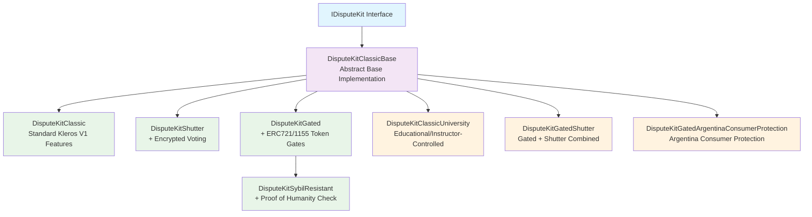
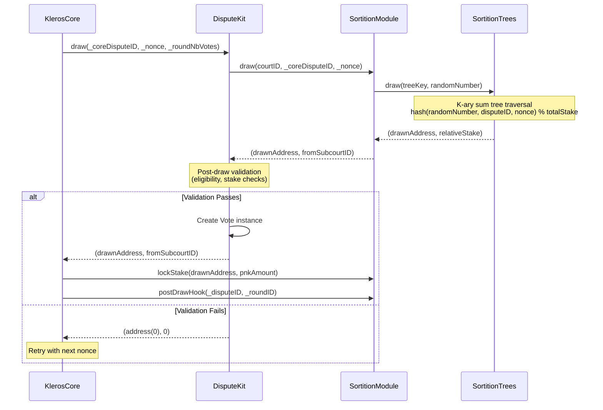
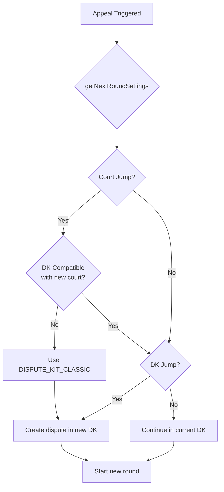
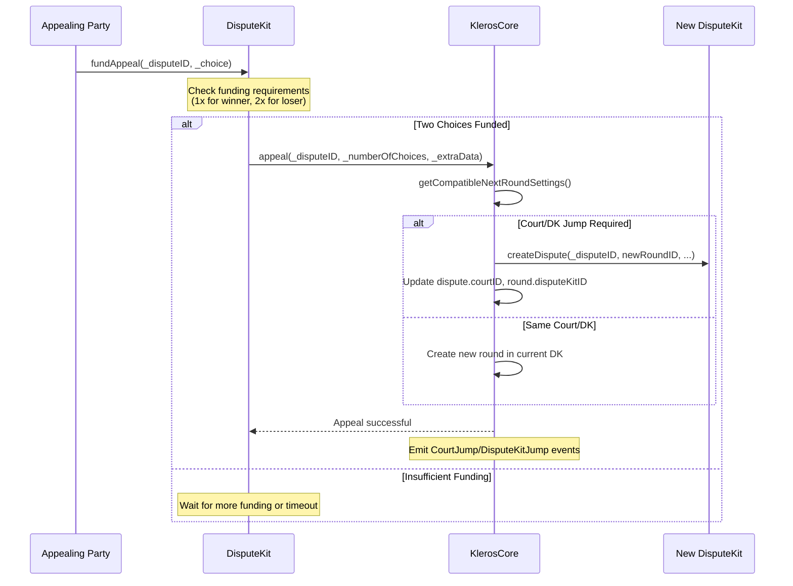
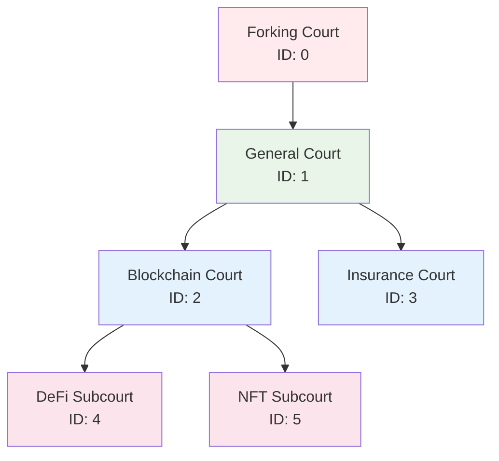

# 🏛️ Dispute Kit Architecture Overview

> Last updated: 2026-03-14 | Based on: kleros-v2 contracts @ dev branch

## 📋 Overview

Kleros V2's dispute resolution system is built around modular **Dispute Kits** that implement different voting, drawing, and incentive mechanisms. This modularity allows courts to choose the most appropriate dispute resolution method for their specific needs.

All dispute kits implement the `IDisputeKit` interface and integrate with KlerosCore through a standardized protocol. They can jump between courts and dispute kits during appeals, enabling sophisticated escalation patterns.

## 📑 Table of Contents

1. [🎯 Core Architecture](#-core-architecture)
   - [Inheritance Hierarchy](#inheritance-hierarchy)
   - [IDisputeKit Interface](#idisputekit-interface)
   - [Integration with KlerosCore](#integration-with-kleroscore)
2. [🎲 Drawing System Pipeline](#-drawing-system-pipeline)
   - [Drawing Flow](#drawing-flow)
   - [SortitionTrees Implementation](#sortitiontrees-implementation)
   - [Post-Draw Validation](#post-draw-validation)
3. [🏺 Available Dispute Kits](#-available-dispute-kits)
   - [Core Implementation: DisputeKitClassic](#core-implementation-disputekitclassic)
   - [Privacy Enhancement: DisputeKitShutter](#privacy-enhancement-disputekitshutter)
   - [Access Control: DisputeKitGated](#access-control-disputekitgated)
   - [Sybil Resistance: DisputeKitSybilResistant](#sybil-resistance-disputekitsybilresistant)
   - [Specialized Variants](#specialized-variants)
4. [🔄 Court and Dispute Kit Selection](#-court-and-dispute-kit-selection)
   - [Initial Selection](#initial-selection)
   - [Appeal Jumps](#appeal-jumps)
   - [Compatibility Matrix](#compatibility-matrix)
5. [📈 Appeal System & DK Jumps](#-appeal-system--dk-jumps)
   - [Appeal Flow](#appeal-flow)
   - [Dispute Kit Jumping](#dispute-kit-jumping)
   - [Court Jumping](#court-jumping)

## 🎯 Core Architecture

### Inheritance Hierarchy



**Key Architectural Principles:**

- **DisputeKitClassicBase**: Abstract base containing all core voting, appeal, and reward logic
- **DisputeKitClassic**: Minimal concrete implementation (inherits Base unchanged)
- **Specialized Variants**: Override specific methods to add features (encryption, gating, etc.)
- **Single Responsibility**: Each kit focuses on one modification to the base behavior

### IDisputeKit Interface

All dispute kits must implement the `IDisputeKit` interface, which defines:

```solidity
interface IDisputeKit {
    // Core lifecycle methods
    function createDispute(uint256 _coreDisputeID, uint256 _coreRoundID, uint256 _numberOfChoices, bytes calldata _extraData, uint256 _nbVotes) external;
    function draw(uint256 _coreDisputeID, uint256 _nonce, uint256 _roundNbVotes) external returns (address drawnAddress, uint96 fromSubcourtID);
    
    // Voting and ruling
    function currentRuling(uint256 _coreDisputeID) external view returns (uint256 ruling, bool tied, bool overridden);
    function areCommitsAllCast(uint256 _coreDisputeID) external view returns (bool);
    function areVotesAllCast(uint256 _coreDisputeID) external view returns (bool);
    
    // Appeal handling
    function isAppealFunded(uint256 _coreDisputeID) external view returns (bool);
    function getNextRoundSettings(uint256 _coreDisputeID, uint96 _currentCourtID, uint96 _parentCourtID, uint256 _currentCourtJurorsForJump, uint256 _currentDisputeKitID, uint256 _currentRoundNbVotes) external view returns (uint96 newCourtID, uint256 newDisputeKitID, uint256 newRoundNbVotes);
    
    // Reward calculation
    function getDegreeOfCoherenceReward(uint256 _coreDisputeID, uint256 _coreRoundID, uint256 _voteID, uint256 _feePerJuror, uint256 _pnkAtStakePerJuror) external view returns (uint256 pnkCoherence, uint256 feeCoherence);
    function getDegreeOfCoherencePenalty(uint256 _coreDisputeID, uint256 _coreRoundID, uint256 _voteID, uint256 _feePerJuror, uint256 _pnkAtStakePerJuror) external view returns (uint256 pnkCoherence);
    function getCoherentCount(uint256 _coreDisputeID, uint256 _coreRoundID) external view returns (uint256);
    
    // Vote information
    function getRoundInfo(uint256 _coreDisputeID, uint256 _coreRoundID, uint256 _choice) external view returns (uint256 winningChoice, bool tied, uint256 totalVoted, uint256 totalCommitted, uint256 nbVoters, uint256 choiceCount);
    function getVoteInfo(uint256 _coreDisputeID, uint256 _coreRoundID, uint256 _voteID) external view returns (address account, bytes32 commit, uint256 choice, bool voted);
    function isVoteActive(uint256 _coreDisputeID, uint256 _coreRoundID, uint256 _voteID) external view returns (bool);
}
```

### Integration with KlerosCore

Dispute kits integrate with KlerosCore through a well-defined protocol:

1. **Registration**: Added to `disputeKits[]` array via `addNewDisputeKit()`
2. **Court Support**: Courts explicitly enable supported dispute kit IDs
3. **Dispute Creation**: Core calls `createDispute()` with dispute parameters
4. **Drawing**: Core calls `draw()` repeatedly until all jurors are drawn
5. **Period Management**: Core queries `areCommitsAllCast()`, `areVotesAllCast()`, `isAppealFunded()`
6. **Rewards**: Core calls coherence methods during execution phase

## 🎲 Drawing System Pipeline

### Drawing Flow

The juror drawing system operates through a multi-layer pipeline:



### SortitionTrees Implementation

The drawing system uses **K-ary sum trees** for efficient weighted random selection:

**Tree Structure:**
- Each court maintains its own sortition tree
- Leaf nodes contain juror stakes: `stakePathID = toStakePathID(address, courtID)`
- Internal nodes contain sum of child stakes
- Tree automatically rebalances on stake changes

**Drawing Algorithm:**
```solidity
// 1. Generate deterministic random position
uint256 randomNumber = hash(disputeID, nonce, block.timestamp);
uint256 targetPosition = randomNumber % totalStaked;

// 2. Walk tree to find juror at position
// Traverse from root, following path where:
// - Go left if targetPosition < leftSubtreeSum
// - Go right and subtract leftSubtreeSum otherwise

// 3. Return results
return (drawnAddress, fromSubcourtID);
```

**Key Properties:**
- **Deterministic**: Same inputs always produce same result
- **Proportional**: Probability ∝ staked amount
- **Efficient**: O(log n) tree traversal
- **Cross-court**: `fromSubcourtID` may differ from dispute court

### Post-Draw Validation

After the sortition tree returns a juror, dispute kits perform validation:

```mermaid
graph TD
    Draw[Tree Draw Completed] --> Check1{Address != 0?}
    Check1 -->|No| Reject[Return address(0)]
    Check1 -->|Yes| Check2{Base Validations}
    
    Check2 --> Check3{singleDrawPerJuror<br/>enabled?}
    Check3 -->|Yes| Check4{Already drawn<br/>this round?}
    Check4 -->|Yes| Reject
    Check4 -->|No| Check5{Additional DK<br/>Validations}
    Check3 -->|No| Check5
    
    Check5 --> CheckGated{DisputeKitGated?}
    CheckGated -->|Yes| TokenBalance{Token balance > 0?}
    TokenBalance -->|No| Reject
    TokenBalance -->|Yes| Accept
    CheckGated -->|No| CheckPoh{DisputeKitSybilResistant?}
    CheckPoh -->|Yes| PohCheck{PoH verified?}
    PohCheck -->|No| Reject
    PohCheck -->|Yes| Accept
    CheckPoh -->|No| Accept[Create Vote & Return Address]
    
    Accept --> VoteCreated[Vote instance created<br/>round.alreadyDrawn[address] = true]
```

**Validation Layers:**
1. **Base Validation**: Address not zero, sufficient stake
2. **Single Draw Check**: Prevent duplicate draws if enabled
3. **Dispute Kit Specific**: Token holdings, PoH status, etc.

## 🏺 Available Dispute Kits

### Core Implementation: DisputeKitClassic

**ID**: 1 (DISPUTE_KIT_CLASSIC constant)
**Features**:
- Proportional drawing by staked PNK
- Plurality vote aggregation
- Equal reward split among coherent voters
- Binary appeal funding (2 choices only)

**Architecture**: Inherits from `DisputeKitClassicBase` without modifications

### Privacy Enhancement: DisputeKitShutter

**Features**:
- All DisputeKitClassic features
- **+ Encrypted voting** via Shutter Network
- Separate justification commitments
- Keyper-based vote encryption/decryption

**Key Differences**:
- `castCommitShutter()`: Submit encrypted vote with Shutter identity
- `castVoteShutter()`: Reveal vote (juror or anyone with decryption)
- `hashJustification()`: Separate commitment for justification text

### Access Control: DisputeKitGated

**Features**:
- All DisputeKitClassic features  
- **+ Token-gated juror eligibility**
- Supports ERC-721 and ERC-1155 tokens
- Court-specific token allowlists

**Key Differences**:
- `isEligible()`: Implements ICourtEligibility interface
- `_postDrawCheck()`: Validates token ownership after tree draw
- `createDispute()`: Requires token gate in extraData
- Per-court token configuration

### Sybil Resistance: DisputeKitSybilResistant

**Features**:
- Inherits from DisputeKitGated
- **+ Proof of Humanity verification**
- `singleDrawPerJuror = true` (one vote per human maximum)

**Key Differences**:
- `isEligible()`: Checks PoH registry status
- `_postDrawCheck()`: Validates PoH verification after draw

### Specialized Variants

**DisputeKitClassicUniversity**:
- Educational dispute kit with instructor-controlled drawing
- Replaces sortition with preset juror queues
- `setJurors()`: Instructor sets juror list in advance

**DisputeKitGatedShutter**: 
- Combines token gating with encrypted voting
- Supports both ERC-721 and ERC-1155 gating
- Shutter encryption for privacy

**DisputeKitGatedArgentinaConsumerProtection**:
- Argentina consumer protection court specialization
- Requires both professional credentials and consumer protection lawyers
- Guarantees at least one consumer protection lawyer per panel

## 🔄 Court and Dispute Kit Selection

### Initial Selection

When creating a dispute, the arbitrable contract provides `extraData` encoding:

```solidity
// extraData structure (96+ bytes):
// bytes 0-31:   uint96 courtID
// bytes 32-63:  uint256 minJurors  
// bytes 64-95:  uint256 disputeKitID
// bytes 96+:    Additional DK-specific data
```

**Selection Process**:
1. Extract courtID, minJurors, disputeKitID from extraData
2. Validate court supports the requested dispute kit
3. Create dispute with specified parameters
4. Initialize first round with minJurors votes

### Appeal Jumps

During appeals, disputes can jump to different courts and/or dispute kits:



### Compatibility Matrix

| Court Type | Classic | Shutter | Gated | SybilResistant | University |
|------------|---------|---------|-------|----------------|------------|
| General    | ✓       | ✓       | ✓     | ✓              | ✓          |
| Specialized| ✓       | Depends | ✓     | Depends        | ✗          |
| Gated      | ✓       | ✓       | ✓     | ✓              | ✗          |

**Compatibility Rules**:
- All courts must support DisputeKitClassic
- Courts explicitly enable additional dispute kits
- University kit typically restricted to educational courts
- Gated kits require token configuration per court

## 📈 Appeal System & DK Jumps

### Appeal Flow



### Dispute Kit Jumping

Dispute kits can specify custom jump logic via `getNextRoundSettings()`:

```solidity
function getNextRoundSettings(
    uint256 _coreDisputeID,
    uint96 _currentCourtID, 
    uint96 _parentCourtID,
    uint256 _currentCourtJurorsForJump,
    uint256 _currentDisputeKitID,
    uint256 _currentRoundNbVotes
) external view returns (
    uint96 newCourtID,
    uint256 newDisputeKitID, 
    uint256 newRoundNbVotes
);
```

**Jump Triggers**:
- **Court Jump**: When `nbVotes >= jurorsForCourtJump` (go to parent court)
- **DK Jump**: Based on dispute kit's custom logic
- **Fallback**: If incompatible, use DisputeKitClassic with 2n+1 votes

### Court Jumping

Courts form hierarchical trees with appeal escalation:



**Escalation Rules**:
- Start in subcourt, escalate to parent when threshold reached
- Each level roughly doubles the number of jurors
- Forking court represents highest possible escalation (not yet implemented)
- Court jump triggers compatibility check for dispute kit support