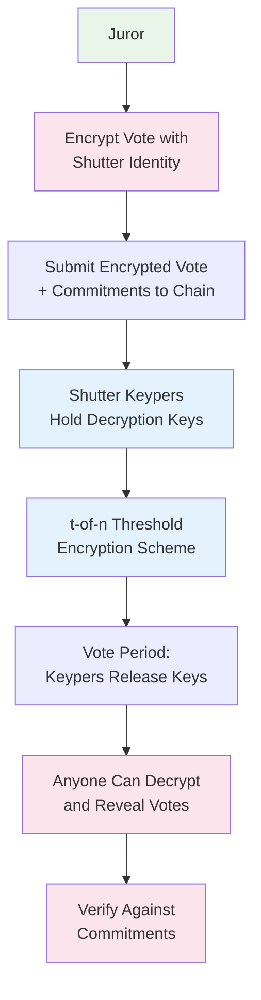
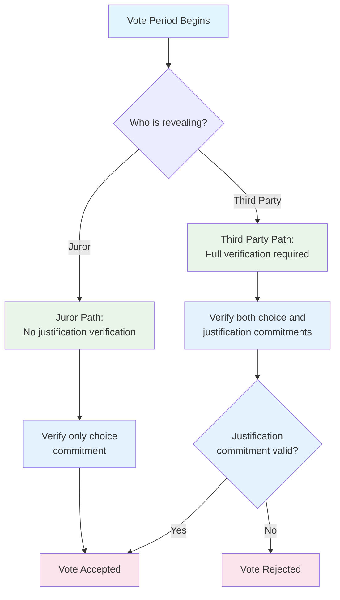
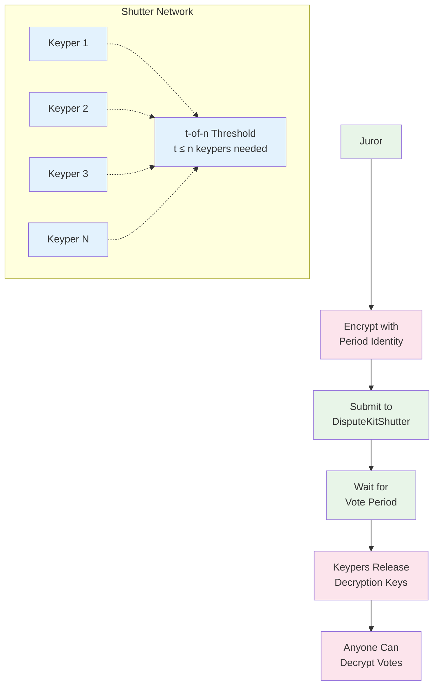
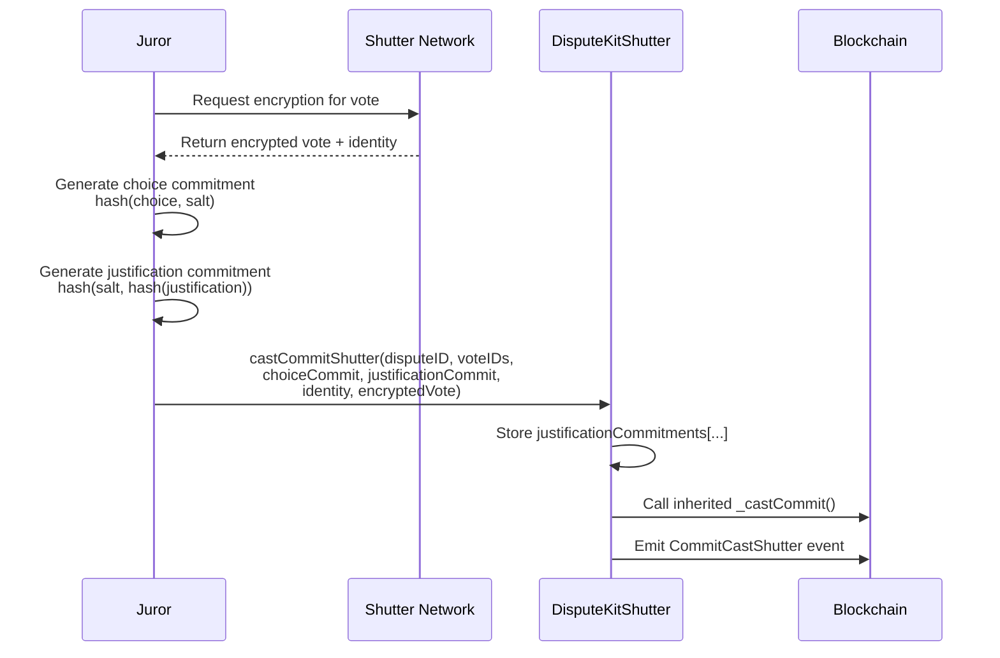
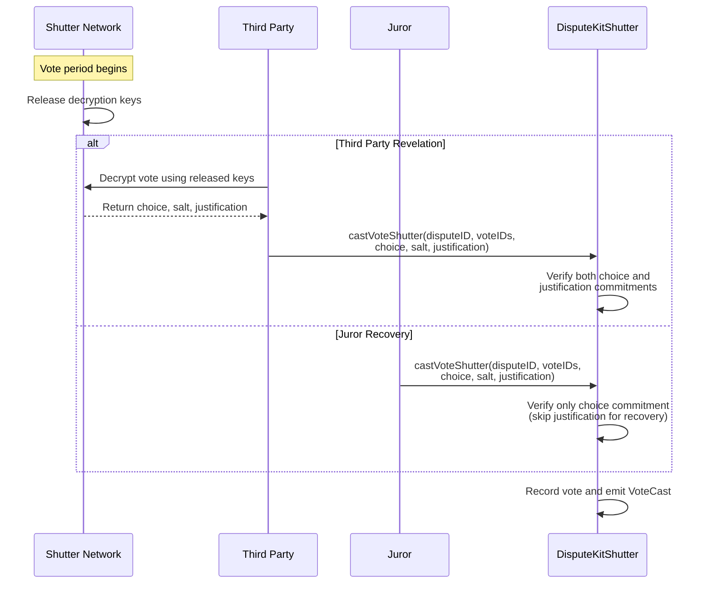

# 🔒 Shutter Dispute Kit Specification

> Last updated: 2026-03-14 | Based on: kleros-v2 contracts @ dev branch

## 📋 Overview

The Shutter Dispute Kit (`DisputeKitShutter`) extends the Classic Dispute Kit with **encrypted voting capabilities** via the Shutter Network. This provides enhanced privacy and prevents vote buying by ensuring votes remain confidential until after the voting period ends.

The kit inherits all features from `DisputeKitClassicBase` while adding a sophisticated commit-reveal mechanism that separates choice commitments from justification commitments and integrates with Shutter Network keypers for vote encryption.

## 📑 Table of Contents

1. [🎯 Core Features](#-core-features)
   - [All Classic Features](#all-classic-features)
   - [Enhanced Privacy: Shutter Encryption](#enhanced-privacy-shutter-encryption)
     - [Shutter Network Integration](#shutter-network-integration)
     - [Dual Commitment System](#dual-commitment-system)
     - [Vote Recovery Mechanism](#vote-recovery-mechanism)
2. [🔐 Encryption Architecture](#-encryption-architecture)
   - [Shutter Network Overview](#shutter-network-overview)
   - [Keyper Network](#keyper-network)
   - [Encryption Flow](#encryption-flow)
   - [Decryption Process](#decryption-process)
3. [📢 Events](#-events)
   - [Standard Events (Inherited)](#standard-events-inherited)
   - [Shutter-Specific Events](#shutter-specific-events)
     - [CommitCastShutter](#commitcastshutter)
   - [Event Usage Patterns](#event-usage-patterns)
4. [🔧 Key Methods](#-key-methods)
   - [Shutter Voting Methods](#shutter-voting-methods)
     - [castCommitShutter](#castcommitshutter)
     - [castVoteShutter](#castvoteshutter)
   - [Utility Methods](#utility-methods)
     - [hashJustification](#hashjustification)
   - [Inherited Methods](#inherited-methods)
5. [🔄 Vote Lifecycle](#-vote-lifecycle)
   - [Commit Phase](#commit-phase)
   - [Vote/Reveal Phase](#votereveal-phase)
   - [Validation Flow](#validation-flow)
6. [📝 Implementation Details](#-implementation-details)
   - [Storage Extensions](#storage-extensions)
   - [Commitment Verification](#commitment-verification)
   - [Recovery Mechanisms](#recovery-mechanisms)
7. [🔒 Security Considerations](#-security-considerations)
   - [Encryption Security](#1-encryption-security)
   - [Commitment Integrity](#2-commitment-integrity)
   - [Vote Privacy](#3-vote-privacy)
   - [Recovery Safety](#4-recovery-safety)

## 🎯 Core Features

### All Classic Features

DisputeKitShutter inherits all functionality from DisputeKitClassicBase:

- **Drawing System**: Proportional selection by staked PNK via SortitionTrees
- **Vote Aggregation**: Plurality voting with real-time winner tracking
- **Incentive System**: Equal reward split among coherent voters
- **Appeal System**: Binary funding with 1x/2x multipliers

For details on these inherited features, see the [Classic Dispute Kit Specification](./dispute-kit-classic.md).

### Enhanced Privacy: Shutter Encryption

#### Shutter Network Integration

The Shutter Network provides **threshold encryption** for vote privacy:



**Key Benefits**:
- **Vote Buying Resistance**: Votes cannot be verified until after voting period
- **Coercion Prevention**: Jurors cannot prove their vote choice during voting
- **Enhanced Privacy**: Vote content hidden until collective reveal
- **Censorship Resistance**: Distributed keyper network prevents single points of failure

#### Dual Commitment System

Shutter introduces separate commitments for vote choice and justification:

```mermaid
graph LR
    Vote[Juror's Vote] --> ChoiceCommit[Choice Commitment<br/>keccak256(choice, salt)]
    Vote --> JustificationCommit[Justification Commitment<br/>keccak256(salt, keccak256(justification))]
    
    ChoiceCommit --> EncryptedVote[Encrypted Vote Package<br/>Shutter Identity + Encrypted Data]
    JustificationCommit --> EncryptedVote
    
    EncryptedVote --> OnChain[On-chain Storage]
    
    classDef input fill:#e8f5e8
    classDef commit fill:#e3f2fd
    classDef encrypted fill:#fce4ec
    classDef storage fill:#fff3e0
    
    class Vote input
    class ChoiceCommit,JustificationCommit commit
    class EncryptedVote encrypted
    class OnChain storage
```

**Commitment Structure**:
- **Choice Commitment**: `keccak256(abi.encodePacked(choice, salt))` (inherited from base)
- **Justification Commitment**: `keccak256(abi.encode(salt, keccak256(bytes(justification))))`
- **Encrypted Vote**: Shutter-encrypted package containing vote data

#### Vote Recovery Mechanism

The system provides multiple paths for vote revelation:



**Recovery Benefits**:
- **Juror Protection**: Jurors can always recover their votes even if justification is lost
- **Network Resilience**: Third parties can reveal votes using Shutter decryption
- **Flexibility**: Multiple revelation paths prevent vote loss

## 🔐 Encryption Architecture

### Shutter Network Overview

The Shutter Network is a **threshold encryption service** that enables time-based vote privacy:

**Core Components**:
- **Keypers**: Distributed set of key-holding nodes
- **Threshold Scheme**: t-of-n encryption where t keypers must cooperate
- **Identity System**: Unique encryption identities per voting period
- **Time-lock**: Automatic key release after voting deadline

### Keyper Network



### Encryption Flow

1. **Identity Generation**: Shutter generates unique encryption identity for voting period
2. **Vote Encryption**: Juror encrypts vote data using period identity
3. **Commitment**: Juror creates separate commitments for choice and justification
4. **Submission**: All components submitted via `castCommitShutter()`
5. **Storage**: On-chain storage of encrypted vote and commitments

### Decryption Process

1. **Period Transition**: Vote period begins, commit period ends
2. **Key Release**: Shutter keypers release decryption keys for the period
3. **Decryption**: Anyone can decrypt votes using released keys
4. **Revelation**: Decrypted votes revealed via `castVoteShutter()`
5. **Verification**: System verifies revealed votes against commitments

## 📢 Events

### Standard Events (Inherited)

DisputeKitShutter emits all standard events from the base implementation:
- `VoteCast`: Emitted during vote revelation (either by juror or third party)
- `DisputeCreation`: Emitted when dispute is created
- Standard appeal events: `Contribution`, `ChoiceFunded`, `Withdrawal`

### Shutter-Specific Events

#### `CommitCastShutter`

Emitted when a juror submits their encrypted vote commitment via the Shutter mechanism.

```solidity
event CommitCastShutter(
    uint256 indexed _coreDisputeID,
    address indexed _juror,
    bytes32 indexed _choiceCommit,
    bytes32 _justificationCommit,
    bytes32 _identity,
    bytes _encryptedVote
);
```

**Parameters**:
- `_coreDisputeID`: Dispute identifier in the Arbitrator contract
- `_juror`: Address of the juror casting the encrypted vote
- `_choiceCommit`: Hash of the choice commitment (choice + salt)
- `_justificationCommit`: Hash of the justification commitment  
- `_identity`: Shutter identity used for encryption
- `_encryptedVote`: Encrypted vote data from Shutter Network

**Usage**: Track encrypted vote submissions and provide data for off-chain decryption

### Event Usage Patterns

1. **Encryption Monitoring**: Use `CommitCastShutter` to track encrypted submissions
2. **Decryption Coordination**: Extract `_identity` and `_encryptedVote` for Shutter decryption
3. **Vote Tracking**: Standard `VoteCast` events track successful revelations
4. **Privacy Analysis**: Compare commit vs reveal timing for privacy metrics

## 🔧 Key Methods

### Shutter Voting Methods

#### castCommitShutter

```solidity
function castCommitShutter(
    uint256 _coreDisputeID,
    uint256[] calldata _voteIDs,
    bytes32 _choiceCommit,
    bytes32 _justificationCommit,
    bytes32 _identity,
    bytes calldata _encryptedVote
) external
```

**Purpose**: Submit encrypted vote with dual commitment system

**Parameters**:
- `_coreDisputeID`: Dispute identifier
- `_voteIDs`: Array of vote IDs to commit for
- `_choiceCommit`: Commitment hash for vote choice
- `_justificationCommit`: Commitment hash for justification text
- `_identity`: Shutter encryption identity for this period
- `_encryptedVote`: Encrypted vote data from Shutter Network

**Requirements**:
- Must be in commit period
- Caller must own all vote IDs
- Justification commitment must not be empty
- All standard commit period validations apply

**Behavior**:
- Stores justification commitments in `justificationCommitments[localDisputeID][localRoundID][voteID]`
- Calls inherited `_castCommit()` for choice commitment storage
- Emits `CommitCastShutter` event with encryption details

#### castVoteShutter

```solidity
function castVoteShutter(
    uint256 _coreDisputeID,
    uint256[] calldata _voteIDs,
    uint256 _choice,
    uint256 _salt,
    string memory _justification
) external
```

**Purpose**: Reveal encrypted votes (callable by juror or third party with Shutter decryption)

**Parameters**:
- `_coreDisputeID`: Dispute identifier
- `_voteIDs`: Array of vote IDs being revealed
- `_choice`: Revealed vote choice
- `_salt`: Salt used in commitments
- `_justification`: Revealed justification text

**Access Control**:
- **Juror**: Can always reveal their own votes (recovery mechanism)
- **Third Party**: Must have courts with hidden votes for non-juror revelation

**Behavior**:
- Sets transient `callerIsJuror` flag for validation logic
- Calls inherited `_castVote()` with juror address as voter
- Validates commitments based on caller type (see validation flow below)

### Utility Methods

#### hashJustification

```solidity
function hashJustification(uint256 _salt, string memory _justification) public pure returns (bytes32)
```

**Purpose**: Compute justification commitment hash

**Formula**: `keccak256(abi.encode(_salt, keccak256(bytes(_justification))))`

**Usage**: Off-chain commitment generation and on-chain verification

### Inherited Methods

All standard methods from `DisputeKitClassicBase` remain available:
- `castCommit()`: Standard commitment (not recommended with Shutter)
- `castVote()`: Standard vote casting (not recommended with Shutter)
- `fundAppeal()`: Appeal funding
- `withdrawFeesAndRewards()`: Reward withdrawal

## 🔄 Vote Lifecycle

### Commit Phase



### Vote/Reveal Phase



### Validation Flow

The validation logic handles different revelation scenarios:

```solidity
function _verifyHiddenVoteCommitments(
    uint256 _localDisputeID,
    uint256 _localRoundID,
    uint256[] calldata _voteIDs,
    uint256 _choice,
    string memory _justification,
    uint256 _salt
) internal view override {
    // Always verify choice commitment (inherited from base)
    super._verifyHiddenVoteCommitments(_localDisputeID, _localRoundID, _voteIDs, _choice, _justification, _salt);
    
    // Skip justification verification for juror recovery
    if (callerIsJuror) return;
    
    // Verify justification commitment for third party revelations
    bytes32 actualJustificationHash = hashJustification(_salt, _justification);
    for (uint256 i = 0; i < _voteIDs.length; i++) {
        require(
            justificationCommitments[_localDisputeID][_localRoundID][_voteIDs[i]] == actualJustificationHash,
            "JustificationCommitmentMismatch"
        );
    }
}
```

## 📝 Implementation Details

### Storage Extensions

DisputeKitShutter adds minimal storage for justification tracking:

```solidity
// Justification commitment storage
mapping(uint256 localDisputeID => mapping(uint256 localRoundID => mapping(uint256 voteID => bytes32 justificationCommitment)))
    public justificationCommitments;

// Transient storage for validation context
bool transient callerIsJuror;
```

### Commitment Verification

The system uses a dual verification approach:

**Choice Commitment** (inherited):
```solidity
function hashVote(uint256 _choice, uint256 _salt, string memory _justification) 
    public view virtual returns (bytes32) {
    return keccak256(abi.encodePacked(_choice, _salt));
    // Note: justification not included in choice commitment
}
```

**Justification Commitment** (Shutter-specific):
```solidity
function hashJustification(uint256 _salt, string memory _justification) 
    public pure returns (bytes32) {
    return keccak256(abi.encode(_salt, keccak256(bytes(_justification))));
}
```

### Recovery Mechanisms

**Juror Recovery Path**:
- Jurors can always reveal their votes using known choice and salt
- Justification verification is skipped to prevent loss of voting rights
- Enables recovery even if justification text is corrupted or lost

**Third Party Path**:
- Requires Shutter Network decryption of the encrypted vote package
- Full verification including justification commitment
- Ensures vote integrity when revealed by non-jurors

## 🔒 Security Considerations

### 1. Encryption Security

**Threats**:
- Keyper collusion to decrypt votes early
- Shutter Network attacks or downtime
- Identity reuse across periods

**Mitigations**:
- Threshold encryption (t-of-n) prevents single keyper attacks
- Juror recovery path provides fallback if Shutter fails
- Unique identities per voting period prevent cross-period attacks
- Distributed keyper network reduces central points of failure

### 2. Commitment Integrity

**Threats**:
- Commitment manipulation before revelation
- Salt collision attacks  
- Hash function vulnerabilities

**Mitigations**:
- Immutable on-chain commitment storage
- Cryptographically secure random salt generation
- Separate hash functions for choice and justification
- Keccak256 with well-tested security properties

### 3. Vote Privacy

**Threats**:
- Voter identification through encryption patterns
- Timing analysis of commits vs reveals
- Metadata leakage through transaction patterns

**Mitigations**:
- Shutter Network provides unlinkable encryption
- Standard gas costs hide vote complexity
- Event data provides minimal identifying information
- Multiple revelation paths obscure voter identity

### 4. Recovery Safety

**Threats**:
- Malicious juror revealing incorrect votes
- Justification tampering during recovery
- Vote denial through commitment mismatch

**Mitigations**:
- Choice commitment verification always enforced
- Recovery only skips justification, not vote choice
- Clear error messages for debugging commitment mismatches
- Multiple revelation attempts allowed during vote period