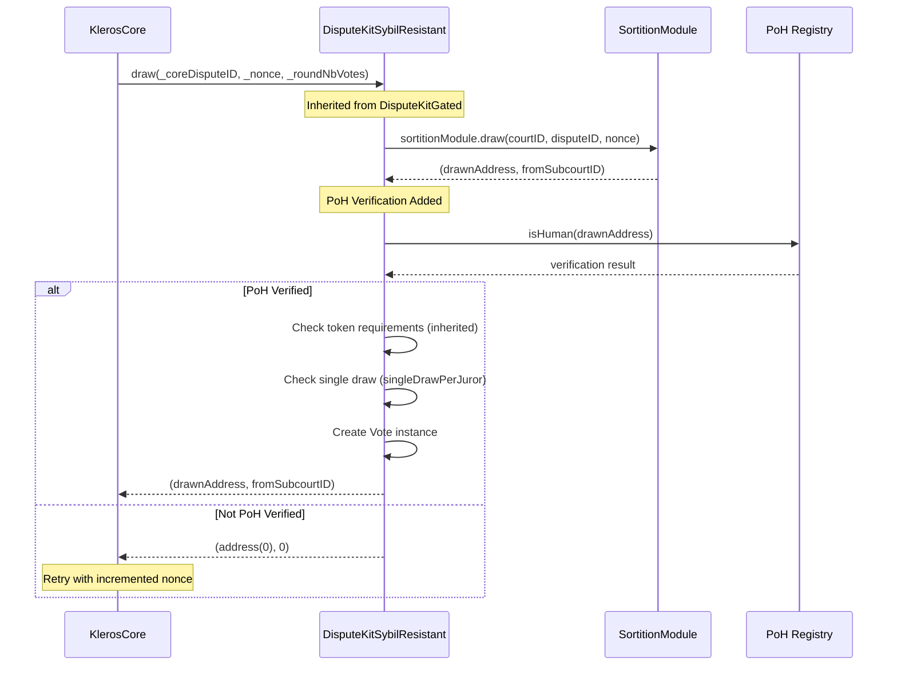
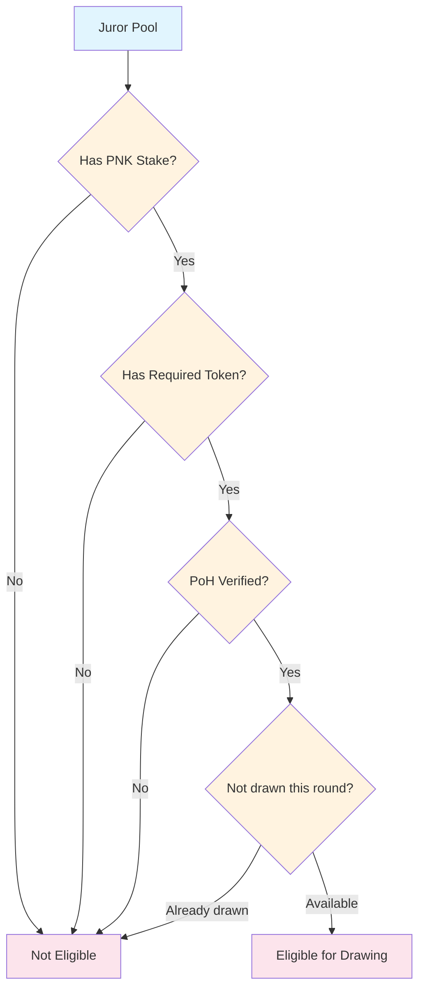
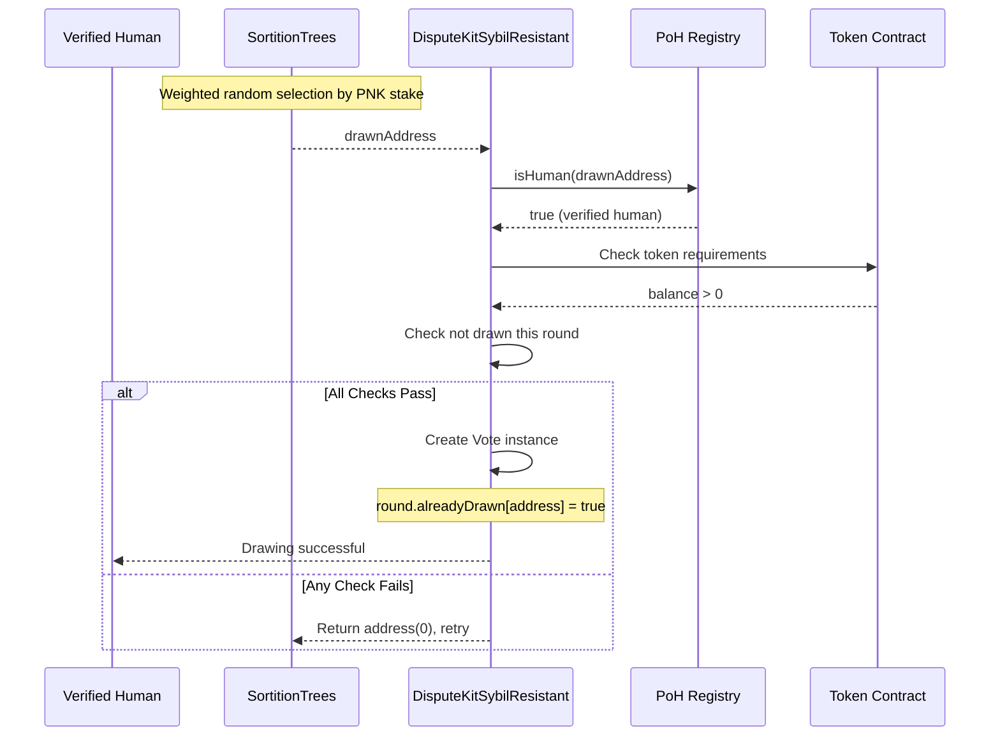

# 🛡️ Sybil Resistant Dispute Kit Specification

> Last updated: 2026-03-14 | Based on: kleros-v2 contracts @ dev branch

## 📋 Overview

The Sybil Resistant Dispute Kit (`DisputeKitSybilResistant`) extends the Gated Dispute Kit with **Proof of Humanity (PoH) verification**. Only jurors with verified human status in the Proof of Humanity registry can participate in disputes, ensuring "one human, one vote" democracy.

This dispute kit inherits the token gating capabilities from `DisputeKitGated` and adds PoH verification as the ultimate sybil resistance mechanism. It automatically enables `singleDrawPerJuror = true` to enforce the one-vote-per-human principle.

## 📑 Table of Contents

1. [🎯 Core Features](#-core-features)
   - [All Gated Features](#all-gated-features)
   - [Proof of Humanity Verification](#proof-of-humanity-verification)
     - [PoH Registry Integration](#poh-registry-integration)
     - [Single Vote Enforcement](#single-vote-enforcement)
     - [Human-Centric Democracy](#human-centric-democracy)
2. [🧑‍🤝‍🧑 Proof of Humanity System](#-proof-of-humanity-system)
   - [PoH Registry Overview](#poh-registry-overview)
   - [Human Verification Process](#human-verification-process)
   - [Registry Integration](#registry-integration)
3. [🎲 Sybil-Resistant Drawing](#-sybil-resistant-drawing)
   - [Drawing Modifications](#drawing-modifications)
   - [Single Draw Enforcement](#single-draw-enforcement)
   - [Eligibility Pipeline](#eligibility-pipeline)
4. [📢 Events](#-events)
   - [Standard Events (Inherited)](#standard-events-inherited)
   - [No Additional Events](#no-additional-events)
5. [🔧 Key Methods](#-key-methods)
   - [Eligibility Methods](#eligibility-methods)
     - [isEligible](#iseligible)
   - [Inherited Methods](#inherited-methods)
6. [🔄 Human Verification Flow](#-human-verification-flow)
   - [Verification Prerequisites](#verification-prerequisites)
   - [Drawing Process](#drawing-process)
   - [Post-Draw Validation](#post-draw-validation)
7. [📝 Implementation Details](#-implementation-details)
   - [PoH Interface Integration](#poh-interface-integration)
   - [Single Draw Configuration](#single-draw-configuration)
   - [Validation Override](#validation-override)
8. [🔒 Security Considerations](#-security-considerations)
   - [Sybil Attack Prevention](#1-sybil-attack-prevention)
   - [PoH Registry Security](#2-poh-registry-security)
   - [Identity Verification](#3-identity-verification)
   - [Democracy Preservation](#4-democracy-preservation)

## 🎯 Core Features

### All Gated Features

DisputeKitSybilResistant inherits all functionality from DisputeKitGated:

- **Drawing System**: Proportional selection by staked PNK via SortitionTrees
- **Vote Aggregation**: Plurality voting with real-time winner tracking
- **Incentive System**: Equal reward split among coherent voters  
- **Appeal System**: Binary funding with 1x/2x multipliers
- **Token Gating**: ERC-721 and ERC-1155 eligibility requirements

For details on these inherited features, see the [Gated Dispute Kit Specification](./dispute-kit-gated.md).

### Proof of Humanity Verification

#### PoH Registry Integration

The dispute kit integrates with the Proof of Humanity v2 registry:

```mermaid
graph TB
    subgraph "Proof of Humanity Registry"
        POH[PoH Registry Contract]
        Humans[Verified Humans Database]
        Validation[Identity Validation Process]
    end
    
    subgraph "DisputeKitSybilResistant"
        DK[Dispute Kit]
        Eligibility[isEligible() Check]
        Drawing[Post-Draw Validation]
    end
    
    subgraph "Juror Pool"
        Staked[Staked Jurors]
        Verified[PoH Verified]
        TokenHolders[Token Holders]
        Eligible[Eligible Pool]
    end
    
    POH --> Eligibility
    Staked --> Eligible
    Verified --> Eligible
    TokenHolders --> Eligible
    
    Eligible --> Drawing
    Drawing --> POH
    
    classDef registry fill:#e3f2fd
    classDef kit fill:#e8f5e8
    classDef pool fill:#fff3e0
    
    class POH,Humans,Validation registry
    class DK,Eligibility,Drawing kit
    class Staked,Verified,TokenHolders,Eligible pool
```

**Integration Benefits**:
- **Sybil Resistance**: Prevents creation of multiple accounts by same person
- **Democratic Legitimacy**: Ensures each human gets equal voting power
- **Identity Verification**: Leverages established PoH verification process
- **Community Trust**: Builds on proven identity verification system

#### Single Vote Enforcement

The dispute kit automatically enforces one vote per human maximum:

```mermaid
graph TD
    Init[Contract Initialization] --> SetSingle[singleDrawPerJuror = true]
    SetSingle --> Drawing[Juror Drawing Process]
    
    Drawing --> CheckDrawn{Already drawn<br/>this round?}
    CheckDrawn -->|Yes| Reject[Reject Draw<br/>Return address(0)]
    CheckDrawn -->|No| CheckPoH{PoH Verified?}
    
    CheckPoH -->|Yes| Accept[Accept Draw<br/>Create Vote Instance]
    CheckPoH -->|No| Reject
    
    Accept --> Track[round.alreadyDrawn[address] = true]
    
    classDef process fill:#e8f5e8
    classDef decision fill:#fff3e0
    classDef result fill:#fce4ec
    
    class Init,SetSingle,Drawing,Track process
    class CheckDrawn,CheckPoH decision
    class Reject,Accept result
```

**Enforcement Mechanisms**:
- `singleDrawPerJuror = true` set during initialization
- `round.alreadyDrawn[]` mapping prevents duplicate draws
- PoH verification occurs on every draw attempt
- Failed draws trigger retry with different address

#### Human-Centric Democracy

The system implements true democratic principles:

**One Human, One Vote**:
- Maximum one vote per verified human per round
- PNK stake affects drawing probability, but not vote count
- High-stake humans cannot accumulate multiple votes

**Democratic Legitimacy**:
- Each vote represents an actual verified human
- Prevents wealthy individuals from dominating through multiple accounts
- Ensures community representation over capital concentration

## 🧑‍🤝‍🧑 Proof of Humanity System

### PoH Registry Overview

The Proof of Humanity registry provides decentralized identity verification:

```mermaid
graph TB
    subgraph "Identity Verification Process"
        Submit[Submit Identity Claim]
        Video[Video Evidence]
        Challenge[Challenge Period]
        Verify[Community Verification]
    end
    
    subgraph "Registry State"
        Pending[Pending Claims]
        Verified[Verified Humans]
        Challenged[Challenged Claims]
        Removed[Removed/Expired]
    end
    
    subgraph "Integration Points"
        Interface[IProofOfHumanity]
        IsHuman[isHuman(address)]
        Result[Boolean Result]
    end
    
    Submit --> Pending
    Video --> Pending
    Challenge --> Challenged
    Verify --> Verified
    
    Verified --> Interface
    Interface --> IsHuman
    IsHuman --> Result
    
    classDef process fill:#e8f5e8
    classDef state fill:#e3f2fd
    classDef integration fill:#fff3e0
    
    class Submit,Video,Challenge,Verify process
    class Pending,Verified,Challenged,Removed state
    class Interface,IsHuman,Result integration
```

### Human Verification Process

**PoH Verification Requirements**:
1. **Video Evidence**: Clear video showing person stating address
2. **Community Validation**: Other verified humans vouch for identity
3. **Challenge Process**: Disputed claims go through arbitration
4. **Continuous Monitoring**: Regular checks for duplicate accounts

### Registry Integration

The dispute kit integrates via the `IProofOfHumanity` interface:

```solidity
interface IProofOfHumanity {
    /// @notice Check whether the account corresponds to a claimed humanity.
    /// @param _account The account address.
    /// @return Whether the account has a valid humanity.
    function isHuman(address _account) external view returns (bool);
}
```

## 🎲 Sybil-Resistant Drawing

### Drawing Modifications

The drawing process includes PoH verification at multiple checkpoints:



### Single Draw Enforcement

The `_postDrawCheck()` method enforces single-draw-per-human:

```solidity
function _postDrawCheck(
    Round storage _round,
    uint256 _coreDisputeID,
    address _juror,
    uint256 _roundNbVotes
) internal view override returns (bool) {
    // First check inherited validations (token requirements)
    if (!super._postDrawCheck(_round, _coreDisputeID, _juror, _roundNbVotes)) {
        return false;
    }
    
    // Then check PoH verification
    return poh.isHuman(_juror);
}
```

**Validation Sequence**:
1. **Base Validation**: Standard drawing checks
2. **Token Validation**: Inherited from DisputeKitGated  
3. **Single Draw Check**: `singleDrawPerJuror` enforcement
4. **PoH Verification**: Human status verification
5. **Final Accept/Reject**: All checks must pass

### Eligibility Pipeline



## 📢 Events

### Standard Events (Inherited)

DisputeKitSybilResistant emits all standard events from its parent classes:
- `VoteCast`: Emitted when verified humans cast votes
- `DisputeCreation`: Emitted when sybil-resistant dispute is created
- Standard appeal events: `Contribution`, `ChoiceFunded`, `Withdrawal`
- Token configuration events: `SupportedErc721TokenChanged`, `SupportedErc1155TokenIdChanged`

### No Additional Events

The sybil resistant kit does not introduce additional events beyond those inherited from `DisputeKitGated`. The PoH verification happens via external registry calls without custom events.

## 🔧 Key Methods

### Eligibility Methods

#### isEligible

```solidity
function isEligible(address _juror, uint96 /* _courtID */) external view override returns (bool)
```

**Purpose**: Check if juror is eligible for sybil-resistant courts

**Simplified Logic**: Only checks PoH verification (ignores court-specific token requirements in this implementation)

```solidity
return poh.isHuman(_juror);
```

**Note**: This implementation only checks PoH status. The court-specific token requirements are validated during the drawing process via inherited `_postDrawCheck()` method.

**Design Decision**: The `isEligible()` implementation focuses on the sybil-resistance aspect rather than combining with token gating for simplicity.

### Inherited Methods

All methods from `DisputeKitGated` and `DisputeKitClassicBase` remain available:

- **Token Configuration**: `changeSupportedErc721Tokens()`, `changeSupportedErc1155TokenIds()`
- **Voting Methods**: `castCommit()`, `castVote()`  
- **Appeal Methods**: `fundAppeal()`, `withdrawFeesAndRewards()`
- **Query Methods**: All token and eligibility query functions

## 🔄 Human Verification Flow

### Verification Prerequisites

Before participating in sybil-resistant courts, jurors must:

1. **Complete PoH Registration**:
   - Submit identity claim to PoH registry
   - Provide video evidence
   - Pass community validation
   - Maintain verified status

2. **Stake PNK**: 
   - Stake required amount in target court
   - Meet court's minimum stake requirements

3. **Hold Required Tokens** (if applicable):
   - Obtain ERC-721 or ERC-1155 tokens specified by court
   - Maintain token balance through dispute lifecycle

### Drawing Process



### Post-Draw Validation

The validation process ensures comprehensive eligibility:

```mermaid
graph TD
    Draw[Address Drawn] --> BaseCheck{Base Validation<br/>(stake, etc.)}
    BaseCheck -->|Fail| Reject[Return address(0)]
    BaseCheck -->|Pass| TokenCheck{Token Requirements<br/>(inherited)}
    
    TokenCheck -->|Fail| Reject
    TokenCheck -->|Pass| SingleCheck{Single Draw Check<br/>(singleDrawPerJuror)}
    
    SingleCheck -->|Already drawn| Reject
    SingleCheck -->|Not drawn| PohCheck{PoH Verification}
    
    PohCheck -->|Not human| Reject
    PohCheck -->|Human verified| Accept[Create Vote Instance]
    
    classDef check fill:#fff3e0
    classDef result fill:#fce4ec
    
    class BaseCheck,TokenCheck,SingleCheck,PohCheck check
    class Reject,Accept result
```

## 📝 Implementation Details

### PoH Interface Integration

The contract stores a reference to the PoH registry:

```solidity
contract DisputeKitSybilResistant is DisputeKitGated, ICourtEligibility {
    IProofOfHumanity public poh; // The Proof of Humanity registry
    
    function initialize(
        address _owner,
        KlerosCore _core,
        IProofOfHumanity _poh,
        address _wNative
    ) external initializer {
        __DisputeKitClassicBase_initialize(_owner, _core, _wNative);
        poh = _poh;
        singleDrawPerJuror = true; // Automatically enforce one vote per human
    }
}
```

### Single Draw Configuration

**Automatic Configuration**:
- `singleDrawPerJuror = true` set during initialization
- Cannot be disabled for sybil-resistant courts
- Ensures democratic one-human-one-vote principle

**Implementation Effect**:
- `round.alreadyDrawn[address]` mapping tracks drawn addresses
- Subsequent draw attempts for same address return false
- Forces retry with different addresses until unique humans found

### Validation Override

The `_postDrawCheck()` method combines all validation layers:

```solidity
function _postDrawCheck(
    Round storage _round,
    uint256 _coreDisputeID, 
    address _juror,
    uint256 _roundNbVotes
) internal view override returns (bool) {
    // Inherited token and single-draw validation
    if (!super._postDrawCheck(_round, _coreDisputeID, _juror, _roundNbVotes)) {
        return false;
    }
    
    // Add PoH verification requirement
    return poh.isHuman(_juror);
}
```

**Validation Layers**:
1. **DisputeKitClassicBase**: Basic drawing validation
2. **DisputeKitGated**: Token ownership requirements  
3. **Single Draw Check**: Prevent duplicate draws
4. **PoH Verification**: Human status confirmation

## 🔒 Security Considerations

### 1. Sybil Attack Prevention

**Threats**:
- Multiple accounts controlled by single individual
- Bot networks attempting to dominate juries
- Fake identity creation to gain multiple votes

**Mitigations**:
- PoH verification requires real human identity proof
- Video evidence makes account creation costly
- Community validation process catches suspicious accounts
- Single draw per human prevents vote accumulation

### 2. PoH Registry Security

**Threats**:
- Compromise of PoH registry contract
- False verification of non-humans
- Registry corruption or manipulation

**Mitigations**:
- PoH registry has own security measures and governance
- Decentralized verification process reduces single points of failure
- Community-driven validation provides distributed oversight
- Regular audits of verification process

### 3. Identity Verification

**Threats**:
- Identity theft to gain PoH verification
- Coercion of verified humans to vote specific ways
- Verification system gaming

**Mitigations**:
- Video evidence requirement makes impersonation difficult
- Challenge process allows community to dispute false identities
- Continuous monitoring for duplicate accounts
- Regular re-verification requirements

### 4. Democracy Preservation  

**Threats**:
- Wealthy individuals attempting to circumvent single vote limit
- Economic pressure on verified humans
- Concentration of PoH-verified accounts

**Mitigations**:
- Technical enforcement of single draw per round
- PoH verification distributed across global community
- Economic incentives align with honest participation
- Community governance of verification standards