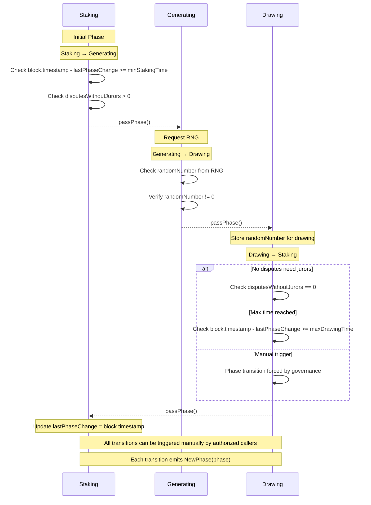
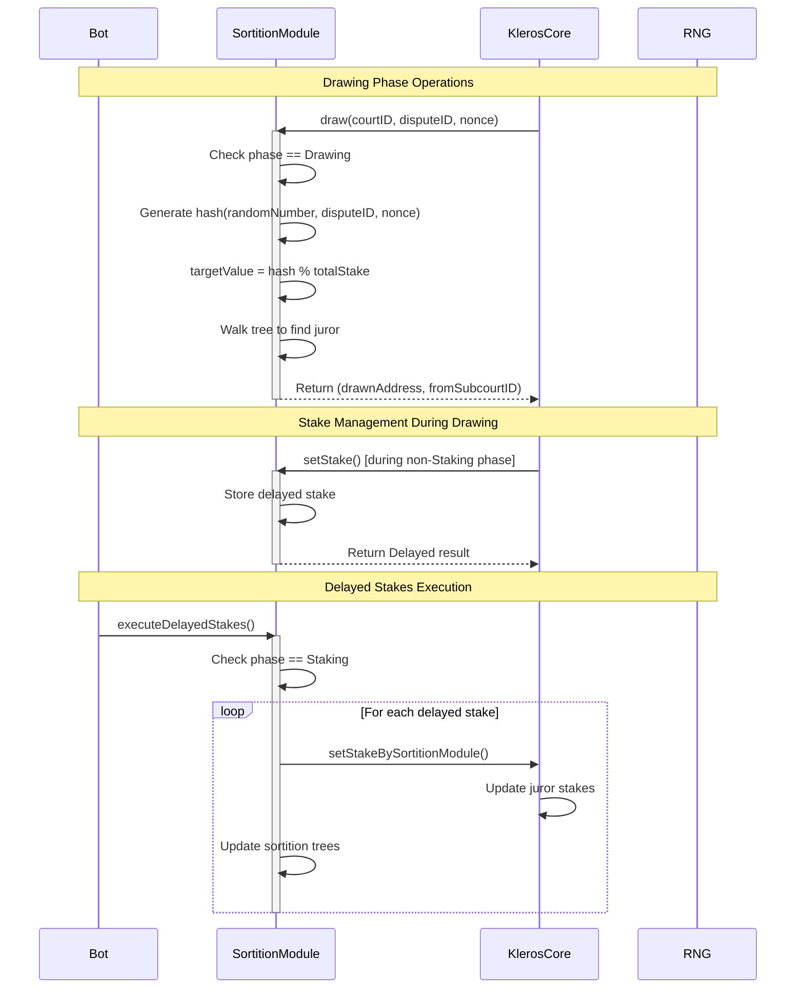

# 🎲 Sortition Module

> Last updated: 2026-03-14 | Based on: kleros-v2 contracts @ dev branch

## 📋 Overview

The Sortition Module is a critical component of the Kleros V2 protocol that manages juror selection and stake tracking. It implements a sophisticated sortition sum tree data structure to enable weighted random selection of jurors based on their staked PNK tokens, while providing security through a multi-phase system that prevents manipulation.

## 📑 Table of Contents

1. [🌳 Sortition Trees](#-sortition-trees)
   - [Tree Structure](#tree-structure)
   - [K-ary Tree Implementation](#k-ary-tree-implementation)
   - [Stake Path System](#stake-path-system)
   - [Tree Operations](#tree-operations)
2. [🎯 Drawing System](#-drawing-system)
   - [Weighted Random Selection](#weighted-random-selection)
   - [Draw Process](#draw-process)
   - [Parent Court Inheritance](#parent-court-inheritance)
3. [🔄 Phase Management](#-phase-management)
   - [Rationale](#rationale)
   - [Phases](#phases)
   - [Phase Transition Flow](#phase-transition-flow)
   - [Interactions](#interactions)
4. [🕒 Delayed Stakes Management](#-delayed-stakes-management)
   - [Overview](#overview)
   - [Delayed Stake Structure](#delayed-stake-structure)
   - [Handling Different Scenarios](#handling-different-scenarios)
   - [Execution of Delayed Stakes](#execution-of-delayed-stakes)
5. [🪙 Autostaking System](#-autostaking-system)
   - [Mechanism](#mechanism)
   - [Implementation](#implementation)
   - [Constraints and Fallbacks](#constraints-and-fallbacks)
6. [📢 Events](#-events)
   - [Phase Events](#phase-events)
   - [Stake Events](#stake-events)
7. [🔧 Core Methods](#-core-methods)
   - [Tree Management](#tree-management)
   - [Stake Management](#stake-management)
   - [Stake Locking and Penalties](#stake-locking-and-penalties)

## 🌳 Sortition Trees

The Sortition Module uses the `SortitionTrees` library to implement efficient k-ary sum trees for weighted random juror selection.

### Tree Structure

```solidity
struct SortitionSumTree {
    uint256 K;                                    // Maximum children per node (branching factor)
    uint256[] stack;                              // Tracks vacant positions for reuse
    uint256[] nodes;                              // Tree nodes stored as flat array
    mapping(bytes32 => uint256) IDsToNodeIndexes; // Maps stake path IDs to node positions
    mapping(uint256 => bytes32) nodeIndexesToIDs; // Maps node positions to stake path IDs
}
```

### K-ary Tree Implementation

The sortition trees use a configurable branching factor (K) for optimal performance:

#### Flat Array Storage

- **Nodes Array**: Tree stored as a flat array where:
  - Index 0: Root node (sum of all stakes)
  - Indices 1 to K: First level children
  - Indices (K+1) to (K²+K): Second level children
  - Pattern: Parent at index `i` has children at indices `(i * K) + 1` through `(i * K) + K`

#### Tree Navigation

```solidity
// Parent calculation
uint256 parent = (nodeIndex - 1) / K;

// Children calculation
uint256 firstChild = (nodeIndex * K) + 1;
uint256 lastChild = firstChild + K - 1;
```

> ⚠️ **Note**: This is simplified pseudocode. The actual implementation in `SortitionTrees.sol` handles additional edge cases including tree boundaries, vacant node management, and overflow conditions. Refer to the contract implementation for complete tree navigation logic.

#### Vacant Position Management

- **Stack**: Maintains list of vacant node positions for efficient reuse
- When a juror unstakes completely, their node position is added to the stack
- New stakes preferentially use vacant positions before expanding the tree

### Stake Path System

Each juror's stake in a court is identified by a unique stake path ID:

#### Stake Path ID Creation

```solidity
function toStakePathID(address _account, uint96 _courtID) internal pure returns (bytes32) {
    return bytes32(uint256(_courtID) << 160 | uint256(uint160(_account)));
}
```

**Format**: 32-byte identifier = 12 bytes court ID + 20 bytes account address

#### Stake Path ID Decoding

```solidity
function toAccountAndCourtID(bytes32 _stakePathID) internal pure returns (address account, uint96 courtID) {
    account = address(uint160(uint256(_stakePathID)));
    courtID = uint96(uint256(_stakePathID) >> 160);
}
```

### Tree Operations

#### Set Operation

Updates a juror's stake in the tree:

```solidity
function set(bytes32 _key, uint256 _value, bytes32 _ID) internal {
    // Find or create node position
    uint256 treeIndex = IDsToNodeIndexes[_ID];
    if (treeIndex == 0) {
        if (_value == 0) return; // Skip zero stakes for new entries
        
        // Reuse vacant position or expand tree
        if (stack.length > 0) {
            treeIndex = stack[stack.length - 1];
            stack.pop();
        } else {
            treeIndex = nodes.length;
            nodes.push(0);
        }
        
        IDsToNodeIndexes[_ID] = treeIndex;
        nodeIndexesToIDs[treeIndex] = _ID;
    }
    
    // Update node value and propagate to ancestors
    uint256 difference = _value > nodes[treeIndex] 
        ? _value - nodes[treeIndex]
        : nodes[treeIndex] - _value;
    
    nodes[treeIndex] = _value;
    
    // If stake is zero, mark position as vacant
    if (_value == 0) {
        stack.push(treeIndex);
        delete IDsToNodeIndexes[_ID];
        delete nodeIndexesToIDs[treeIndex];
    }
    
    // Propagate changes up the tree
    _updateParents(treeIndex, difference, _value > nodes[treeIndex]);
}
```

#### Stake Lookup

```solidity
function stakeOf(bytes32 _key, bytes32 _ID) internal view returns (uint256) {
    uint256 treeIndex = trees[_key].IDsToNodeIndexes[_ID];
    return treeIndex == 0 ? 0 : trees[_key].nodes[treeIndex];
}
```

## 🎯 Drawing System

The drawing system implements provably fair weighted random selection using the stake distribution in sortition trees.

### Weighted Random Selection

The drawing algorithm uses cryptographic randomness combined with dispute-specific data:

```solidity
function draw(
    uint96 _courtID,
    uint256 _coreDisputeID,
    uint256 _nonce
) public view returns (address drawnAddress, uint96 fromSubcourtID) {
    require(phase == Phase.drawing, "Not drawing phase");
    
    TreeKey key = CourtID.wrap(_courtID).toTreeKey();
    return sortitionSumTrees[key].draw(_coreDisputeID, _nonce, randomNumber);
}
```

### Draw Process

#### Random Value Generation

```solidity
// In SortitionTrees library
function draw(
    SortitionSumTree storage _tree,
    uint256 _disputeID,
    uint256 _nonce,
    uint256 _randomNumber
) internal view returns (address drawnAddress, uint96 fromSubcourtID) {
    // Generate deterministic random value
    uint256 randomValue = uint256(keccak256(abi.encode(_randomNumber, _disputeID, _nonce)));
    
    // Scale to total stake range
    uint256 targetValue = randomValue % _tree.nodes[0]; // nodes[0] = total stake
    
    // Walk tree to find selected juror
    return _drawRecursive(_tree, 0, targetValue);
}
```

#### Tree Traversal

The algorithm traverses the tree to find the juror whose cumulative stake range contains the target value:

```solidity
function _drawRecursive(
    SortitionSumTree storage _tree,
    uint256 _nodeIndex,
    uint256 _targetValue
) internal view returns (address, uint96) {
    // If leaf node, return the juror
    if (_isLeaf(_nodeIndex)) {
        bytes32 stakePathID = _tree.nodeIndexesToIDs[_nodeIndex];
        return toAccountAndCourtID(stakePathID);
    }
    
    // Find which child contains the target value
    uint256 cumulativeValue = 0;
    for (uint256 i = 0; i < K; i++) {
        uint256 childIndex = (_nodeIndex * K) + 1 + i;
        if (childIndex >= _tree.nodes.length) break;
        
        uint256 childValue = _tree.nodes[childIndex];
        if (_targetValue < cumulativeValue + childValue) {
            return _drawRecursive(_tree, childIndex, _targetValue - cumulativeValue);
        }
        cumulativeValue += childValue;
    }
    
    return (address(0), 0); // No valid selection
}
```

### Parent Court Inheritance

A key feature of the sortition system is that jurors staked in child courts are also eligible for selection in parent courts:

#### Multi-Court Updates

When a juror's stake changes, the update propagates through the court hierarchy:

```solidity
function _setStake(
    address _account,
    uint96 _courtID,
    uint256 _pnkDeposit,
    uint256 _pnkWithdrawal,
    uint256 _newStake
) internal {
    // ... stake accounting ...
    
    // Update sortition trees for current court and all parents
    bytes32 stakePathID = SortitionTrees.toStakePathID(_account, _courtID);
    bool finished = false;
    uint96 currentCourtID = _courtID;
    
    while (!finished) {
        TreeKey key = CourtID.wrap(currentCourtID).toTreeKey();
        sortitionSumTrees[key].set(_newStake, stakePathID);
        
        if (currentCourtID == GENERAL_COURT) {
            finished = true;
        } else {
            // Get parent court
            (currentCourtID, , , , , , ) = core.courts(currentCourtID);
        }
    }
}
```

#### Drawing Returns

The `draw` function returns both the selected juror and the specific court where they were staked:

```solidity
function draw(
    uint96 _courtID,
    uint256 _coreDisputeID,
    uint256 _nonce
) public view returns (address drawnAddress, uint96 fromSubcourtID) {
    // drawnAddress: The selected juror's address
    // fromSubcourtID: The specific court where they staked (may differ from _courtID)
}
```

This enables:
- **Accurate accounting**: Penalties and rewards applied to the correct court
- **Proper stake tracking**: Knows which court's stake to lock/unlock
- **Court-specific rules**: Different courts may have different eligibility requirements

## 🔄 Phase Management

### Rationale

The Sortition Module uses a phase system (Staking → Generating → Drawing) to prevent manipulation of the juror selection process. This design is crucial for several reasons:

1. **Preventing RNG Gaming**: During the Generating phase, the random number that will be used for juror selection becomes visible on-chain before it is used. Without the phase system, jurors could observe this number and adjust their stakes to manipulate their chances of being selected.

2. **Deterministic Selection**: The phase system ensures that all drawings in a round use the same stake distribution and random number, making the selection process deterministic and fair. This is essential for the protocol's integrity.

3. **Anti-Gaming Mechanism**: By freezing stake changes during the Generating and Drawing phases, the system prevents "last-minute" stake adjustments that could unfairly influence juror selection.

### Phases

The module operates in three distinct phases:

1. **Staking Phase**
   - Stake sum trees can be updated
   - Jurors can freely modify their stakes
   - Transitions after `minStakingTime` passes and there is at least one dispute without jurors

2. **Generating Phase**
   - **Critical phase**: Waiting for a random number from the RNG provider
   - **Purpose**: Prevents manipulation by freezing stakes before random number becomes known
   - **Stake restriction**: No stake tree updates allowed during this phase
   - **Transition condition**: Transitions as soon as the random number is ready (randomNumber != 0)
   - **Duration**: Variable, depends on RNG provider response time
   - **Security**: Prevents jurors from adjusting stakes after seeing the randomness

3. **Drawing Phase**
   - Jurors can be drawn using the generated random number
   - Stakes remain frozen from the Generating phase
   - Transitions after all disputes have jurors or `maxDrawingTime` passes
   - Uses the fixed random number and stake distribution from when Generating phase started

### Phase Transition Flow


```mermaid
sequenceDiagram
    participant Staking
    participant Generating
    participant Drawing

    Note over Staking: Initial Phase

    Note over Staking: Staking → Generating
    Staking->>Staking: Check block.timestamp - lastPhaseChange >= minStakingTime
    Staking->>Staking: Check disputesWithoutJurors > 0
    Staking-->>Generating: passPhase()
    Note over Generating: Request RNG

    Note over Generating: Generating → Drawing
    Generating->>Generating: Check randomNumber from RNG
    Generating->>Generating: Verify randomNumber != 0
    Generating-->>Drawing: passPhase()
    Note over Drawing: Store randomNumber for drawing

    Note over Drawing: Drawing → Staking
    alt No disputes need jurors
        Drawing->>Drawing: Check disputesWithoutJurors == 0
    else Max time reached
        Drawing->>Drawing: Check block.timestamp - lastPhaseChange >= maxDrawingTime
    else Manual trigger
        Drawing->>Drawing: Phase transition forced by governance
    end
    Drawing-->>Staking: passPhase()
    Note over Staking: Update lastPhaseChange = block.timestamp

    Note over Staking,Drawing: All transitions can be triggered manually by authorized callers

    Note over Staking,Drawing: Each transition emits NewPhase(phase)
```

### Interactions


```mermaid
sequenceDiagram
    participant Bot
    participant SortitionModule
    participant KlerosCore
    participant RNG

    Note over Bot,RNG: Drawing Phase Operations

    KlerosCore->>SortitionModule: draw(courtID, disputeID, nonce)
    activate SortitionModule
    SortitionModule->>SortitionModule: Check phase == Drawing
    SortitionModule->>SortitionModule: Generate hash(randomNumber, disputeID, nonce)
    SortitionModule->>SortitionModule: targetValue = hash % totalStake
    SortitionModule->>SortitionModule: Walk tree to find juror
    SortitionModule-->>KlerosCore: Return (drawnAddress, fromSubcourtID)
    deactivate SortitionModule

    Note over Bot,RNG: Stake Management During Drawing

    KlerosCore->>SortitionModule: setStake() [during non-Staking phase]
    activate SortitionModule
    SortitionModule->>SortitionModule: Store delayed stake
    SortitionModule-->>KlerosCore: Return Delayed result
    deactivate SortitionModule

    Note over Bot,RNG: Delayed Stakes Execution

    Bot->>SortitionModule: executeDelayedStakes()
    activate SortitionModule
    SortitionModule->>SortitionModule: Check phase == Staking
    loop For each delayed stake
        SortitionModule->>KlerosCore: setStakeBySortitionModule()
        KlerosCore->>KlerosCore: Update juror stakes
        SortitionModule->>SortitionModule: Update sortition trees
    end
    deactivate SortitionModule
```

## 🕒 Delayed Stakes Management

### Overview

Delayed stakes are a mechanism to handle stake changes during the Generating and Drawing phases while maintaining system integrity. When the system is not in the Staking phase, stake changes are stored for later execution but handled differently based on whether they increase or decrease the stake.

### Delayed Stake Structure

```solidity
struct DelayedStake {
    address account; // The juror's address
    uint96 courtID; // The court ID
    uint256 stake; // The new stake amount
}
```

### Handling Different Scenarios

#### 1. Stake Increase During Non-Staking Phase

```solidity
if (_newStake > currentStake) {
    delayedStake.alreadyTransferred = true;
    pnkDeposit = _increaseStake(juror, _courtID, _newStake, currentStake);
    emit StakeDelayedAlreadyTransferredDeposited(_account, _courtID, _newStake);
}
```

- Tokens are transferred immediately
- `stakedPnk` is updated
- Drawing chance update is delayed
- Emits `StakeDelayedAlreadyTransferredDeposited`

#### 2. Stake Decrease During Non-Staking Phase

```solidity
else {
    emit StakeDelayedNotTransferred(_account, _courtID, _newStake);
}
```

- No immediate token transfer
- Drawing chance update is delayed
- Token transfer will occur during execution
- Emits `StakeDelayedNotTransferred`

### Execution of Delayed Stakes

Delayed stakes are executed when the phase returns to Staking:

```solidity
function executeDelayedStakes(uint256 _iterations) external override {
    require(phase == Phase.staking, "Not staking phase");
    
    uint256 actualIterations = min(_iterations, delayedStakeWriteIndex - delayedStakeReadIndex + 1);
    uint256 newDelayedStakeReadIndex = delayedStakeReadIndex + actualIterations;

    for (uint256 i = delayedStakeReadIndex; i < newDelayedStakeReadIndex; i++) {
        DelayedStake storage delayedStake = delayedStakes[i];
        if (!core.setStakeBySortitionModule(delayedStake.account, delayedStake.courtID, delayedStake.stake)) {
            emit StakeDelayedExecutionFailed(delayedStake.account, delayedStake.courtID, delayedStake.stake);
        }
        delete delayedStakes[i];
    }
    delayedStakeReadIndex = newDelayedStakeReadIndex;
}
```

Key aspects:
- Processes stakes in batches for gas efficiency
- Updates sortition trees during execution
- Handles transfer operations based on delayed stake type
- Cleans up storage after execution

## 🪙 Autostaking System

A new feature that automatically stakes PNK rewards in the court where the juror was drawn, improving capital efficiency.

### Mechanism

The autostaking system operates through the `setStakeReward()` function:

```solidity
function setStakeReward(
    address _account,
    uint96 _courtID,
    uint256 _reward
) external override onlyByCore returns (bool success) {
    if (_reward == 0) return true; // No reward to add
    
    uint256 currentStake = _stakeOf(_account, _courtID);
    if (currentStake == 0) return false; // Juror has been unstaked
    
    uint256 newStake = currentStake + _reward;
    
    // Check limits before auto-staking
    if (jurors[_account].stakedPnk + _reward > maxStakePerJuror || 
        newStake > maxStakePerJuror) {
        return false;
    }
    
    _setStake(_account, _courtID, _reward, 0, newStake);
    return true;
}
```

### Implementation

Called during reward execution in `KlerosCore`:

```solidity
// In KlerosCore._executeRewards()
uint96 rewardedInCourtID = round.drawnJurorFromCourtIDs[repartition];

// Try to auto-stake the PNK reward
if (!sortitionModule.setStakeReward(account, rewardedInCourtID, pnkReward)) {
    // If auto-staking fails, transfer directly to juror
    pinakion.safeTransfer(account, pnkReward);
}
```

### Constraints and Fallbacks

Auto-staking can fail and fallback to direct transfer when:

1. **Zero Reward**: No reward to stake
2. **Unstaked Juror**: Current stake in the court is 0
3. **Max Stake Exceeded**: Would exceed `maxStakePerJuror` limits
4. **Total Stake Limits**: Would exceed global staking constraints

**Benefits**:
- Automatic compounding of rewards
- No manual restaking required
- Improved capital efficiency
- Gas savings from avoiding separate transactions

## 📢 Events

### Phase Events

```solidity
event NewPhase(Phase _phase)
```

### Stake Events

```solidity
// Stake Changes
event StakeSet(address indexed _address, uint256 _courtID, uint256 _amount, uint256 _amountAllCourts);

// Delayed Stakes
event StakeDelayed(address indexed _address, uint96 indexed _courtID, uint256 _amount);
event StakeDelayedExecutionFailed(address indexed _address, uint96 indexed _courtID, uint256 _amount);

// Stake Locking
event StakeLocked(address indexed _address, uint256 _relativeAmount, bool _unlock);

// Leftover PNK
event LeftoverPNK(address indexed _account, uint256 _amount);
event LeftoverPNKWithdrawn(address indexed _account, uint256 _amount);
```

## 🔧 Core Methods

### Tree Management

```solidity
function createTree(uint96 _courtID, bytes memory _extraData) external override onlyByCore
```

- Creates new sortition tree for a court
- Extracts K value from `_extraData` (default: `DEFAULT_K`)
- Key derived from court ID using `CourtID.wrap(_courtID).toTreeKey()`

### Stake Management

```solidity
function validateStake(
    address _account,
    uint96 _courtID,
    uint256 _newStake,
    bool _noDelay,
    ICourtEligibility _eligibility
) external override onlyByCore returns (uint256 pnkDeposit, uint256 pnkWithdrawal, StakingResult stakingResult)
```

**Validation Checks**:
- Maximum number of staking courts (`MAX_STAKE_PATHS`)
- Individual and global stake limits
- Eligibility requirements via `_eligibility` predicate
- Phase-based delay handling

```solidity
function setStake(
    address _account,
    uint96 _courtID,
    uint256 _pnkDeposit,
    uint256 _pnkWithdrawal,
    uint256 _newStake
) external override onlyByCore
```

**Operations**:
- Updates juror's `stakedPnk` balance
- Manages `courtIDs` array for cleanup
- Updates sortition trees in court hierarchy
- Handles parent court propagation

### Stake Locking and Penalties

```solidity
function lockStake(address _account, uint256 _relativeAmount) external override onlyByCore
function unlockStake(address _account, uint256 _relativeAmount) external override onlyByCore
```

**Features**:
- Tracks locked PNK during disputes
- Prevents withdrawal of locked tokens
- Triggers `LeftoverPNK` events when applicable

```solidity
function setStakePenalty(
    address _account,
    uint96 _courtID,
    uint256 _penalty
) external override onlyByCore returns (uint256 pnkBalance, uint256 newCourtStake, uint256 availablePenalty)
```

**Penalty Application**:
- Reduces both total and court-specific stakes
- Respects available balance limits
- Updates sortition trees to reflect new stakes
- Returns actual penalty applied

```solidity
function forcedUnstakeAllCourts(address _account) external override onlyByCore
function forcedUnstake(address _account, uint96 _courtID) external override onlyByCore
```

**Forced Unstaking**:
- Used when jurors become inactive or ineligible
- Removes stakes from sortition trees
- Cleans up court tracking arrays
- Handles both individual courts and complete unstaking

## Error Conditions

| Operation | Failure condition | Result |
|-----------|------------------|--------|
| setStake() | Not in staking phase | Delayed stake |
| draw() | Not in drawing phase | Reverts |
| draw() | Random number not ready | Reverts |
| setStake() | Exceeds max stake per juror | Reverts |
| setStake() | Court doesn't exist | Reverts |
| setStakeReward() | Juror unstaked | Returns false |
| setStakeReward() | Would exceed limits | Returns false |

## 🔒 Security Considerations

1. **Phase Integrity**: Drawing can only occur during Drawing phase with fixed random numbers
2. **Manipulation Prevention**: Stake changes delayed during sensitive phases
3. **Tree Consistency**: All updates propagate correctly through court hierarchy
4. **Limit Enforcement**: Individual and global stake limits prevent abuse
5. **Eligibility Validation**: Court-specific eligibility predicates enforced
6. **Randomness**: Cryptographic randomness combined with dispute-specific nonces