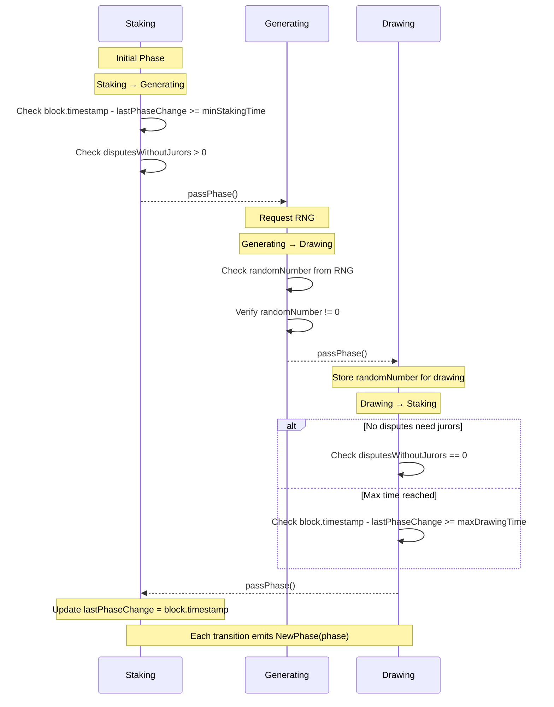
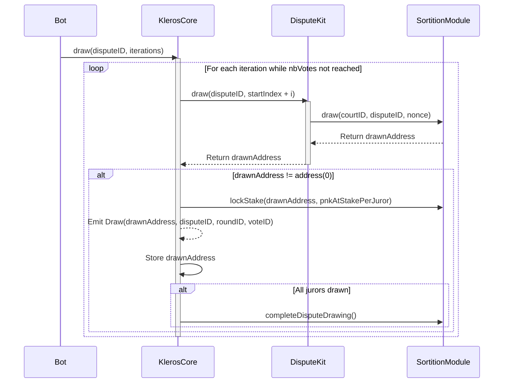

# 🎲 Sortition Module

## 📋 Overview

The Sortition Module is a critical component of the Kleros V2 protocol that manages juror selection and stake tracking. It implements a sortition sum tree data structure to enable weighted random selection of jurors based on their staked PNK tokens.

PNK deposits, withdrawals and token balances are managed by KlerosCore. SortitionModule tracks active court stakes and amounts locked in disputes. Unstaking changes selection weight; it does not withdraw tokens or release existing dispute locks.

## 📑 Table of Contents

1. [🔄 Phase Management](#-phase-management)
   - [Rationale](#rationale)
   - [Phases](#phases)
   - [Phase Transition Flow](#phase-transition-flow)
   - [Juror Selection Flow](#juror-selection-flow)
2. [🌳 Sortition Trees](#-sortition-trees)
   - [Tree Structure](#tree-structure)
   - [Tree Operations](#tree-operations)
3. [🎯 Drawing System](#-drawing-system)
   - [Drawing Process](#drawing-process)
   - [Random Number Generation](#random-number-generation)
4. [🕒 Delayed Stakes Management](#-delayed-stakes-management)
   - [Overview](#overview)
   - [Delayed Stake Structure](#delayed-stake-structure)
   - [Edge Cases](#edge-cases)
5. [📢 Events](#-events)
   - [Phase Events](#phase-events)
   - [Stake Events](#stake-events)
6. [🔧 Core Methods](#-core-methods)
   - [Tree Management](#tree-management)
   - [Stake Management](#stake-management)
   - [Stake Locking and Penalties](#stake-locking-and-penalties)

## 🔄 Phase Management

### Rationale

The Sortition Module uses a phase system (Staking → Generating → Drawing) to prevent manipulation of the juror selection process. This design is crucial for several reasons:

1. **Preventing RNG Gaming**: During the Generating phase, the random number that will be used for juror selection becomes visible on-chain before it is used. Without the phase system, jurors could observe this number and adjust their stakes to manipulate their chances of being selected.

2. **Deterministic Selection**: The phase system ensures that all drawings in a round use the same stake distribution and random number, making the selection process deterministic and fair. This is essential for the protocol's integrity.

3. **Anti-Gaming Mechanism**: By freezing stake changes during the Generating and Drawing phases, the system prevents "last-minute" stake adjustments that could unfairly influence juror selection.

### Phases

The module operates in three distinct phases:

1. **Staking Phase**

   - Stake sum trees can be updated
   - Transitions after `minStakingTime` passes and there is at least one dispute without jurors

2. **Generating Phase**

   - Waiting for a random number
   - Transitions as soon as the random number is ready

3. **Drawing Phase**
   - Jurors can be drawn
   - Transitions after all disputes have jurors or `maxDrawingTime` passes

Each Staking → Generating → Drawing cycle is a session. Disputes and appeal rounds registered during Staking can participate in that session’s drawing. Those registered during Generating or Drawing are deferred to the next session and cannot use the current random number. Returning from Drawing to Staking advances the session and includes the deferred disputes.

### Phase Transition Flow


```mermaid
sequenceDiagram
    participant Staking
    participant Generating
    participant Drawing

    Note over Staking: Initial Phase

    Note over Staking: Staking → Generating
    Staking->>Staking: Check block.timestamp - lastPhaseChange >= minStakingTime
    Staking->>Staking: Check disputesWithoutJurors > 0
    Staking-->>Generating: passPhase()
    Note over Generating: Request RNG

    Note over Generating: Generating → Drawing
    Generating->>Generating: Check randomNumber from RNG
    Generating->>Generating: Verify randomNumber != 0
    Generating-->>Drawing: passPhase()
    Note over Drawing: Store randomNumber for drawing

    Note over Drawing: Drawing → Staking
    alt No disputes need jurors
        Drawing->>Drawing: Check disputesWithoutJurors == 0
    else Max time reached
        Drawing->>Drawing: Check block.timestamp - lastPhaseChange >= maxDrawingTime
    end
    Drawing-->>Staking: passPhase()
    Note over Staking: Update lastPhaseChange = block.timestamp

    Note over Staking,Drawing: Each transition emits NewPhase(phase)
```

### Juror Selection Flow


```mermaid
sequenceDiagram
    participant Bot
    participant KlerosCore
    participant DisputeKit
    participant SortitionModule

    Bot->>KlerosCore: draw(disputeID, iterations)
    activate KlerosCore
    loop For each iteration while nbVotes not reached
        KlerosCore->>DisputeKit: draw(disputeID, startIndex + i)
        activate DisputeKit
        DisputeKit->>SortitionModule: draw(courtID, disputeID, nonce)
        SortitionModule-->>DisputeKit: Return drawnAddress
        DisputeKit-->>KlerosCore: Return drawnAddress
        deactivate DisputeKit
        alt drawnAddress != address(0)
            KlerosCore->>SortitionModule: lockStake(drawnAddress, pnkAtStakePerJuror)
            KlerosCore-->>KlerosCore: Emit Draw(drawnAddress, disputeID, roundID, voteID)
            KlerosCore->>KlerosCore: Store drawnAddress
            alt All jurors drawn
                KlerosCore->>SortitionModule: completeDisputeDrawing()
            end
        end
    end
    deactivate KlerosCore
```

## 🌳 Sortition Trees

### Tree Structure

```solidity
struct SortitionSumTree {
  uint256 K; // Maximum children per node
  uint256[] stack; // Tracks vacant positions
  uint256[] nodes; // Tree nodes
  mapping(bytes32 => uint256) IDsToNodeIndexes;
  mapping(uint256 => bytes32) nodeIndexesToIDs;
}
```
Each stake path identifies a juror and the court where they directly staked. Its weight is included in that court’s tree and every ancestor tree up to General Court. Drawing returns both the juror and the court where that selected path was directly staked.

### Tree Operations

- **Creation**: `createTree(uint96 _courtID)`

  - Initializes a new sortition tree for a court
  - Key is derived from court ID
  - K value determines tree branching factor

- **Value Updates**: Internal `_set` function
  - Updates node values
  - Maintains tree balance
  - Updates parent nodes recursively

## 🎯 Drawing System

### Drawing Process

```solidity
function draw(
    uint96 _courtID,
    uint256 _coreDisputeID,
    uint256 _nonce
) public view returns (address drawnAddress, uint96 fromSubcourtID)
```

Key characteristics:

- Weighted selection based on stake amounts
- Traverses tree to select juror
- Returns address(0) if no jurors are staked

### Random Number Generation

- Managed through external RNG contract
- Random number used for all drawings in a phase

## 🕒 Delayed Stakes Management

### Overview

All manual stake changes, including unstaking, are delayed. They can be activated only during Staking and after their activation time. Forced unstaking executes immediately during Staking; during Generating or Drawing it is queued with the same stakingDelay.

### Delayed Stake Structure

```solidity
struct DelayedStake {
  uint256 stake; // The new stake.
  bool forced; // Whether the stake was forced (e.g. forcedUnstakeAllCourts) or not. Forced stakes will not be replaced with manual stakes.
  bool pending; // Whether the stake is pending or not, to distinguish between 0 stake and no entry.
  uint256 activationTime; // Time after which delayed stake can be executed.
  uint256 reservedStake; // Additional PNK reserved for this delayed stake above the currently active stake in the court.
}
```

There is one pending entry per juror and court. A new manual request replaces an existing manual request and resets its activation time. Manual requests cannot replace forced entries.

### Execution of Delayed Stakes

Anyone can call executeDelayedStakes(accounts, courtIDs) to process selected entries during Staking, once their activation times have passed. Execution is not automatic when the phase changes. Accepted changes update the trees; changes rejected by the staking checks emit StakeDelayedExecutionFailed. In either case, the processed entry and its reservation are cleared.

### Edge Cases

1. **Court Limits**
   - Cannot stake in more than `MAX_STAKE_PATHS` courts
   - Critical for controlling computational complexity
   - Many operations have O(n) complexity where n is number of staked courts:
     - `forcedUnstakeAllCourts()`: `O(n * (p * log_k(j)))`
     - `setStake()`: `O(n)` for court array iteration
     - Stake updates: `O(n)` for parent court propagation
   - `MAX_STAKE_PATHS` keeps these operations bounded and gas-efficient

## 📢 Events

### Phase Events

```solidity
// From ISortitionModule
event NewPhase(Phase _phase)
```

### Stake Events

```solidity
// Stake Changes
event StakeSet(address indexed _address, uint256 _courtID, uint256 _amount, uint256 _amountAllCourts);

// Delayed Stakes
event StakeDelayed(address indexed _address, uint96 indexed _courtID, uint256 _amount);

event StakeDelayedExecutionFailed(address indexed _address, uint96 indexed _courtID, uint256 _amount);

// Stake Locking
event StakeLocked(address indexed _address, uint256 _relativeAmount, bool _unlock);
```

## 🔧 Core Methods

### Tree Management

```solidity
function createTree(uint96 _courtID)
```

- Creates new sortition tree
- Called by KlerosCore only
- Key derived from court ID

### Stake Management

```solidity
function setStake(address _account, uint96 _courtID, uint256 _newStake, bool forced)
```

- Sets juror's stake in a court
- Handles both increases and decreases
- Updates tree values accordingly

### Stake Locking and Penalties

```solidity
function lockStake(address _account, uint256 _relativeAmount)
```

- Called by KlerosCore only
- Increases juror's locked token amount
- Used when juror is drawn for a dispute
- Emits `StakeLocked(account, amount, false)`

```solidity
function unlockStake(address _account, uint256 _relativeAmount)
```

- Called by KlerosCore only
- Decreases juror's locked token amount
- Used after dispute resolution
- Emits `StakeLocked(account, amount, true)`

```solidity
function forcedUnstakeAllCourts(address _account)
```
- Called by KlerosCore only
- Unstakes the inactive juror from all courts
- Used after dispute resolution