# 🎲 Sortition Module

## 📋 Overview

The Sortition Module is a critical component of the Kleros V2 protocol that manages juror selection and stake tracking. It implements a sortition sum tree data structure to enable weighted random selection of jurors based on their staked PNK tokens.

## 📑 Table of Contents

1. [🔄 Phase Management](#-phase-management)
   - [Rationale](#rationale)
   - [Phases](#phases)
   - [Phase Transition Flow](#phase-transition-flow)
   - [Interactions](#interactions)
   - [Juror Selection Flow](#juror-selection-flow)
2. [🌳 Sortition Trees](#-sortition-trees)
   - [Tree Structure](#tree-structure)
   - [Tree Operations](#tree-operations)
3. [🎯 Drawing System](#-drawing-system)
   - [Drawing Process](#drawing-process)
   - [Random Number Generation](#random-number-generation)
4. [🕒 Delayed Stakes Management](#-delayed-stakes-management)
   - [Overview](#overview)
   - [Delayed Stake Structure](#delayed-stake-structure)
   - [Handling Different Scenarios](#handling-different-scenarios)
   - [Successive Delayed Stakes](#successive-delayed-stakes)
   - [Execution of Delayed Stakes](#execution-of-delayed-stakes)
   - [Edge Cases](#edge-cases)
5. [📢 Events](#-events)
   - [Phase Events](#phase-events)
   - [Stake Events](#stake-events)
6. [🔧 Core Methods](#-core-methods)
   - [Tree Management](#tree-management)
   - [Stake Management](#stake-management)
   - [Stake Locking and Penalties](#stake-locking-and-penalties)

## 🔄 Phase Management

### Rationale

The Sortition Module uses a phase system (Staking → Generating → Drawing) to prevent manipulation of the juror selection process. This design is crucial for several reasons:

1. **Preventing RNG Gaming**: During the Generating phase, the random number that will be used for juror selection becomes visible on-chain before it is used. Without the phase system, jurors could observe this number and adjust their stakes to manipulate their chances of being selected.

2. **Deterministic Selection**: The phase system ensures that all drawings in a round use the same stake distribution and random number, making the selection process deterministic and fair. This is essential for the protocol's integrity.

3. **Anti-Gaming Mechanism**: By freezing stake changes during the Generating and Drawing phases, the system prevents "last-minute" stake adjustments that could unfairly influence juror selection.

### Phases

The module operates in three distinct phases:

1. **Staking Phase**

   - Stake sum trees can be updated
   - Transitions after `minStakingTime` passes and there is at least one dispute without jurors

2. **Generating Phase**

   - Waiting for a random number
   - Transitions as soon as the random number is ready

3. **Drawing Phase**
   - Jurors can be drawn
   - Transitions after all disputes have jurors or `maxDrawingTime` passes

### Phase Transition Flow

```mermaid
sequenceDiagram
    participant Staking
    participant Generating
    participant Drawing

    Note over Staking: Initial Phase

    Note over Staking: Staking → Generating
    Staking->>Staking: Check block.timestamp - lastPhaseChange >= minStakingTime
    Staking->>Staking: Check disputesWithoutJurors > 0
    Staking-->>Generating: passPhase()
    Note over Generating: Request RNG at block.number + rngLookahead

    Note over Generating: Generating → Drawing
    Generating->>Generating: Check randomNumber from RNG
    Generating->>Generating: Verify randomNumber != 0
    Generating-->>Drawing: passPhase()
    Note over Drawing: Store randomNumber for drawing

    Note over Drawing: Drawing → Staking
    alt No disputes need jurors
        Drawing->>Drawing: Check disputesWithoutJurors == 0
    else Max time reached
        Drawing->>Drawing: Check block.timestamp - lastPhaseChange >= maxDrawingTime
    end
    Drawing-->>Staking: passPhase()
    Note over Staking: Update lastPhaseChange = block.timestamp

    Note over Staking,Drawing: Each transition emits NewPhase(phase)
```



### Interactions


### Juror Selection Flow


## 🌳 Sortition Trees

### Tree Structure

```solidity
struct SortitionSumTree {
  uint256 K; // Maximum children per node
  uint256[] stack; // Tracks vacant positions
  uint256[] nodes; // Tree nodes
  mapping(bytes32 => uint256) IDsToNodeIndexes;
  mapping(uint256 => bytes32) nodeIndexesToIDs;
}
```

### Tree Operations

- **Creation**: `createTree(bytes32 _key, bytes memory _extraData)`

  - Initializes a new sortition tree for a court
  - Key is derived from court ID
  - K value determines tree branching factor

- **Value Updates**: Internal `_set` function
  - Updates node values
  - Maintains tree balance
  - Updates parent nodes recursively

## 🎯 Drawing System

### Drawing Process

```solidity
function draw(
    bytes32 _key,
    uint256 _coreDisputeID,
    uint256 _nonce
) public view returns (address drawnAddress)
```

Key characteristics:

- Weighted selection based on stake amounts
- Traverses tree to select juror
- Returns address(0) if no jurors are staked

### Random Number Generation

- Managed through external RNG contract
- Configurable lookahead period
- Random number used for all drawings in a phase

## 🕒 Delayed Stakes Management

### Overview

Delayed stakes are a mechanism to handle stake changes during the Generating and Drawing phases while maintaining system integrity. When the system is not in the Staking phase, stake changes are stored for later execution but handled differently based on whether they increase or decrease the stake.

### Delayed Stake Structure

```solidity
struct DelayedStake {
  address account; // The juror's address
  uint96 courtID; // The court ID
  uint256 stake; // The new stake amount
  bool alreadyTransferred; // Whether tokens were already transferred
}
```

### Handling Different Scenarios

#### 1. Stake Increase During Non-Staking Phase

```solidity
if (_newStake > currentStake) {
    delayedStake.alreadyTransferred = true;
    pnkDeposit = _increaseStake(juror, _courtID, _newStake, currentStake);
    emit StakeDelayedAlreadyTransferredDeposited(_account, _courtID, _newStake);
}
```

- Tokens are transferred immediately
- `stakedPnk` is updated
- Drawing chance update is delayed
- Emits `StakeDelayedAlreadyTransferredDeposited`

#### 2. Stake Decrease During Non-Staking Phase

```solidity
else {
    emit StakeDelayedNotTransferred(_account, _courtID, _newStake);
}
```

- No immediate token transfer
- Drawing chance update is delayed
- Token transfer will occur during execution
- Emits `StakeDelayedNotTransferred`

### Successive Delayed Stakes

The system handles multiple delayed stakes for the same juror and court through the `latestDelayedStakeIndex` mapping:

```solidity
mapping(address jurorAccount => mapping(uint96 courtId => uint256)) public latestDelayedStakeIndex
```

This mechanism is designed to improve user experience by allowing jurors to modify their stake decisions without waiting for delayed stakes to execute. For example:

- A juror who increased their stake but changed their mind can decrease it
- A juror who decreased their stake can increase it again if needed
- Each new decision immediately overrides the previous one
- Token transfers are handled efficiently to minimize unnecessary movements

The system ensures that only the final decision matters, while handling token transfers appropriately based on the sequence of changes.

When a new delayed stake is created for the same juror and court, the previous one is always deleted. The handling of PNK transfers depends on the sequence:

#### Scenario 1: Stake Increase Then Decrease

```solidity
// First delayed stake (increase from 100 to 500)
delayedStakes[++delayedStakeWriteIndex] = DelayedStake({
    account: _account,
    courtID: _courtID,
    stake: 500,
    alreadyTransferred: true  // PNK transferred immediately
});
latestDelayedStakeIndex[_account][_courtID] = delayedStakeWriteIndex;

// Second delayed stake (decrease to 200)
// 1. Previous delayed stake is found and deleted
// 2. Since it was an increase with tokens transferred:
uint256 amountToWithdraw = 500 - sortitionStake; // 500 - 100 = 400
juror.stakedPnk -= amountToWithdraw;  // Reverse the previous increase
// 3. New delayed stake stored
delayedStakes[++delayedStakeWriteIndex] = DelayedStake({
    account: _account,
    courtID: _courtID,
    stake: 200,
    alreadyTransferred: false  // No immediate PNK transfer
});
```

In this scenario:

- First stake: 400 PNK transferred immediately to the arbitrator contract
- Second stake:
  - 400 PNK returned to juror (reversing first stake)
  - Final transfer of 100 PNK (from 100 to 200) delayed until execution

#### Scenario 2: Stake Decrease Then Increase

```solidity
// First delayed stake (decrease from 500 to 200)
delayedStakes[++delayedStakeWriteIndex] = DelayedStake({
    account: _account,
    courtID: _courtID,
    stake: 200,
    alreadyTransferred: false  // No PNK transferred yet
});
latestDelayedStakeIndex[_account][_courtID] = delayedStakeWriteIndex;

// Second delayed stake (increase to 800)
// 1. Previous delayed stake is found and deleted
// 2. Since it was a decrease with no tokens transferred:
//    No token operations needed to reverse it
// 3. New delayed stake stored
delayedStakes[++delayedStakeWriteIndex] = DelayedStake({
    account: _account,
    courtID: _courtID,
    stake: 800,
    alreadyTransferred: true  // PNK transferred immediately
});
```

In this scenario:

- First stake: No immediate PNK transfer
- Second stake:
  - First stake discarded (no transfers to reverse)
  - 300 PNK transferred immediately to contract (from 500 to 800)

Key Points:

- Only increases trigger immediate PNK transfers
- When overwriting a previous delayed stake:
  - If previous was an increase: Reverse the transfer
  - If previous was a decrease: No transfer to reverse
- Final stake value always determined by most recent delayed stake
- **Drawing chances only update when stakes are executed in Staking phase**

### Execution of Delayed Stakes

Delayed stakes are executed when the phase returns to Staking.

Key aspects:

- Processes stakes in batches for gas efficiency
- Executes from `delayedStakeReadIndex` to `delayedStakeWriteIndex`
- Each stake execution:
  1. Updates the sortition tree
  2. Transfers tokens if not already transferred
  3. Cleans up the delayed stake storage

### Edge Cases

1. **Locked Tokens**

   - Delayed stake decreases respect locked tokens
   - Cannot withdraw below `lockedPnk` amount
   - Example: If `stakedPnk = 1000`, `lockedPnk = 400`, maximum withdrawal is 600

2. **Zero Stakes**

   - Cannot set stake to 0 if current stake is 0
   - Prevents unnecessary storage operations

3. **Court Limits**
   - Cannot stake in more than `MAX_STAKE_PATHS` courts
   - Critical for controlling computational complexity
   - Many operations have O(n) complexity where n is number of staked courts:
     - `setJurorInactive()`: `O(n * (p * log_k(j)))`
     - `setStake()`: `O(n)` for court array iteration
     - Stake updates: `O(n)` for parent court propagation
   - `MAX_STAKE_PATHS` keeps these operations bounded and gas-efficient
   - New stakes in additional courts are rejected with `StakingResult.CannotStakeInMoreCourts`

## 📢 Events

### Phase Events

```solidity
// From ISortitionModule
event NewPhase(Phase _phase)
```

### Stake Events

```solidity
// Stake Changes
event StakeSet(address indexed _address, uint256 _courtID, uint256 _amount, uint256 _amountAllCourts);

// Delayed Stakes
event StakeDelayedNotTransferred(address indexed _address, uint256 _courtID, uint256 _amount);

event StakeDelayedAlreadyTransferredDeposited(address indexed _address, uint256 _courtID, uint256 _amount);

event StakeDelayedAlreadyTransferredWithdrawn(address indexed _address, uint96 indexed _courtID, uint256 _amount);

// Stake Locking
event StakeLocked(address indexed _address, uint256 _relativeAmount, bool _unlock);
```

## 🔧 Core Methods

### Tree Management

```solidity
function createTree(bytes32 _key, bytes memory _extraData)
```

- Creates new sortition tree
- Called by KlerosCore only
- Key derived from court ID
- ExtraData contains tree parameters

### Stake Management

```solidity
function setStake(address _account, uint96 _courtID, uint256 _newStake, bool _alreadyTransferred)
```

- Sets juror's stake in a court
- Handles both increases and decreases
- Manages delayed stakes during drawing phase
- Updates tree values accordingly

### Stake Locking and Penalties

```solidity
function lockStake(address _account, uint256 _relativeAmount)
```

- Called by KlerosCore only
- Increases juror's locked token amount
- Used when juror is drawn for a dispute
- Emits `StakeLocked(account, amount, false)`

```solidity
function unlockStake(address _account, uint256 _relativeAmount)
```

- Called by KlerosCore only
- Decreases juror's locked token amount
- Used after dispute resolution
- Emits `StakeLocked(account, amount, true)`

```solidity
function penalizeStake(address _account, uint256 _relativeAmount)
```

- Called by KlerosCore only
- Reduces juror's `stakedPnk` by penalty amount
- If `stakedPnk` is less than penalty, sets to 0
- Does not affect `lockedPnk` which covers penalties

```solidity
function setJurorInactive(address _account)
```
