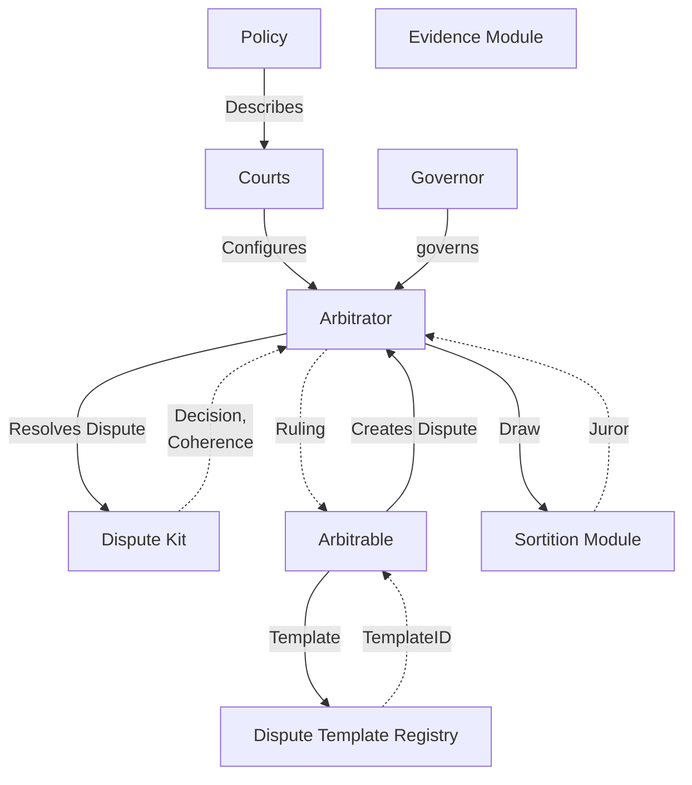

# 📚 Kleros V2 Specifications

## 📋 Overview

This directory contains the technical specifications for the Kleros V2 protocol. Each document details a specific component of the system, its functionality, and interactions with other components.

## 🏛️ Core Protocol Components

### [🧑‍⚖️ Arbitrator](./arbitrator.md)

The core arbitration logic of Kleros V2, handling dispute creation, appeals, and evidence submission. This component orchestrates the entire dispute resolution process.

### [🤝 Arbitrable](./arbitrable.md)

The interface and reference implementation for contracts that can create disputes and receive rulings from Kleros courts. Includes the DisputeResolver contract as a standard implementation.

### [📝 Dispute Kit Classic](./dispute-kit-classic.md)

The standard implementation for handling dispute rounds, vote aggregation, and incentive calculations. This is the primary dispute resolution logic used by courts.

### [🎲 Sortition Module](./sortition-module.md)

The juror selection mechanism using weighted random draws based on staked PNK tokens. Manages the phase system, stake updates, and the drawing process.

## 📄 Data Formats

### [⚖️ Courts](./courts.md)

The hierarchical court system specification, detailing court creation, configuration, and the appeals process.

### [📜 Policy Format](./policy-format.md)

The format specification for court policies, which define the rules, guidelines, and procedures for each court.

### [📋 Evidence Format](./evidence-format.md)

The standardized format for submitting and organizing evidence in disputes, ensuring consistent presentation to jurors.

## 🔄 High-Level Interactions

## 🛠️ Development

These specifications serve as the primary reference for implementing and interacting with the Kleros V2 protocol. Each document follows a consistent structure:

1. Overview of the component
2. Detailed technical specifications
3. Interaction patterns with other components
4. Implementation considerations
5. Security considerations

## 📖 How to Use These Specifications

1. Start with the core components (Arbitrator, Arbitrable) to understand the basic flow
2. Review the Sortition Module for juror selection mechanics
3. Study the Dispute Kit for detailed dispute resolution logic
4. Reference the data formats when implementing evidence submission or court policies
5. Use the component interaction diagram to understand system integration points

## 🔒 Security Model

The Kleros V2 protocol's security relies on several key principles:

1. **Cryptoeconomic Security**: Jurors stake PNK tokens as collateral
2. **Random Selection**: Robust juror selection through the Sortition Module
3. **Incentive Alignment**: Rewards and penalties encourage honest behavior
4. **Appeal System**: Multiple rounds of review for important cases
5. **Transparent Process**: All dispute data and evidence is public
