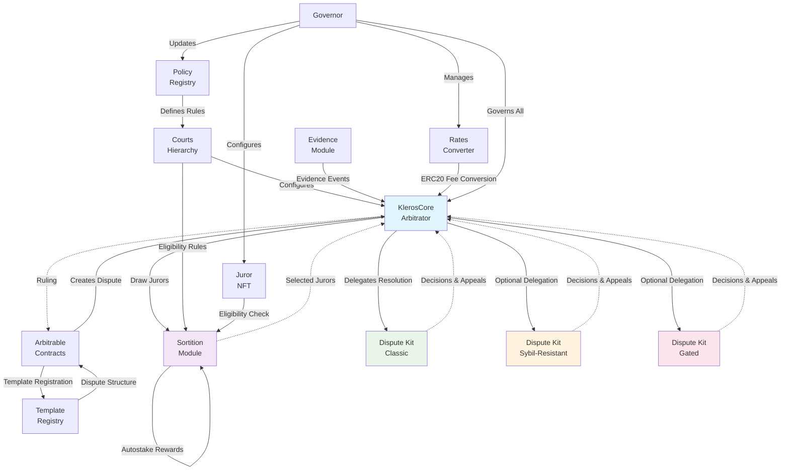

# 📚 Kleros V2 Specifications

> Last updated: 2026-03-14 | Based on: kleros-v2 contracts @ dev branch

## 📋 Overview

This directory contains the technical specifications for the Kleros V2 protocol. Each document details a specific component of the system, its functionality, and interactions with other components. These specifications reflect the current state of the protocol with enhanced features for scalability, security, and user experience.

## 🏛️ Core Protocol Components

### [🧑‍⚖️ Arbitrator](./arbitrator.md)

The core arbitration logic of Kleros V2, handling dispute creation, appeals, and evidence submission. This component orchestrates the entire dispute resolution process with enhanced features:

- **Autostaking PNK Rewards**: Automatically stakes rewards in the court where jurors were drawn
- **ERC20 Fee Support**: Accepts multiple tokens for arbitration fees via RatesConverter
- **Arbitrable Whitelist**: Optional access control for dispute creation
- **Grace Period System**: Protects appeal periods during arbitration pauses
- **Enhanced Court/DK Jumps**: Improved logic delegating decisions to dispute kits

### [🤝 Arbitrable](./arbitrable.md)

The interface and reference implementation for contracts that can create disputes and receive rulings from Kleros courts. Includes the DisputeResolver contract as a standard implementation with template system integration:

- **Template-Based Disputes**: Structured dispute creation with reusable templates
- **Registry Integration**: Seamless integration with DisputeTemplateRegistry
- **Flexible Templating**: Support for both on-chain and URI-based templates
- **Enhanced Event Structure**: Streamlined events for better indexing

### [🎲 Sortition Module](./sortition-module.md)

The juror selection mechanism using weighted random draws based on staked PNK tokens. Manages the sophisticated sortition tree system and phase-based security:

- **K-ary Sortition Trees**: Efficient tree structure with configurable branching factor
- **Weighted Random Selection**: Cryptographically secure selection using hash functions
- **Phase System**: Anti-manipulation protection through Staking → Generating → Drawing phases
- **Autostaking Integration**: `setStakeReward()` function for automatic reward compounding
- **Parent Court Inheritance**: Jurors in child courts are eligible for parent court selection
- **Delayed Stakes**: Secure handling of stake changes during sensitive phases

## 🎯 Dispute Resolution Mechanisms

### [⚖️ Dispute Kit Classic](./dispute-kit-classic.md)

The standard implementation for handling dispute rounds, vote aggregation, and incentive calculations. This is the primary dispute resolution logic used by courts:

- **Proportional Drawing**: Selection weighted by staked PNK amounts
- **Plurality Voting**: Simple majority rule for dispute resolution
- **Universal Compatibility**: Mandatorily supported by all courts as fallback
- **Enhanced Jump Logic**: Improved `getNextRoundSettings()` for flexible appeals

### 🔒 Dispute Kit Sybil-Resistant

Advanced dispute kit requiring Proof of Humanity registration for juror participation:

- **Identity Verification**: Integration with Proof of Humanity registry
- **Equal Drawing Chances**: All registered humans have equal selection probability
- **Sybil Attack Prevention**: Prevents manipulation through multiple fake identities
- **Specialized Use Cases**: Ideal for disputes requiring human judgment

### 🚪 Dispute Kit Gated

Token-gated dispute kit requiring specific asset holdings for juror eligibility:

- **Token Requirements**: Configurable ERC20/ERC721/ERC1155 holdings required
- **Expert Juries**: Enables specialist knowledge requirements
- **Flexible Configuration**: Different token requirements per court
- **Economic Alignment**: Ensures jurors have stake in relevant ecosystems

## 🏛️ Court System

### [⚖️ Courts](./courts.md)

The hierarchical court system specification, detailing court creation, configuration, and the appeals process:

- **Hierarchical Structure**: Tree-based court organization with inheritance
- **Dispute Kit Support**: Flexible mapping of supported resolution mechanisms
- **Eligibility Predicates**: Custom requirements via ICourtEligibility interface
- **Appeal Mechanism**: Progressive appeals through court hierarchy
- **Parameter Inheritance**: Child courts inherit and extend parent capabilities

### [📜 Policy Format](./policy-format.md)

The format specification for court policies, which define the rules, guidelines, and procedures for each court:

- **Structured Policies**: JSON format with purpose, rules, and skill requirements
- **Policy Inheritance**: Hierarchical rule application through court tree
- **IPFS Storage**: Immutable, decentralized policy storage
- **Governance Control**: Policy updates managed through governance system

### [📋 Evidence Format](./evidence-format.md)

The standardized format for submitting and organizing evidence in disputes:

- **Structured Submissions**: JSON format with name, description, and file references
- **IPFS Integration**: Secure file uploads via Atlas provider with SIWE authentication
- **Role-Based Restrictions**: File type and size limits enforced by upload system
- **Authentication Required**: Evidence tied to submitter through cryptographic signatures

## 🔧 Supporting Infrastructure

### 💰 RatesConverter

Exchange rate management for ERC20 fee tokens:

- **Multi-Token Support**: Converts ETH-denominated fees to various ERC20 tokens
- **Governance Control**: Rate updates managed by protocol governance
- **Flexible Implementation**: Pluggable rate conversion strategies
- **Oracle Integration**: Can integrate with external price feeds

### 🎟️ JurorNFT Eligibility

Optional NFT-based juror qualification system:

- **Reputation Gating**: Requires specific NFT holdings for court participation
- **Flexible Configuration**: Can be enabled/disabled per deployment
- **Integration Ready**: Works with existing NFT ecosystems
- **Governance Control**: NFT contract managed by protocol governance

### 📋 DisputeTemplateRegistry

Centralized registry for dispute templates:

- **Template Management**: Stores and indexes dispute templates on-chain
- **Immutable Templates**: Templates cannot be changed once registered
- **Event-Based Discovery**: Templates discoverable through emitted events
- **Version Control**: Sequential template IDs provide natural versioning

### 📄 EvidenceModule

Dedicated contract for evidence submission and management:

- **Standardized Interface**: Implements IEvidence for consistent evidence handling
- **Event Emission**: Emits Evidence events with standardized structure
- **Access Control**: Configurable permissions for evidence submission
- **Integration Ready**: Works with existing arbitrable contracts

## 🔄 High-Level Interactions

```mermaid
graph TB
    %% Core Components
    Arbitrator[KlerosCore<br/>Arbitrator] 
    Arbitrable[Arbitrable<br/>Contracts]
    SortitionModule[Sortition<br/>Module]
    
    %% Dispute Kits
    DKClassic[Dispute Kit<br/>Classic]
    DKSybil[Dispute Kit<br/>Sybil-Resistant]
    DKGated[Dispute Kit<br/>Gated]
    
    %% Supporting Systems
    Courts[Courts<br/>Hierarchy]
    Policy[Policy<br/>Registry]
    Evidence[Evidence<br/>Module]
    Templates[Template<br/>Registry]
    
    %% New V2 Components
    RatesConverter[Rates<br/>Converter]
    JurorNFT[Juror<br/>NFT]
    
    %% Core Flow
    Arbitrable -->|Creates Dispute| Arbitrator
    Arbitrator -..->|Ruling| Arbitrable
    Arbitrator -->|Draw Jurors| SortitionModule
    SortitionModule -..->|Selected Jurors| Arbitrator
    
    %% Dispute Kit Integration
    Arbitrator -->|Delegates Resolution| DKClassic
    Arbitrator -->|Optional Delegation| DKSybil
    Arbitrator -->|Optional Delegation| DKGated
    DKClassic -..->|Decisions & Appeals| Arbitrator
    DKSybil -..->|Decisions & Appeals| Arbitrator
    DKGated -..->|Decisions & Appeals| Arbitrator
    
    %% Court System
    Courts -->|Configures| Arbitrator
    Policy -->|Defines Rules| Courts
    Courts -->|Eligibility Rules| SortitionModule
    
    %% Evidence System
    Evidence -->|Evidence Events| Arbitrator
    Templates -->|Dispute Structure| Arbitrable
    Arbitrable -->|Template Registration| Templates
    
    %% V2 Features
    RatesConverter -->|ERC20 Fee Conversion| Arbitrator
    JurorNFT -->|Eligibility Check| SortitionModule
    SortitionModule -->|Autostake Rewards| SortitionModule
    
    %% Governance
    Governor[Governor] -->|Governs All| Arbitrator
    Governor -->|Updates| Policy
    Governor -->|Manages| RatesConverter
    Governor -->|Configures| JurorNFT
    
    style Arbitrator fill:#e1f5fe
    style SortitionModule fill:#f3e5f5
    style DKClassic fill:#e8f5e8
    style DKSybil fill:#fff3e0
    style DKGated fill:#fce4ec
```

## ⚡ Key V2 Enhancements

### 1. **Autostaking System**
- PNK rewards automatically restaked in the court where juror was drawn
- Improves capital efficiency and reduces manual operations
- Graceful fallback to direct transfer when constraints prevent staking

### 2. **Multi-Token Fee Support**
- ERC20 tokens accepted for dispute creation fees
- RatesConverter provides flexible exchange rate management
- ETH remains required for appeal fees for security reasons

### 3. **Enhanced Security Controls**
- Optional arbitrable whitelist for controlled access
- JurorNFT eligibility for reputation-based participation
- Grace period mechanism protects appeal deadlines during pauses

### 4. **Improved Dispute Kit System**
- Flexible court/dispute kit jumping via `getNextRoundSettings()`
- Multiple dispute kits for different use cases
- Classic Dispute Kit serves as universal fallback

### 5. **Sophisticated Juror Selection**
- K-ary sortition trees for efficient weighted selection
- Parent court inheritance for broader juror pools
- Phase-based manipulation protection

### 6. **Template-Driven Disputes**
- Structured dispute creation through template system
- Reusable templates reduce gas costs and improve UX
- Flexible template storage (registry or direct URI)

## 🛠️ Development

These specifications serve as the primary reference for implementing and interacting with the Kleros V2 protocol. Each document follows a consistent structure:

1. Overview of the component
2. Detailed technical specifications
3. Interaction patterns with other components
4. Implementation considerations
5. Security considerations

## 📖 How to Use These Specifications

1. **Start with Core Components**: Begin with Arbitrator and Arbitrable to understand basic dispute flow
2. **Understand Juror Selection**: Review Sortition Module for selection mechanics and tree structures
3. **Study Resolution Logic**: Examine Dispute Kits for detailed dispute resolution mechanisms
4. **Review Court System**: Study Courts and Policy specifications for governance structure
5. **Implementation Integration**: Use component interaction diagrams for system integration
6. **V2 Features**: Focus on autostaking, multi-token fees, and enhanced security features

## 🔒 Security Model

The Kleros V2 protocol's security relies on several key principles:

1. **Cryptoeconomic Security**: Jurors stake PNK tokens as collateral with automatic restaking
2. **Robust Random Selection**: Secure juror selection through sortition trees and phase system
3. **Incentive Alignment**: Enhanced rewards and penalties encourage honest behavior
4. **Flexible Appeal System**: Multiple rounds of review with dispute kit flexibility
5. **Transparent Process**: All dispute data and evidence is publicly accessible
6. **Access Controls**: Optional whitelisting and NFT requirements for enhanced security
7. **Multi-Layer Defense**: Grace periods, pause mechanisms, and governance controls

## 🚀 Protocol Evolution

Kleros V2 represents a significant evolution from V1 with:

- **Enhanced Performance**: More efficient sortition trees and dispute resolution
- **Greater Flexibility**: Multiple dispute kits and customizable court requirements
- **Improved UX**: Autostaking, multi-token support, and template-driven disputes
- **Better Security**: Enhanced access controls and manipulation protections
- **Scalable Architecture**: Modular design supporting future enhancements

The protocol continues to evolve through governance decisions and community feedback, with these specifications reflecting the current state and design principles.